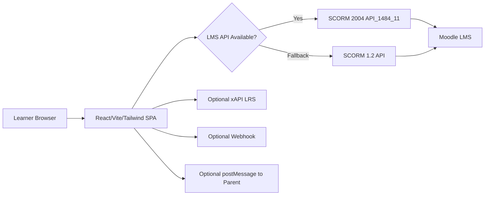
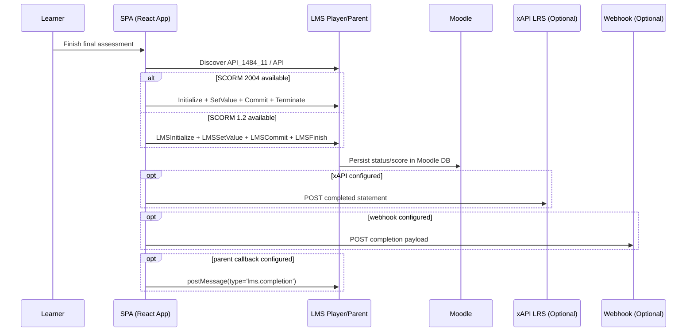

# CSM-485 Training App — Technical Architecture

## 1) Purpose and Scope
This document describes the architecture of the CSM-485 Home Health training application, including runtime behavior, LMS integration, data flow, deployment patterns, and operational considerations.

## 2) Technology Stack
- Frontend framework: React + TypeScript
- Build tooling: Vite
- UI styling: Tailwind CSS
- Packaging target: SCORM 1.2 package for Moodle LMS
- Optional integrations: xAPI endpoint, webhook endpoint, LTI-style postMessage callback

## 3) High-Level Architecture
The app is a client-side single-page application (SPA). In SCORM mode, it is launched by Moodle inside an LMS player/iframe and communicates completion/score using SCORM APIs exposed by the parent frame.

## 4) Runtime Card Flow
Current user flow starts with an intro video card, then proceeds to cover/training cards/challenges/final exam.

Key characteristics:
- Intro video is first card in the flow.
- Video playback is user-initiated (autoplay removed) to avoid browser audio-policy issues.
- Challenge options are deterministically rotated so the correct answer is not always option A.
- Navigation/progress controls are rendered only for training/test card types.

## 5) LMS Completion and Grading Model
### Primary system of record
Moodle is the system of record for learner progress/grade in SCORM launch mode.

### Completion dispatch sequence
When learner completes training, the app attempts:
1. SCORM writeback (2004 first, then 1.2)
2. Optional webhook POST (if configured)
3. Optional xAPI statement POST (if configured)
4. Optional `window.parent.postMessage` event for LTI-style host communication

### SCORM data points
- SCORM 2004 fields:
  - `cmi.completion_status = completed`
  - `cmi.success_status = passed|failed`
  - `cmi.score.raw`
  - `cmi.score.scaled`
  - `cmi.exit = normal`
- SCORM 1.2 fields:
  - `cmi.core.lesson_status = passed|completed`
  - `cmi.core.score.raw`
  - `cmi.core.exit = logout`

## 6) Sequence Diagram (Completion Path)

## 7) Packaging and Deployment
### SCORM package (Moodle)
- Build artifacts are generated via `npm run build` into `dist/`.
- SCORM manifest (`imsmanifest.xml`) declares SCORM 1.2 metadata and points SCO launch to `index.html`.
- Package is zipped and uploaded into Moodle as SCORM activity.

### Vite base path requirement
- `vite.config.ts` uses `base: './'`.
- Rationale: SCORM packages are often served from nested LMS paths; relative asset paths prevent blank-screen failures.

### Alternate web deployment (Vercel)
- Same SPA can be hosted directly on Vercel for demos/testing.
- In Vercel mode, SCORM APIs are not available unless embedded in an LMS-compatible host.

## 8) Data and Ownership Boundaries
- App-owned persistence: none required for core training playback.
- LMS-owned persistence: learner completion, pass/fail, score, tracking state (in Moodle DB).
- Optional external persistence: xAPI LRS and/or webhook receiver, if configured by query params.

## 9) Security and Compliance Notes
- SCORM API access occurs through parent-window traversal with bounded attempts.
- In iframe context, cross-origin restrictions may limit parent access if LMS/player policies are strict.
- Query-string based integration settings (`xapiAuth`, endpoints) should be treated as sensitive and controlled in deployment process.
- Use HTTPS for LMS, webhook, and xAPI endpoints.

## 10) Operational Risks and Mitigations
- Browser media policy may block unmuted autoplay: mitigated by user-initiated playback.
- LMS player differences (SCORM runtime quirks): mitigated by dual support for SCORM 2004 and 1.2.
- Asset path issues in LMS package: mitigated via `base: './'` and build validation before zipping.

## 11) Verification Checklist
- Launch from Moodle SCORM activity.
- Complete assessment and verify:
  - lesson/completion status persisted,
  - score value persisted,
  - pass/fail computed as expected.
- Validate optional integrations (xAPI/webhook/postMessage) only when configured.

## 12) Architecture Decision Record (ADR Summary)
- Decision: Use a static React SPA with SCORM runtime bridge rather than a custom backend for core grading.
- Why: Fast deployment, LMS-native gradebook integration, reduced backend complexity.
- Tradeoff: Runtime behavior depends on LMS/player browser context and SCORM API compatibility.
