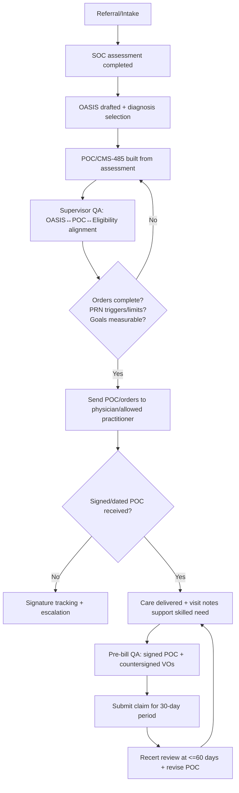

# CMS-485 Physician Plan of Care Compliance Manual for Clinicians

## Executive summary

This manual is an audit-ready, compliance-grade training curriculum for home health clinicians (RNs, LVNs, Clinical Supervisors) on the CMS-485 Physician Plan of Care (Plan of Treatment/POC) as used in Medicare-certified skilled home health operations. It is tailored to the operational reality of a dual-line organization operating in the San Francisco Bay Area with publicly described home health offerings (skilled nursing, therapy, medical social work, medication management, wound care) and a large community footprint—without asserting Medicare certification status. citeturn37view2turn37view1turn3search1

The CMS-485 form itself is a legacy “convenient way” to present the required POC/certification elements; Medicare does **not** require use of the CMS-485 specifically, and agencies may use any signed/dated document that contains all required data elements in a readily identifiable format. citeturn16search2turn4search9 What *is* required is that every Medicare home health patient receive an individualized written plan of care and that services be furnished in accordance with that plan. citeturn12view1turn12view0

Why this matters now: the most common drivers of home health improper payments and denials remain documentation sufficiency and medical necessity. For the 2024 reporting period, CMS reported home health improper payments of **6.7% (~$1.1B projected)** and attributed **51.4% of improper payments to insufficient documentation** and **33.7% to medical necessity**. citeturn35view3 Separately, the HHS OIG reported that in calendar year 2023 Medicare paid **~$16B** for home health to **~2.8M** people, with a **7.7% improper payment error rate (~$1.2B)**. citeturn35view0 These numbers convert the CMS-485/POC into one of the highest-leverage clinical documents your agency produces: it is simultaneously a care roadmap, survey compliance artifact, and the backbone of reimbursement defensibility.

### What this curriculum trains clinicians to do

Clinicians will learn how to produce a POC that is:

- **Regulation-complete** (contains every required element under the CoPs and coverage rules). citeturn12view1turn12view0  
- **Reimbursement-aligned** (supports PDGM grouping and accurate billing eligibility). citeturn1search10turn18search3turn19view1  
- **OASIS-consistent** (diagnoses, function, and risk narrative align with OASIS items and the comprehensive assessment). citeturn2search7turn1search3turn12view1  
- **Audit-defensible** (structured to withstand MAC/RAC/CERT review and OIG scrutiny, including signature/ordering controls). citeturn12view0turn9view0turn8view0turn35view2  
- **Survey-ready** (built for surveyors who validate compliance by record review, interviews, and care observations against the plan of care and CoPs). citeturn7view0turn13search18turn6search3  

### How to use this manual

- Treat this as a **master training document** for onboarding and annual competency validation.
- Implement the included **defensibility checklist** and **supervisor review workflow** as standardized internal controls.
- Use the **case studies** as live-charting drills and audit simulations.

### Required labeling approach used throughout

For each major advisory item, this manual clearly distinguishes:

- **Regulatory Fact**: a requirement stated in regulation/manual guidance.  
- **Interpretation**: how surveyors/auditors typically apply that requirement in practice.  
- **Risk Level**: the practical exposure (High/Medium/Low) if the item is deficient.  
- **Best Practice**: operational steps and documentation language to mitigate risk.

## Regulatory foundation

### Core legal/regulatory pillars that govern the Plan of Care

**Regulatory Fact**  
Medicare home health services are covered only when furnished **under an individualized plan of care** that meets the plan-of-care requirements (coverage rules) and CoP requirements, and when the beneficiary meets homebound and skilled need criteria. citeturn12view0turn1search0turn2search0turn35view3

**How the rules split in practice (coverage vs. participation)**  
- Coverage/payment rules are primarily in **42 CFR Part 409 Subpart E** (coverage requirements) and **42 CFR 424.22** (certification/recertification). citeturn12view0turn0search2turn1search0  
- Quality/operations requirements (CoPs) are primarily in **42 CFR Part 484**, especially the plan of care CoP at **484.60**, comprehensive assessment at **484.55**, and clinical records at **484.110**. citeturn12view1turn2search7turn13search0  

#### The Plan of Care content requirements

**Regulatory Fact**  
Under the Home Health CoPs, the individualized plan of care must include (at minimum) diagnoses; mental/psychosocial/cognitive status; types of services/supplies/equipment; visit frequency/duration; prognosis; rehab potential; functional limitations; permitted activities; nutritional requirements; all meds and treatments; safety measures; ED/hospital readmission risk and interventions; patient/caregiver education for discharge; patient-specific interventions and measurable outcomes/goals; advance directive information; and any additional items chosen by the agency/physician. All patient care orders—including verbal orders—must be recorded in the plan of care. citeturn12view1  

**Interpretation (survey/audit)**  
Surveyors treat this as a **minimum completeness checklist**, and then verify that:  
1) the plan matches the comprehensive assessment, 2) the care delivered matches the plan, and 3) changes in condition trigger plan revision and physician communication. citeturn12view1turn13search18turn7view0  

**Risk Level**: High  
Missing required POC elements is regularly framed as **noncompliance with CoPs** (survey) and can also manifest as **insufficient documentation** (payment denial/recoupment). citeturn12view1turn35view3turn34search0  

**Best Practice**  
Use the CMS-485 fields as an organizational scaffold, but explicitly ensure every 484.60(a)(2) element is addressed—even if your EHR breaks it into multiple screens/prints. Build an internal “POC completeness attestation” that clinical supervisors must sign before billing cycles close. citeturn12view1turn13search0  

### Physician/allowed practitioner ordering & signatures

#### Who can sign and order home health services

**Regulatory Fact**  
Plans of care and certifications may be signed by a physician **or** an “allowed practitioner” (physician assistant, nurse practitioner, clinical nurse specialist) acting within scope and meeting certification requirements. citeturn12view1turn35view3turn7view0  

**Regulatory Fact**  
CMS implemented changes allowing NPs/CNSs/PAs to certify and order home health services (including establishing and periodically reviewing the plan of care), following statutory changes. citeturn3search4turn0search2turn7view0  

**Interpretation**  
Auditors check that the signer is both:  
- legally permitted (scope of practice), and  
- operationally qualified to sign (enrolled/eligible ordering & certifying practitioner). citeturn3search20turn12view0turn0search2  

**Risk Level**: High  
A plan or certification signed by an ineligible practitioner can lead to denial as “missing/invalid certification/POC,” particularly in medical review. citeturn35view3turn12view0turn34search0  

**Best Practice**  
Maintain an agency-level **ordering/certifying roster control** (credentialing + NPI verification + enrollment status check) for all physicians/allowed practitioners from whom you accept orders. citeturn3search20turn13search1  

#### Signature and timing requirements

**Regulatory Fact**  
The plan of care must be **signed and dated** by the physician/allowed practitioner **before the claim** for each 30-day period is submitted (for periods beginning on or after January 1, 2020). citeturn12view0turn9view0  

**Regulatory Fact**  
If services are initiated based on **oral/verbal orders**, the order must be put in writing, signed/dated (with date of receipt) by the responsible RN/qualified therapist, and then **authenticated/countersigned** by the physician/allowed practitioner **before billing**. citeturn12view0turn12view1turn9view0  

**Regulatory Fact**  
Claims processing guidance states HHAs may not submit the claim until after all services are provided for the period and the physician has signed the plan of care and any subsequent verbal order. citeturn8view0  

**Interpretation**  
Auditors treat “late signatures” as a control failure even when the care was clinically appropriate. If the signature is missing at the time of medical review, the claim is commonly denied as “insufficient documentation” or “POC missing/invalid.” citeturn35view3turn34search0turn8view0  

**Risk Level**: High  
Signature/timeliness issues are denial catalysts because they are objective (either signed/dated timely or not). citeturn12view0turn8view0turn34search0  

**Best Practice**  
Implement a **“hard stop” billing control**: no final claims submission unless the signed/dated POC and all related signed verbal orders are on file for the payment period. citeturn12view0turn8view0turn9view0  

### Certification/recertification and face-to-face requirements

**Regulatory Fact**  
Certification requires (among other elements) a face-to-face encounter that:  
- is related to the primary reason for home health, and  
- occurs **within 90 days prior** to SOC or **within 30 days after** SOC, with the encounter date documented as part of certification. citeturn0search2turn35view3turn0search14  

**Interpretation**  
Plan of care content must be consistent with the face-to-face narrative and physician record. CMS guidance indicates HHA documentation may be incorporated into the certifier’s record but must be corroborated by other medical record entries to create a clinically consistent picture of eligibility. citeturn9view0turn35view3  

**Risk Level**: High  
If the face-to-face/certification narrative is missing or clinically inconsistent, it becomes a “medical necessity” denial driver even if clinician notes are otherwise strong. citeturn35view3turn0search2turn34search0  

**Best Practice**  
Build an internal “FTF/Cert alignment check” performed by the clinical supervisor during SOC/ROC QA: verify that the primary diagnosis, skilled need, and homebound rationale are consistent across physician record, OASIS, and POC. citeturn35view3turn12view1turn1search3  

### Legal implications of inaccurate plan of care documentation

**Regulatory Fact**  
The CMS-485 form contains an explicit warning that misrepresenting, falsifying, or concealing essential information required for payment of federal funds may be subject to fine, imprisonment, or civil penalty. citeturn17view0  

**Regulatory Fact**  
Submitting claims you know or should know are false can create liability under fraud and abuse laws, including the False Claims Act framework (civil monetary exposure can include treble damages and per-claim penalties). citeturn14search1turn14search5  

**Recent enforcement signal (context)**  
DOJ announcements continue to include large False Claims Act settlements involving home health services, reinforcing that homebound/skilled need/POC documentation is not merely a billing issue but a legal risk area. citeturn14search0  

**Interpretation**  
In practice, “bad documentation” becomes “false documentation” when patterns show knowledge, recklessness, or systemic disregard of requirements (e.g., repeated homebound template language that contradicts functional reality). citeturn14search1turn35view3  

**Risk Level**: High for systemic patterns; Medium for isolated errors  
**Best Practice**  
Treat CMS-485/POC controls as part of your compliance program: pre-bill review, targeted auditing of high-risk diagnoses and high-volume physicians, and corrective action plans with documented retraining. citeturn16search14turn35view2turn35view3  

### How surveyors interpret and test plan of care compliance

**Regulatory Fact**  
CMS survey protocols emphasize patient-focused, outcome-oriented surveys using observations, clinical record reviews, and interviews to evaluate compliance with CoPs. Interpretive guidelines (Appendix B) provide authoritative interpretations, but surveyors cannot rely on IGs alone as the sole basis for citation. citeturn7view0turn6search3  

**Interpretation**  
Surveyors commonly select records and ask:  
- “Show me where the plan of care addresses this identified risk,” then compare to:  
  - OASIS/comprehensive assessment findings,  
  - visit notes/interdisciplinary notes, and  
  - evidence of physician communication and plan revision. citeturn13search18turn12view1turn2search7  

**Risk Level**: Medium to High (depending on scope/systemic)  
**Best Practice**  
Train clinicians to chart with a “survey trace” mindset: if a risk is assessed (falls, infection, rehospitalization), it must appear on the POC as a problem/risk with interventions, measurable goals, and frequency support. citeturn12view1turn13search18turn35view3  

image_group{"layout":"carousel","aspect_ratio":"16:9","query":["CMS-485 Home Health Certification and Plan of Care form","CMS 485 physician plan of care example","OASIS-E M1021 M1023 diagnosis section screenshot","Home Health OASIS-E guidance manual diagnosis section"],"num_per_query":1}

## Anatomy of the CMS-485

### First principle: the CMS-485 is a format; the requirements are the law

**Regulatory Fact**  
CMS describes Form CMS-485 as a convenient way to submit a signed/dated plan of care and certification, but HHAs may submit any signed/dated document containing all required elements in a readily identifiable location in the medical record. citeturn16search2turn17view0  

**Interpretation**  
Clinicians should treat each CMS-485 “box” as an **audit hook**—a place a reviewer will anchor questions about medical necessity, coverage eligibility, and whether care followed orders. citeturn35view3turn12view0turn13search18  

**Risk Level**: High (if the form is relied on but incomplete)  
**Best Practice**  
Your EHR-generated POC must be able to print/export in a way that is:  
- complete to 484.60(a)(2), citeturn12view1  
- consistent with 409.43 plan-of-care coverage rules, citeturn12view0  
- and signed/dated per 409.43/MBPM rules before billing. citeturn12view0turn9view0turn8view0  

### CMS-485 field-by-field deep dive

The CMS-485 form layout below follows the official exhibit version (legacy labels reference ICD-9, but agencies operationally use ICD-10; CMS also shows an ICD-10 example in its materials). citeturn17view0turn17view1

For each area: **Regulatory requirement → reimbursement impact → common mistakes → compliant vs noncompliant examples → audit red flags**.

#### Patient identifiers, SOC date, certification period, provider information

**Regulatory Fact**  
The plan must be individualized, based on the comprehensive assessment, and reviewed/updated at least every 60 days. citeturn12view1turn12view0  

**Reimbursement impact**  
- SOC date anchors eligibility windows (FTF timing; assessment completion timing) and drives the certification timeline. citeturn0search2turn2search7turn12view0  
- Certification periods remain 60 days (even though PDGM payment periods are 30 days). citeturn9view0turn1search6turn19view1  

**Common mistakes**  
- SOC date on POC mismatches OASIS SOC/claim admission date.  
- Certification “from/to” dates do not align with physician review cycle or with agency billing periods.

**Compliant example (clinical language)**  
“SOC 02/18/2026. Cert period 02/18/2026–04/17/2026. Plan reviewed with MD/allowed practitioner at SOC and scheduled for recert review no later than day 60.” citeturn12view0turn12view1turn9view0  

**Noncompliant example**  
“Cert period dates blank” or “cert overlaps prior signed period with no transfer/discharge rationale.” citeturn12view0turn8view0  

**Audit red flags**  
- POC dates inconsistent across POC, OASIS, and claim.  
- Missing evidence of 60-day review/signature. citeturn12view0turn12view1turn35view3  

#### Diagnoses: principal vs other; ICD-10 sequencing

**Regulatory Fact**  
The plan must include all pertinent diagnoses. citeturn12view1  

**Regulatory Fact**  
OASIS diagnosis sequencing should reflect seriousness and support the disciplines and services provided. citeturn31search3turn1search3  

**Regulatory Fact**  
ICD-10-CM official coding guidelines govern selection and sequencing; classification instructions take precedence over guidelines. citeturn31search0turn31search2  

**Reimbursement impact (PDGM)**  
PDGM places 30-day periods into case-mix groups; the principal diagnosis code on the claim drives clinical grouping logic. citeturn1search10turn1search14turn19view1 Mis-sequencing or non-supported principal diagnoses can mis-group payment and increase audit risk (especially if the clinical record reads like a different primary problem). citeturn35view3turn31search3  

**Common mistakes**  
- “List everything” diagnosis dumps, without linkage to skilled need.  
- Using a vague chronic diagnosis (e.g., “hypertension”) as principal when skilled services are clearly wound-related or post-op.  
- Diagnosis on POC differs from OASIS M1021/M1023.

**Compliant example (supports services)**  
Principal: “L02.416 Cutaneous abscess of left lower limb” with symptom control noted on OASIS, plus secondary: diabetes with skin complication and anticoagulant use when relevant to wound healing and skilled monitoring. citeturn31search3turn12view1turn10view1  

**Noncompliant example**  
Principal: “I10 Essential hypertension” when the plan orders skilled nursing for complex wound packing and infection surveillance—a mismatch likely to trigger “medical necessity not met/insufficient documentation.” citeturn35view3turn10view1turn34search0  

**Audit red flags**  
- Principal diagnosis lacks an acute or skilled-driving problem described in visit notes.  
- OASIS diagnosis severity/control ratings conflict with narrative (e.g., “0—Asymptomatic” but care plan implies instability). citeturn1search3turn35view3  

#### Discipline orders and treatments: nursing, PT/OT/SLP, MSW, aide

**Regulatory Fact**  
The plan must specify types of services, responsible disciplines, and frequency/duration; all care must follow the plan of care. citeturn12view1turn12view0  

**Regulatory Fact**  
Orders must specify medical treatments, discipline, and frequency. PRN orders require signs/symptoms that trigger the visit and a specific limit on PRN visit counts before new orders are required. citeturn12view0turn33view1turn33view0  

**Reimbursement impact**  
- Frequencies must be defensible for skilled need; over-ordering raises medical necessity risk and under-ordering can create care delivery/missed visit problems and OASIS alignment issues. citeturn10view1turn12view0turn35view3  

**Common mistakes**  
- “SN eval and treat” with no specific skilled services described.  
- PRN orders without triggers/limits.  
- Therapy plan omits measurable goals and expected duration.

**Compliant example**  
“SN 2w2, then 1w4 for wound assessment, sterile packing, infection surveillance, medication teaching; PRN x2 per 30 days for increased drainage, fever >100.4, new erythema, uncontrolled pain.” citeturn12view0turn10view1turn33view0  

**Noncompliant example**  
“SN PRN for wound care” (no triggers, no limits). citeturn12view0turn33view1  

**Audit red flags**  
- PRN used as a blanket to cover staffing variability.  
- Frequencies not supported by instability/teaching needs (see skilled need section). citeturn10view1turn11view2turn35view3  

#### Visit frequencies: “why this many visits?”

**Regulatory Fact**  
Plan of care must specify frequency and duration of visits; for billing, the ordered frequency must be reflected in the POC and provided services must align. citeturn12view1turn12view0turn13search18  

**Interpretation**  
Auditors ask: “Could fewer visits safely and effectively accomplish the same patient-specific goals?” They look for explicit links between: condition instability → skilled intervention → measurable outcome → frequency. citeturn10view1turn35view3  

**Risk Level**: High (frequency is an audit lever)  
**Best Practice**  
Write the frequency rationale in clinician language within the treatment narrative (and reinforce in visit notes): *what is being assessed/taught/managed, what would happen without skilled care, and what change is expected per week*. citeturn10view1turn11view2  

#### Goals, measurable outcomes, and interventions

**Regulatory Fact**  
The plan must identify patient-specific measurable outcomes/goals and the interventions/education to achieve them. citeturn12view1  

**Reimbursement impact**  
Therapy plans in particular are expected to include measurable goals and expected duration; missing goals triggers denial rationale in medical review resources. citeturn35view3turn34search0  

**Common mistakes**  
- Non-measurable goals (“improve strength,” “prevent falls”).  
- Interventions listed without linkage to identified deficits and expected outcome.

**Compliant vs noncompliant examples**  
- Compliant goal: “Patient will demonstrate safe transfer bed↔chair with FWW using stand-by assist, no LOB, within 14 days.” citeturn12view1turn35view3  
- Noncompliant goal: “Improve mobility.” (No metric, no timeframe, no safety threshold). citeturn12view1  

**Audit red flags**  
- Goals that never change across recerts (copy/paste), despite condition changes.  
- Goals not reassessed or not reflected in visit notes. citeturn13search0turn12view1  

#### Medications: dose/frequency/route; new/changed; safety monitoring

**Regulatory Fact**  
All medications and treatments must be included in the POC, and the agency must provide the patient a medication schedule/instructions. citeturn12view1  

**Reimbursement impact**  
Medication teaching/monitoring is a common skilled justification when there is risk for adverse drug events and when nursing judgment is required (e.g., observation for toxicity, evaluating regimen effects). citeturn10view1turn11view2  

**Common mistakes**  
- Med list on POC mismatches derived med profile used in visit documentation.  
- No documentation linking new med to skilled monitoring (just “med education done”).

**Compliant example phrase**  
“Reviewed new anticoagulant regimen; skilled assessment for bleeding signs; reinforced lab monitoring schedule and action thresholds; communicated changes to MD.” citeturn10view1turn12view1  

**Audit red flags**  
- “Medication reconciliation completed” without identifying clinically meaningful discrepancies or teaching response. citeturn13search0turn11view2  

#### DME/supplies; safety measures; nutrition; rehab potential; discharge planning

**Regulatory Fact**  
POC must address equipment needed, safety measures, nutritional requirements, rehab potential, and discharge planning/education facilitating timely discharge. citeturn12view1  

**Reimbursement impact**  
These fields are where surveyors and reviewers validate that the plan is individualized and aligned with assessed risks (falls, oxygen safety, infection risk, rehospitalization risk). citeturn12view1turn13search18turn35view3  

**Common mistakes**  
- Generic safety measures not tied to patient-specific hazards (e.g., “fall precautions” with no interventions).  
- Nutrition section blank despite wound/healing needs.  
- Rehab potential marked “excellent” in dementia/end-stage disease without explanation.

**Compliant examples**  
- Safety: “O2 safety education; no smoking; tubing management; fall risk mitigation with FWW, remove rugs; night lighting; caregiver training.” citeturn12view1turn35view3turn10view2  
- Nutrition: “High-protein diet education for wound healing; monitor intake, weight trends; coordinate with MD for supplements if intake <75%.” citeturn12view1turn10view1  
- Discharge planning: “Anticipated discharge when wound resolves and caregiver demonstrates sterile dressing technique ×2 without cueing; teach-back documented.” citeturn12view1turn10view2  

**Audit red flags**  
- “Rehab potential excellent” + “goals minimal” + “no measurable progress” suggests templating.  
- Discharge plan absent or inconsistent with education plan. citeturn12view1turn13search0  

#### Physician certification statement and signatures

**Regulatory Fact**  
CMS-485 includes the certification attestation regarding homebound status and need for intermittent skilled services, and requires attending physician signature/date signed. citeturn17view0turn35view3  

**Regulatory Fact**  
The plan must be signed/dated before claim submission for each 30-day period; plan review must occur at least every 60 days. citeturn12view0turn9view0turn12view1  

**Audit red flags**  
- Missing “date received” or missing signed POT date tracking.  
- Signatures that are illegible without signature log (see signature requirements guidance). citeturn14search13turn8view0  

## Medical necessity and skilled need

### Medicare’s skilled services standard in home health

#### Coverage pillars clinicians must support

**Regulatory Fact**  
To qualify for Medicare home health, the patient must be confined to home, under care of a physician/allowed practitioner, receiving services under an established and periodically reviewed plan of care, and need skilled nursing (reasonable and necessary, intermittent), PT, SLP, or continuing OT need. citeturn35view3turn1search0turn12view0  

**Interpretation (auditor lens)**  
Medical review commonly separates denial rationales into:  
1) **Eligibility failures** (not homebound, not skilled, missing/invalid certification/POC), and  
2) **Documentation failures** (insufficient to show why skilled care was required and how it changed care). citeturn35view3turn34search0turn34search20  

**Risk Level**: High  
**Best Practice**  
Write every skilled visit as “clinical decision-making” rather than “task completion,” and ensure the POC forecasts that need logically.

### Custodial vs skilled: how reviewers draw the line

**Regulatory Fact**  
Skilled nursing care includes services that must be performed by an RN or LPN/LVN under State law and must meet skilled criteria; coverage is not based on general inferences about diagnoses but on objective clinical evidence of the individual’s need. citeturn2search0turn2search8  

**Interpretation**  
- **Custodial**: help with ADLs, routine assistance, stable tasks that can be done safely by non-medical caregivers without skilled judgment.  
- **Skilled**: requires professional judgment/skill to assess, manage, or teach due to complexity, instability, or risk of adverse outcomes.

**Risk Level**: High when “skilled” is used as a label without skilled reasoning  
**Best Practice**  
Use a structured “skilled need paragraph” in both POC and visit notes (see defensibility framework): condition + instability/risk + skilled action + expected clinical decision/response.

### Skilled nursing: the four high-yield justifications (and their failure points)

The Medicare Benefit Policy Manual drills into core skilled nursing principles and applications that auditors repeatedly cite. citeturn10view0turn11view2

#### Observation and assessment

**Regulatory Fact**  
Observation and assessment is covered when there is reasonable potential that skilled observation by a nurse will result in changes to treatment; it is not reasonable/necessary when fluctuations are longstanding and have not required changes in prescribed treatment. citeturn10view1turn11view2  

**Interpretation**  
“Monitor VS” is not skilled unless monitoring detects meaningful change and drives action, escalation, or provider communication.

**Risk Level**: High  
**Best Practice**  
Document the “decision hinge”: what specifically are you watching for, why now, and what action you took or would take. Each note should reflect deliberations and outcomes. citeturn10view1  

#### Management and evaluation of the care plan

**Regulatory Fact**  
The plan must be revised based on updated assessment and progress toward measurable outcomes, and the HHA must promptly alert the physician to changes suggesting outcomes aren’t achieved or the plan should be altered. citeturn12view1turn12view0  

**Interpretation**  
If nurses identify new risks (falls, infection, medication intolerance) but the POC is not updated—or physician notification is missing—surveyors see an interdisciplinary care planning failure.

**Risk Level**: High (survey + audit)  
**Best Practice**  
Use a “Change-in-Condition → POC update trigger list” (provided later) and require a documented physician communication entry when triggers occur.

#### Teaching and training vs reinforcement

**Regulatory Fact**  
Teaching that requires skilled nursing personnel constitutes skilled nursing when reasonable and necessary. Reinforcement of teaching after discharge is covered when patient needs reinforcement; reteaching is covered when there’s change in procedure/condition or caregiver isn’t properly carrying out task; documentation must show why reteaching is required and the patient/caregiver response. Teaching ends when it becomes apparent after a reasonable period the patient/caregiver cannot be trained. citeturn10view2turn11view2  

**Interpretation**  
Auditors often deny for “teaching” when the patient has long prior experience and there is no new barrier. citeturn11view2  

**Risk Level**: High  
**Best Practice**  
Document: prior baseline knowledge, the new barrier or new regimen complexity, teach-back results, and next-step plan if learning fails.

#### When skilled care becomes non-skilled

**Regulatory Fact**  
Skilled observation/monitoring is not reasonable/necessary when the clinical pattern is longstanding and not expected to lead to treatment changes. Teaching becomes non-covered when continued teaching is not reasonable/necessary because training is unsuccessful or not needed due to patient competence. citeturn10view1turn11view2  

**Interpretation**  
This is the heart of recertification defensibility: stable chronic patients often require maintenance/monitoring, but the record must show why skilled judgment is still required (complexity, risk, or maintenance therapy rules for therapy). citeturn10view4turn2search9  

**Risk Level**: Medium to High  
**Best Practice**  
At recert, add a “Why skilled continues” paragraph or explicitly document discharge readiness and transition plan if skilled need has plateaued.

### Therapy skilled need: restorative vs maintenance

**Regulatory Fact**  
CMS clarifications (including manual updates) emphasize that lack of restorative potential cannot be the sole basis for denying skilled therapy when skilled care is necessary for a safe and effective maintenance program to maintain condition or prevent/slow deterioration (individualized assessment governs). citeturn2search9turn10view4  

**Interpretation**  
For therapy, auditors look for: measurable goals OR maintenance justification supported by complexity and skilled judgment need, plus periodic reevaluation when needed. citeturn10view4turn35view3  

**Risk Level**: Medium (higher for long episodes)  
**Best Practice**  
Differentiate:  
- restorative goals (improvement expected), versus  
- maintenance goals (prevent decline / maintain current function), with narrative linking complexity to skilled needs.

### Denial examples and root cause analysis (medical necessity)

Below are **illustrative composite denial letter excerpts** based on common review rationales and published denial reason categories. They are not actual letters from Medicare, and must be used for training only.

#### Denial scenario A: “Homebound not met” (common)

**Regulatory Fact**  
Homebound requires meeting the two-part definition (criterion 1 plus criterion 2), and leaving home must require a considerable and taxing effort; infrequent/short absences and certain absences for care/religious services do not disqualify. citeturn35view3turn9view1turn1search0  

**Illustrative denial excerpt (composite)**  
> “Documentation does not support that the beneficiary is confined to the home. Notes indicate the beneficiary routinely went shopping and attended social outings without assistance.”

**Root cause**  
- Homebound statement used templated language (“taxing effort”) without longitudinal evidence. CMS specifically notes clinicians are not required to use standardized phrases and phrases alone are insufficient; longitudinal clinical information is typically needed. citeturn9view1turn35view3  

**Defense strategy**  
- Rewrite homebound narrative using functional specifics (assistive devices, assistance needs, medical contraindications) and ensure visit notes consistently document actual leaving-home frequency and effort.

#### Denial scenario B: “Skilled observation/assessment not reasonable and necessary”

**Regulatory Fact**  
Observation is covered when reasonable potential exists that skilled observation will result in changes to treatment; not covered when fluctuations are longstanding with no expected treatment change. citeturn10view1turn11view2  

**Illustrative denial excerpt (composite)**  
> “Services are not reasonable and necessary because the patient’s condition is stable and monitoring does not require skilled nursing.”

**Root cause**  
- The plan of care and notes describe routine monitoring but do not show clinical decision-making, escalation thresholds, or medication changes.

**Defense strategy**  
- Document instability/risk (new regimen, recent hospitalization, new symptoms) and show how findings drove provider communication or regimen adjustment.

#### Denial scenario C: “POC/Certification missing or invalid”

**Regulatory Fact**  
The plan must be signed/dated before claim submission for the 30-day period; verbal orders must be countersigned before billing. citeturn12view0turn8view0turn9view0  

**Published denial category example**  
MAC education materials list denials where the physician plan of care is missing/invalid or does not contain required elements. citeturn34search0turn35view3  

**Root cause**  
- Operational breakdown: late signatures, missing elements on printed POC, or missing verbal order authentication.

**Defense strategy**  
- Implement the hard stop billing control, plus physician signature tracking with escalation timelines (see workflow section).

### Risk-based documentation framework for skilled need

**Regulatory Fact**  
Coverage decisions must be based on objective clinical evidence of the individual’s need, not general inferences. citeturn2search8turn2search0  

**Interpretation**  
A defensible record makes it easy to answer:  
1) Why is the patient skilled today?  
2) Why does it require this discipline?  
3) Why this frequency today?  
4) What would happen without skilled care?  
5) What measurable outcome is expected?

**Risk Level**: High  
**Best Practice**  
Use the **Condition + Risk + Skilled Intervention + Response** structure (full checklist provided below). Align that language in both:
- the POC (forecast), and  
- the visit note (evidence that forecast remains true).

## Homebound status and OASIS/PDGM alignment

### Advanced homebound analysis

#### Homebound: the two-prong test in operational clinician language

**Regulatory Fact**  
Homebound status is a coverage requirement: the beneficiary must be confined to the home. citeturn1search0turn35view3  

**Regulatory Fact**  
CMS guidance frames homebound as meeting:  
- **Criterion 1**: need supportive devices/special transportation/assistance of another person to leave home, or leaving home is medically contraindicated; and  
- **Criterion 2**: normal inability to leave home and leaving home requires a considerable and taxing effort. citeturn35view3turn1search5  

**Regulatory Fact**  
The Medicare Benefit Policy Manual emphasizes clinicians are not required to use standardized phrases (“taxing effort”), and phrases alone are insufficient; longitudinal clinical information is typically needed. Absences for health care, adult day care for medical care, dialysis, chemo/radiation, religious services, and infrequent/short nonmedical events do not necessarily disqualify homebound status. citeturn9view1  

**Interpretation**  
Homebound is not “never leaves home.” It is “leaving home is hard and rare, and requires a big effort or assistance.” The record must show both: **functional** barriers and **frequency/effort**.

**Risk Level**: High  
**Best Practice**  
Use a standard homebound narrative template that forces you to fill in specifics:

- Criterion 1: *Which supportive devices? Which person assists? Or what medical contraindication?*  
- Criterion 2: *What happens physiologically/functionally when leaving? SOB? pain? fatigue? cognitive safety? fall risk?*  
- Absences: *how often, how long, for what purpose, and what effort/assistance required?*

#### Compliant vs deficient documentation examples

**Compliant homebound statement**  
“Patient requires FWW and caregiver steadying assistance to negotiate 3 steps and uneven porch. Leaving home triggers SOB at minimal exertion due to COPD/O2 dependence; requires 10–15 min rest after ambulation to car. Leaves home only for MD appointment 1x/month via family transport; otherwise remains home. Effort to leave is considerable and taxing.” citeturn35view3turn9view1turn12view1  

**Deficient homebound statement**  
“Patient is homebound. Taxing effort.” (No specifics; explicitly flagged by CMS guidance as insufficient by itself). citeturn9view1turn35view3  

#### Survey citation examples (how this becomes a deficiency)

**Regulatory Fact**  
For Medicare patients, comprehensive assessment must be completed within 5 days of SOC, and an RN must determine eligibility for the Medicare home health benefit, including homebound status. citeturn2search7turn12view1  

**Interpretation**  
Surveyors may cite deficiencies when:  
- homebound determination appears unsupported or inconsistent with assessment findings, and/or  
- the POC fails to incorporate risks identified in assessment (falls, cognition, rehospitalization risk). citeturn13search18turn12view1turn7view0  

**Risk Level**: Medium to High  
**Best Practice**  
Require supervisors to verify homebound rationale at SOC and recert and to ensure it is reflected consistently across OASIS, POC, and visit notes.

### Plan of care vs OASIS alignment

#### Why OASIS alignment is non-negotiable

**Regulatory Fact**  
The comprehensive assessment must incorporate OASIS items specified by the Secretary, and OASIS reporting is mandated by regulation. citeturn2search7turn2search3turn2search11  

**Regulatory Fact**  
The plan of care must be based on the comprehensive assessment and revised to reflect updated assessment and progress. citeturn12view1turn12view0  

**Interpretation**  
Reviewers cross-reference:  
- OASIS (what you assessed),  
- POC (what you planned/ordered),  
- visit notes (what you did and why),  
and look for internal consistency. citeturn13search18turn35view3  

**Risk Level**: High  
**Best Practice**  
Use an internal “OASIS↔POC crosswalk” (table below) during SOC QA and recert QA.

### Mapping table: CMS-485 fields to CoP requirements and OASIS anchors

| CMS-485 area (common EHR equivalent) | CoP/coverage requirement anchor | OASIS anchor (examples) | Audit risk if mismatched |
|---|---|---|---|
| Diagnoses (principal/other) | POC must include all pertinent diagnoses; coverage requires POC specifies services needed | OASIS Section I: M1021/M1023 diagnosis coding and symptom control | PDGM clinical group errors; medical necessity denials; “insufficient documentation” citeturn12view1turn12view0turn31search3turn1search10 |
| Frequency/duration and responsible disciplines | POC must include frequency/duration; orders must specify discipline and frequency; PRN rules | OASIS timing/visit utilization doesn’t list frequency, but clinician assessment should justify ordered intensity | Denials for unsupported frequency; missed care delivery; survey noncompliance with plan-of-care delivery citeturn12view1turn12view0turn13search18 |
| Functional limitations / activities permitted | POC must include functional limitations and activities permitted | OASIS functional items (ambulation, transfers, ADLs) | Contradiction triggers “homebound not supported” and “POC not individualized” findings citeturn12view1turn9view1turn13search18 |
| Medications and treatments | POC must include all meds and treatments; patient must receive medication schedule/instructions | OASIS medication-related items (varies by instrument) and med list from assessment | Adverse event risk; denial for insufficient skilled justification; survey citations for inaccurate clinical record citeturn12view1turn13search0turn10view1 |
| Safety measures + ED/hospital risk & interventions | POC must include safety measures and readmission risk description + interventions | OASIS risk-related assessment findings | Surveyors flag mismatch between assessed risk and POC interventions; rehospitalization quality exposure citeturn12view1turn13search18turn7view0 |
| Rehab potential / goals / discharge plan | POC must include rehab potential and measurable outcomes/goals; education training for timely discharge | OASIS clinical/functional picture and therapy assessment | Denials for therapy goals missing or not measurable; recert vulnerabilities citeturn12view1turn35view3turn34search0 |

### PDGM impact analysis: how mismatches become money

**Regulatory Fact**  
PDGM places 30-day periods into case-mix groups; a national standardized 30-day payment rate is case-mix and wage-adjusted. citeturn1search10turn18search3turn19view1  

**Interpretation**  
When OASIS diagnoses and the POC narrative do not support the claim’s principal diagnosis, agencies face a dual risk:  
- payment mis-grouping (under/overpayment), and  
- increased likelihood of medical review because the record appears internally inconsistent.

**Risk Level**: Medium to High  
**Best Practice**  
At SOC and recert, supervisors should confirm: principal diagnosis selection is clinically dominant, explicitly drives skilled services, and is consistently referenced in clinician notes.

## Frequency, orders, signatures, and common survey/audit findings

### Frequency and orders

#### Skilled nursing frequency justification

**Regulatory Fact**  
POC must specify visit frequency/duration and services necessary per comprehensive assessment. citeturn12view1turn12view0  

**Interpretation**  
Frequency must map to one of these rationales:  
- instability/new diagnosis,  
- new/changed medication regimen with risk of adverse events,  
- complex wound/device care requiring skilled technique and surveillance,  
- patient/caregiver training requiring multiple skilled encounters,  
- significant change in condition requiring reassessment and plan revision.

**Risk Level**: High  
**Best Practice**  
Write the frequency as a clinical hypothesis: “2w2 then 1w4” *because* you expect wound burden and infection risk to reduce after two weeks of skilled management and caregiver competence improvement.

#### PRN orders

**Regulatory Fact**  
PRN orders must include signs/symptoms that would occasion the visit and a specific limit on number of PRN visits before additional orders must be obtained. citeturn12view0turn33view1turn33view0  

**Risk Level**: High  
**Best Practice**  
PRN must never be a loophole. Use it for clear clinical contingencies. Example: “PRN x2 for BG <70 or >300 with symptoms; provide assessment and physician notification.”

#### Therapy frequency alignment and measurable goals

**Regulatory Fact**  
CMS states that if the POC includes a course of therapy treatment, it must include measurable therapy goals, expected duration, and consistency with therapist assessment; physician must decide course of treatment after consulting therapist. citeturn35view3turn12view1turn12view0  

**Risk Level**: Medium to High  
**Best Practice**  
Therapy must produce measurable impairment-based goals and expected duration. Avoid “maintenance” as a shorthand—use the maintenance therapy rationale only when skilled complexity requires it. citeturn2search9turn10view4  

### Verbal orders and physician signature workflow

#### Verbal order rule set (coverage + CoP)

**Regulatory Fact**  
Coverage rule: oral orders must be written, signed/dated with date of receipt by RN/qualified therapist, and countersigned by physician/allowed practitioner before billing. citeturn12view0turn33view3turn9view0  

**Regulatory Fact**  
CoP: verbal orders must be documented, signed, dated, timed, and authenticated by the ordering practitioner per state law and HHA policy. citeturn12view1turn36search18turn36search3  

**Risk Level**: High  
**Best Practice**  
Standardize your verbal order documentation: date/time received, exact order, clinical reason, who received it, and immediate submission to practitioner for signature tracking.

### Common survey and audit findings

#### What current oversight signals tell us

**Regulatory Fact**  
CMS and OIG reporting show that home health improper payments and audit findings frequently involve homebound and skilled need failures, as well as documentation sufficiency. citeturn35view1turn35view3turn35view0  

**Regulatory Fact**  
OIG audits within its nationwide series continue to identify claims that fail plan-of-care requirements, skilled need requirements, and coding/documentation requirements; audits often estimate overpayments by extrapolation from samples. citeturn35view2turn35view0  

**Interpretation (practical deficiency/denial clusters relevant to CMS-485)**  
1) **POC missing required elements** (esp. goals, frequency rationale, therapies). citeturn12view1turn34search0  
2) **Late/missing signatures or invalid verbal orders**. citeturn12view0turn8view0turn14search13  
3) **Homebound rationale templated/inconsistent**. citeturn9view1turn35view3  
4) **Skilled services described as tasks without skilled judgment**. citeturn10view1turn35view3  
5) **OASIS↔POC mismatches** (diagnoses, function, risk). citeturn1search3turn12view1turn2search7  

**Risk Level**: High  
**Best Practice**  
Adopt a “three-document rule”: no SOC is considered QA-complete until OASIS, POC, and the first skilled visit note tell the same story of eligibility, skilled need, and plan.

### Denial management: building a defensible appeal-ready record

**Regulatory Fact**  
CMS emphasizes supporting documentation requirements: certifying physician and facility records must justify referral including skilled need and homebound status. citeturn35view3turn9view0  

**Interpretation**  
Most appeals fail because agencies try to defend with **new arguments** rather than pointing to contemporaneous documentation. “If it isn’t in the record, it didn’t happen” is the audit reality. citeturn34search20turn35view3  

**Risk Level**: High  
**Best Practice**  
Train clinicians to write visit notes as if they will be read months later by a reviewer who never met the patient and has only the record.

## Defensibility framework, case studies, financial/legal impact, and implementation

### Risk mitigation and defensibility checklist

Below is the core defensibility engine for CMS-485/POC and daily documentation. It operationalizes the CMS expectation that documentation must substantiate eligibility and skilled need and remain consistent across the record. citeturn35view3turn12view1turn13search0  

#### The Condition + Risk + Skilled Intervention formula

**Regulatory Fact**  
Coverage determinations must be based on individualized clinical evidence; skilled observation/teaching must be reasonable and necessary and tied to potential changes or safe/effective care. citeturn2search8turn10view1turn11view2  

**Interpretation**  
A reviewer approves when they can trace:  
- what condition is being treated,  
- what risk exists,  
- why skilled care is required,  
- what skilled action occurred,  
- what outcome/decision resulted.

**Risk Level**: High  
**Best Practice (template phrases)**  
Use this language structure in POC and notes:

- **Condition**: “Recent hospitalization for ___ with residual ___.”  
- **Risk**: “High risk for ___ due to ___ (objective findings).”  
- **Skilled intervention**: “Skilled RN required to assess ___, interpret ___, and adjust/communicate ___.”  
- **Response**: “Findings prompted ___ (MD notified, meds adjusted, wound regimen changed, therapy progressed).”

#### Measurable goal standards (audit-safe)

**Regulatory Fact**  
POC must include measurable outcomes/goals and patient-specific interventions and education. citeturn12view1  

**Best Practice**  
Each goal should contain: **metric + timeframe + safety threshold**.

- Strong: “No falls for 30 days while ambulating household distances with FWW and supervision.”  
- Weak: “Prevent falls.”

#### Reassessment and change-in-condition triggers

**Regulatory Fact**  
POC must be reviewed/revised as patient condition requires and at least every 60 days; HHA must promptly alert physician to changes. citeturn12view1turn12view0  

**Best Practice trigger list**  
Document and communicate plan revision when any of the following occur:

- New/worsening SOB, edema, weight gain, hypotension/hypertension changes (CHF/COPD). citeturn10view1  
- Wound deterioration: increased drainage, odor, erythema, systemic symptoms. citeturn10view1turn33view0  
- Medication changes or suspected adverse drug events. citeturn10view1  
- Falls, near-falls, new cognitive/behavioral safety issues. citeturn12view1  
- Rehospitalization/ED visit events (risk description/interventions must be updated). citeturn12view1  

#### Documentation phrases that strengthen vs weaken claims

**Strengthen (examples)**  
- “Skilled assessment required to determine whether ___ indicates decompensation or requires treatment change.” citeturn10view1  
- “Teaching required due to new regimen and demonstrated learning barrier; teach-back performed; caregiver accuracy improved from __ to __.” citeturn10view2turn11view2  
- “MD notified of ___; new orders received; POC updated.” citeturn12view1turn12view0  

**Weaken (examples)**  
- “Patient stable. Continue plan.” (without evidence of why skilled still needed). citeturn10view1turn35view3  
- “Homebound—taxing effort.” (without functional specifics; explicitly insufficient alone). citeturn9view1turn35view3  
- “Medication education provided” (without what was taught and response). citeturn11view2turn13search0  

#### Copy/paste and automation risks

**Regulatory Fact**  
Clinical records must be accurate and adhere to documentation standards; surveyors use record review to confirm services comply with the plan of care. citeturn13search0turn13search18turn7view0  

**Interpretation**  
Copy/paste becomes an audit red flag when it produces internal contradictions (e.g., identical homebound narratives across different patients; identical wound measurements repeatedly).  

**Risk Level**: Medium to High  
**Best Practice**  
Require clinicians to update at least: objective findings, response to teaching, risk status, and progress toward goals each visit.

### Case studies: complex scenarios with compliant CMS-485 outlines

Each case includes: compliant POC outline, skilled need justification, frequency justification, homebound statement, and audit vulnerabilities.

#### Case study: CHF exacerbation with medication changes

**Clinical scenario**  
Post-hospital discharge for CHF exacerbation; new diuretic regimen; weight fluctuations; high rehospitalization risk.

**Compliant CMS-485/POC outline (high-level)**  
- Diagnoses: CHF exacerbation (principal), CKD if impacts diuretics, HTN, AFib (if present and relevant). citeturn12view1turn31search3turn1search10  
- Orders: SN for skilled assessment (weight, edema, lung sounds), medication teaching and monitoring for adverse effects, coordination with MD for parameter-based escalation. citeturn10view1turn12view0turn12view1  
- Frequency: SN 2w2 then 1w4; PRN x2 for weight gain >2 lbs/24h or SOB increase. citeturn12view0turn33view1turn10view1  
- Safety: fall prevention (orthostasis risk), emergency plan, readmission risk interventions. citeturn12view1turn10view1  
- Goals: weight stable within individualized parameter; no ED visits; medication teach-back accuracy. citeturn12view1turn10view2  

**Skilled need**  
Observation/assessment is reasonable and necessary because findings could drive changes to treatment regimen until stabilized. citeturn10view1turn11view2  

**Homebound statement**  
Leaving requires assistance and taxing effort due to dyspnea with minimal exertion and fatigue; leaves only infrequently for medical visits. citeturn35view3turn9view1turn12view1  

**Audit vulnerabilities**  
- “Monitoring” without showing treatment changes or physician communication.  
- Homebound narrative not reflecting dyspnea severity objectively.

#### Case study: Post-hospital wound infection requiring complex care

**Scenario**  
Surgical incision with signs of infection (redness, drainage, fever).

**POC outline**  
- Diagnoses: post-op wound infection as principal; diabetes if relevant. citeturn12view1turn31search3  
- Orders: SN for wound assessment, sterile dressing changes, infection surveillance, teaching wound care, MD notification triggers. citeturn10view1turn33view0  
- Frequency: SN 3w2 then 2w2; PRN for increased drainage, fever. citeturn12view0turn33view1  
- Goals: wound measures improve by X over 14 days; no systemic infection signs. citeturn12view1  

**Skilled need**  
MBPM examples specifically support skilled monitoring when incision shows potential infection and clinical notes must show skilled monitoring required each visit. citeturn10view1  

**Homebound**  
Pain/weakness post-hospital, restricted activity; leaving requires major effort. citeturn9view1turn35view3  

**Vulnerabilities**  
- Wound care described as routine task without documenting skilled assessment and decision-making.

#### Case study: Diabetic neuropathy with fall risk and medication complexity

**Scenario**  
Poor sensation; recurrent near-falls; insulin regimen change.

**POC outline**  
- Diagnoses: diabetic neuropathy and diabetes as principal if driving skilled services; include fall-risk-related comorbidities. citeturn31search3turn12view1  
- Orders: SN teaching for insulin administration and hypoglycemia management; PT for balance, gait training; safety measures and DME. citeturn10view2turn12view1  
- Frequency: SN 1w3 then PRN x2 for hypoglycemia/hyperglycemia symptoms; PT 2w3. citeturn12view0turn10view2  
- Goals: patient/caregiver demonstrates correct insulin technique and recognizes signs; improved balance score/transfer safety.

**Skilled need**  
Teaching is covered when regimen is new and patient requires education; documentation must include patient/caregiver responses. citeturn10view2turn11view2  

**Homebound**  
Fall risk requiring assistance and device; leaving requires considerable effort and safety supervision. citeturn35view3turn9view1  

**Vulnerabilities**  
- “Teaching” billed when patient has long history of insulin self-injection with no new barrier. citeturn11view2  

#### Case study: COPD with oxygen dependency and exacerbation risk

**Scenario**  
O2 therapy; recent exacerbation; breathlessness with minimal exertion.

**POC outline**  
- Diagnoses: COPD with exacerbation as principal; chronic respiratory failure if documented and relevant. citeturn12view1turn31search3  
- Orders: SN for assessment of respiratory status and medication/inhaler teaching; PT for endurance conditioning; safety: oxygen safety. citeturn10view1turn12view1  
- Frequency: SN 2w2 then 1w4; PRN x2 for increased SOB, sputum change, fever.

**Skilled need**  
MBPM notes skilled observation needed until condition or regimen stabilized; initial phases of medical gas regimen can require skilled observation and teaching. citeturn10view1turn10view0  

**Homebound**  
SOB with minimal exertion; leaving home requires considerable and taxing effort; absences limited. citeturn9view1turn35view3  

**Vulnerabilities**  
- Oxygen safety education not documented; homebound statement not supported by functional findings.

#### Case study: Dementia with behavioral disturbances and safety risk

**Scenario**  
Cognitive impairment, agitation, unsafe wandering; caregiver strain; medication management complexity.

**POC outline**  
- Diagnoses: dementia with behavioral disturbance and related risk. citeturn12view1turn31search3  
- Orders: SN for medication management teaching/monitoring adverse effects; MSW for caregiver support and community resource linkage; safety plan interventions. citeturn12view1turn13search2  
- Frequency: SN 1w4 then reassess; MSW 1w2.

**Skilled need**  
Skilled services can be justified by complexity and risk; homebound may be met when it is unsafe to leave unattended due to psychiatric/cognitive condition (MBPM examples). citeturn9view1turn35view3  

**Homebound**  
Unsafe to leave home unattended; requires another person for safety; leaving is taxing due to cognitive impairment and risk behaviors. citeturn9view1turn35view3  

**Vulnerabilities**  
- Drifting into custodial supervision without a skilled focus; missing measurable safety outcomes.

### Financial and legal impact analysis

#### Denial cost and unsigned plan-of-care impact

**Regulatory Fact**  
The plan of care must be signed/dated before billing the 30-day period claim; verbal orders must be countersigned before billing. citeturn12view0turn8view0turn9view0  

**Financial reality (payment magnitude)**  
Public summaries of the HH PPS standard 30-day payment rate show roughly **~$2,038** in CY 2024, **~$2,057** in CY 2025, and **~$2,038** in CY 2026 (standard rate; actual payment varies by case-mix and wage index). citeturn26view3turn30search7turn19view1  

**Interpretation**  
A single unsigned/invalid POC can place essentially the full 30-day period payment at risk. Multiply by volume and extrapolation risk becomes significant.

**Risk Level**: High  
**Best Practice**  
Quantify exposure internally: “Unsigned POC count × standard 30-day rate × denial probability” and report monthly to leadership.

#### Extrapolated overpayment risk

**Regulatory Fact**  
OIG audits commonly estimate overpayments based on sample results and recommend refunds and strengthened internal controls. citeturn35view2turn35view0  

**Risk Level**: High (for systemic failures)  
**Best Practice**  
Treat every OIG finding category (POC requirements, skilled need, coding/documentation) as an internal audit category—especially for high-risk clinicians/physicians and high-risk diagnoses.

#### CMP and False Claims Act implications

**Regulatory Fact**  
Civil monetary penalties law includes penalties for false statements/material misrepresentations in claims contexts. citeturn14search5  

**Regulatory Fact**  
Home health settlements under the False Claims Act continue to occur and can be significant, reinforcing the importance of accurate eligibility and documentation. citeturn14search0turn14search1  

**Interpretation**  
Most agencies’ risk is not a single chart error; it is a *pattern* that looks like a system designed to generate claims regardless of eligibility (e.g., template-based homebound, non-individualized POCs, repeated late signatures).  

**Risk Level**: Medium (isolated) to High (patterned/systemic)  
**Best Practice**  
Document a compliance feedback loop: identification → root cause → retraining → re-audit. Keep evidence of corrective action.

### Implementation recommendations for agencies

#### Internal audit process and QA checklist (CMS-485 focused)

**Regulatory Fact**  
Clinical records must be accurate and available to ordering practitioners and staff; POC must be individualized, complete, and revised based on assessment and progress. citeturn13search0turn12view1  

**Best Practice: three-tier audit approach**  
- **Tier 1 (SOC QA, within 48–72 hours)**: OASIS↔POC alignment, homebound/skilled narrative completeness, orders and frequencies, measurable goals. citeturn2search7turn12view1turn35view3  
- **Tier 2 (Pre-bill QA, each 30-day period)**: signed/dated POC on file, all verbal orders countersigned, frequency compliance, visit notes support skilled need through the period. citeturn12view0turn8view0turn9view0  
- **Tier 3 (Quarterly risk-based audit)**: target high-risk diagnoses, high-volume signers, high LUPA rates, and high denial categories (insufficient documentation; medical necessity). citeturn35view3turn35view2turn34search0  

#### Training cadence recommendations

- **Onboarding (first 30 days)**: complete this manual + case study charting drills + competency validation.  
- **Quarterly refreshers**: denial trend updates, signature/order controls, homebound revalidation training. citeturn35view3turn30search7  
- **Annual competency**: audit simulation using 5 complex cases and a “mock CERT request” packet.

#### Supervisor review workflow template

This workflow operationalizes the regulatory “hard stops”: POC completeness (CoP), signature requirements (coverage/billing), and recert review timelines. citeturn12view1turn12view0turn8view0turn9view0  

#### Documentation review template (audit-ready “one-page checklist”)

**POC completeness (484.60)**: diagnoses; mental/psychosocial/cognitive status; services/supplies/equipment; frequency/duration; prognosis; rehab potential; functional limits; permitted activities; nutrition; meds/treatments; safety; ED/readmission risk + interventions; education/training for discharge; measurable goals/outcomes; advance directives. citeturn12view1  

**Coverage essentials**: homebound + skilled need supported; under practitioner care; services under POC; FTF timing in certification record. citeturn35view3turn0search2turn1search0  

**Orders/signatures**: POC signed/dated before claim; verbal orders written and countersigned before billing; practitioner eligibility verified. citeturn12view0turn9view0turn8view0turn3search20  

### Optional add-on: Medicare vs Medicare Advantage vs Private Pay expectations

**Regulatory Fact**  
CMS beneficiary guidance notes that Medicare Advantage plans may have different processes and you should check with the plan, even though Medicare home health coverage rules are the baseline reference point for Original Medicare. citeturn32search12turn15search15  

**Interpretation**  
- **Original Medicare**: coverage criteria and documentation standards are governed by Medicare regulations/manuals; denials frequently hinge on certification/POC/signature/homebound/skilled evidence. citeturn35view3turn12view0turn9view1  
- **Medicare Advantage**: plans must cover Medicare benefits but often use prior authorization, plan-specific documentation requirements, and different denial/appeal workflows; operationally, agencies should treat MA documentation as “Medicare-plus.” citeturn32search12turn34search4  
- **Private pay**: contractual documentation may be simpler, but maintaining Medicare-grade POC discipline across all lines reduces risk of “documentation drift” in dual-service organizations and supports consistent clinical quality. citeturn13search0turn12view1  

**Risk Level**: Medium  
**Best Practice**  
Keep **separate documentation governance** by payer line: Medicare-certified skilled home health documentation must always meet CoP/coverage requirements regardless of private-pay operations (avoid cross-contamination of templates and workflows).

