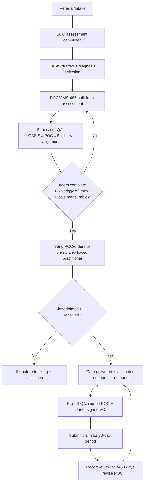

# CMS-485 Physician Plan of Care Compliance Manual for Clinicians

## Executive summary

This manual is an audit-ready, compliance-grade training curriculum for home health clinicians (RNs, LVNs, Clinical Supervisors) on the CMS-485 Physician Plan of Care (Plan of Treatment/POC) as used in Medicare-certified skilled home health operations. It is tailored to the operational reality of a dual-line organization operating in the San Francisco Bay Area with publicly described home health offerings (skilled nursing, therapy, medical social work, medication management, wound care) and a large community footprint—without asserting Medicare certification status. citeturn37view2turn37view1turn3search1

The CMS-485 form itself is a legacy “convenient way” to present the required POC/certification elements; Medicare does **not** require use of the CMS-485 specifically, and agencies may use any signed/dated document that contains all required data elements in a readily identifiable format. citeturn16search2turn4search9 What *is* required is that every Medicare home health patient receive an individualized written plan of care and that services be furnished in accordance with that plan. citeturn12view1turn12view0

Why this matters now: the most common drivers of home health improper payments and denials remain documentation sufficiency and medical necessity. For the 2024 reporting period, CMS reported home health improper payments of **6.7% (~$1.1B projected)** and attributed **51.4% of improper payments to insufficient documentation** and **33.7% to medical necessity**. citeturn35view3 Separately, the HHS OIG reported that in calendar year 2023 Medicare paid **~$16B** for home health to **~2.8M** people, with a **7.7% improper payment error rate (~$1.2B)**. citeturn35view0 These numbers convert the CMS-485/POC into one of the highest-leverage clinical documents your agency produces: it is simultaneously a care roadmap, survey compliance artifact, and the backbone of reimbursement defensibility.

### What this curriculum trains clinicians to do

Clinicians will learn how to produce a POC that is:

- **Regulation-complete** (contains every required element under the CoPs and coverage rules). citeturn12view1turn12view0  
- **Reimbursement-aligned** (supports PDGM grouping and accurate billing eligibility). citeturn1search10turn18search3turn19view1  
- **OASIS-consistent** (diagnoses, function, and risk narrative align with OASIS items and the comprehensive assessment). citeturn2search7turn1search3turn12view1  
- **Audit-defensible** (structured to withstand MAC/RAC/CERT review and OIG scrutiny, including signature/ordering controls). citeturn12view0turn9view0turn8view0turn35view2  
- **Survey-ready** (built for surveyors who validate compliance by record review, interviews, and care observations against the plan of care and CoPs). citeturn7view0turn13search18turn6search3  

### How to use this manual

- Treat this as a **master training document** for onboarding and annual competency validation.
- Implement the included **defensibility checklist** and **supervisor review workflow** as standardized internal controls.
- Use the **case studies** as live-charting drills and audit simulations.

### Required labeling approach used throughout

For each major advisory item, this manual clearly distinguishes:

- **Regulatory Fact**: a requirement stated in regulation/manual guidance.  
- **Interpretation**: how surveyors/auditors typically apply that requirement in practice.  
- **Risk Level**: the practical exposure (High/Medium/Low) if the item is deficient.  
- **Best Practice**: operational steps and documentation language to mitigate risk.

## Regulatory foundation

### Core legal/regulatory pillars that govern the Plan of Care

**Regulatory Fact**  
Medicare home health services are covered only when furnished **under an individualized plan of care** that meets the plan-of-care requirements (coverage rules) and CoP requirements, and when the beneficiary meets homebound and skilled need criteria. citeturn12view0turn1search0turn2search0turn35view3

**How the rules split in practice (coverage vs. participation)**  
- Coverage/payment rules are primarily in **42 CFR Part 409 Subpart E** (coverage requirements) and **42 CFR 424.22** (certification/recertification). citeturn12view0turn0search2turn1search0  
- Quality/operations requirements (CoPs) are primarily in **42 CFR Part 484**, especially the plan of care CoP at **484.60**, comprehensive assessment at **484.55**, and clinical records at **484.110**. citeturn12view1turn2search7turn13search0  

#### The Plan of Care content requirements

**Regulatory Fact**  
Under the Home Health CoPs, the individualized plan of care must include (at minimum) diagnoses; mental/psychosocial/cognitive status; types of services/supplies/equipment; visit frequency/duration; prognosis; rehab potential; functional limitations; permitted activities; nutritional requirements; all meds and treatments; safety measures; ED/hospital readmission risk and interventions; patient/caregiver education for discharge; patient-specific interventions and measurable outcomes/goals; advance directive information; and any additional items chosen by the agency/physician. All patient care orders—including verbal orders—must be recorded in the plan of care. citeturn12view1  

**Interpretation (survey/audit)**  
Surveyors treat this as a **minimum completeness checklist**, and then verify that:  
1) the plan matches the comprehensive assessment, 2) the care delivered matches the plan, and 3) changes in condition trigger plan revision and physician communication. citeturn12view1turn13search18turn7view0  

**Risk Level**: High  
Missing required POC elements is regularly framed as **noncompliance with CoPs** (survey) and can also manifest as **insufficient documentation** (payment denial/recoupment). citeturn12view1turn35view3turn34search0  

**Best Practice**  
Use the CMS-485 fields as an organizational scaffold, but explicitly ensure every 484.60(a)(2) element is addressed—even if your EHR breaks it into multiple screens/prints. Build an internal “POC completeness attestation” that clinical supervisors must sign before billing cycles close. citeturn12view1turn13search0  

### Physician/allowed practitioner ordering & signatures

#### Who can sign and order home health services

**Regulatory Fact**  
Plans of care and certifications may be signed by a physician **or** an “allowed practitioner” (physician assistant, nurse practitioner, clinical nurse specialist) acting within scope and meeting certification requirements. citeturn12view1turn35view3turn7view0  

**Regulatory Fact**  
CMS implemented changes allowing NPs/CNSs/PAs to certify and order home health services (including establishing and periodically reviewing the plan of care), following statutory changes. citeturn3search4turn0search2turn7view0  

**Interpretation**  
Auditors check that the signer is both:  
- legally permitted (scope of practice), and  
- operationally qualified to sign (enrolled/eligible ordering & certifying practitioner). citeturn3search20turn12view0turn0search2  

**Risk Level**: High  
A plan or certification signed by an ineligible practitioner can lead to denial as “missing/invalid certification/POC,” particularly in medical review. citeturn35view3turn12view0turn34search0  

**Best Practice**  
Maintain an agency-level **ordering/certifying roster control** (credentialing + NPI verification + enrollment status check) for all physicians/allowed practitioners from whom you accept orders. citeturn3search20turn13search1  

#### Signature and timing requirements

**Regulatory Fact**  
The plan of care must be **signed and dated** by the physician/allowed practitioner **before the claim** for each 30-day period is submitted (for periods beginning on or after January 1, 2020). citeturn12view0turn9view0  

**Regulatory Fact**  
If services are initiated based on **oral/verbal orders**, the order must be put in writing, signed/dated (with date of receipt) by the responsible RN/qualified therapist, and then **authenticated/countersigned** by the physician/allowed practitioner **before billing**. citeturn12view0turn12view1turn9view0  

**Regulatory Fact**  
Claims processing guidance states HHAs may not submit the claim until after all services are provided for the period and the physician has signed the plan of care and any subsequent verbal order. citeturn8view0  

**Interpretation**  
Auditors treat “late signatures” as a control failure even when the care was clinically appropriate. If the signature is missing at the time of medical review, the claim is commonly denied as “insufficient documentation” or “POC missing/invalid.” citeturn35view3turn34search0turn8view0  

**Risk Level**: High  
Signature/timeliness issues are denial catalysts because they are objective (either signed/dated timely or not). citeturn12view0turn8view0turn34search0  

**Best Practice**  
Implement a **“hard stop” billing control**: no final claims submission unless the signed/dated POC and all related signed verbal orders are on file for the payment period. citeturn12view0turn8view0turn9view0  

### Certification/recertification and face-to-face requirements

**Regulatory Fact**  
Certification requires (among other elements) a face-to-face encounter that:  
- is related to the primary reason for home health, and  
- occurs **within 90 days prior** to SOC or **within 30 days after** SOC, with the encounter date documented as part of certification. citeturn0search2turn35view3turn0search14  

**Interpretation**  
Plan of care content must be consistent with the face-to-face narrative and physician record. CMS guidance indicates HHA documentation may be incorporated into the certifier’s record but must be corroborated by other medical record entries to create a clinically consistent picture of eligibility. citeturn9view0turn35view3  

**Risk Level**: High  
If the face-to-face/certification narrative is missing or clinically inconsistent, it becomes a “medical necessity” denial driver even if clinician notes are otherwise strong. citeturn35view3turn0search2turn34search0  

**Best Practice**  
Build an internal “FTF/Cert alignment check” performed by the clinical supervisor during SOC/ROC QA: verify that the primary diagnosis, skilled need, and homebound rationale are consistent across physician record, OASIS, and POC. citeturn35view3turn12view1turn1search3  

### Legal implications of inaccurate plan of care documentation

**Regulatory Fact**  
The CMS-485 form contains an explicit warning that misrepresenting, falsifying, or concealing essential information required for payment of federal funds may be subject to fine, imprisonment, or civil penalty. citeturn17view0  

**Regulatory Fact**  
Submitting claims you know or should know are false can create liability under fraud and abuse laws, including the False Claims Act framework (civil monetary exposure can include treble damages and per-claim penalties). citeturn14search1turn14search5  

**Recent enforcement signal (context)**  
DOJ announcements continue to include large False Claims Act settlements involving home health services, reinforcing that homebound/skilled need/POC documentation is not merely a billing issue but a legal risk area. citeturn14search0  

**Interpretation**  
In practice, “bad documentation” becomes “false documentation” when patterns show knowledge, recklessness, or systemic disregard of requirements (e.g., repeated homebound template language that contradicts functional reality). citeturn14search1turn35view3  

**Risk Level**: High for systemic patterns; Medium for isolated errors  
**Best Practice**  
Treat CMS-485/POC controls as part of your compliance program: pre-bill review, targeted auditing of high-risk diagnoses and high-volume physicians, and corrective action plans with documented retraining. citeturn16search14turn35view2turn35view3  

### How surveyors interpret and test plan of care compliance

**Regulatory Fact**  
CMS survey protocols emphasize patient-focused, outcome-oriented surveys using observations, clinical record reviews, and interviews to evaluate compliance with CoPs. Interpretive guidelines (Appendix B) provide authoritative interpretations, but surveyors cannot rely on IGs alone as the sole basis for citation. citeturn7view0turn6search3  

**Interpretation**  
Surveyors commonly select records and ask:  
- “Show me where the plan of care addresses this identified risk,” then compare to:  
  - OASIS/comprehensive assessment findings,  
  - visit notes/interdisciplinary notes, and  
  - evidence of physician communication and plan revision. citeturn13search18turn12view1turn2search7  

**Risk Level**: Medium to High (depending on scope/systemic)  
**Best Practice**  
Train clinicians to chart with a “survey trace” mindset: if a risk is assessed (falls, infection, rehospitalization), it must appear on the POC as a problem/risk with interventions, measurable goals, and frequency support. citeturn12view1turn13search18turn35view3  

image_group{"layout":"carousel","aspect_ratio":"16:9","query":["CMS-485 Home Health Certification and Plan of Care form","CMS 485 physician plan of care example","OASIS-E M1021 M1023 diagnosis section screenshot","Home Health OASIS-E guidance manual diagnosis section"],"num_per_query":1}

## Anatomy of the CMS-485

### First principle: the CMS-485 is a format; the requirements are the law

**Regulatory Fact**  
CMS describes Form CMS-485 as a convenient way to submit a signed/dated plan of care and certification, but HHAs may submit any signed/dated document containing all required elements in a readily identifiable location in the medical record. citeturn16search2turn17view0  

**Interpretation**  
Clinicians should treat each CMS-485 “box” as an **audit hook**—a place a reviewer will anchor questions about medical necessity, coverage eligibility, and whether care followed orders. citeturn35view3turn12view0turn13search18  

**Risk Level**: High (if the form is relied on but incomplete)  
**Best Practice**  
Your EHR-generated POC must be able to print/export in a way that is:  
- complete to 484.60(a)(2), citeturn12view1  
- consistent with 409.43 plan-of-care coverage rules, citeturn12view0  
- and signed/dated per 409.43/MBPM rules before billing. citeturn12view0turn9view0turn8view0  

### CMS-485 field-by-field deep dive

The CMS-485 form layout below follows the official exhibit version (legacy labels reference ICD-9, but agencies operationally use ICD-10; CMS also shows an ICD-10 example in its materials). citeturn17view0turn17view1

For each area: **Regulatory requirement → reimbursement impact → common mistakes → compliant vs noncompliant examples → audit red flags**.

#### Patient identifiers, SOC date, certification period, provider information

**Regulatory Fact**  
The plan must be individualized, based on the comprehensive assessment, and reviewed/updated at least every 60 days. citeturn12view1turn12view0  

**Reimbursement impact**  
- SOC date anchors eligibility windows (FTF timing; assessment completion timing) and drives the certification timeline. citeturn0search2turn2search7turn12view0  
- Certification periods remain 60 days (even though PDGM payment periods are 30 days). citeturn9view0turn1search6turn19view1  

**Common mistakes**  
- SOC date on POC mismatches OASIS SOC/claim admission date.  
- Certification “from/to” dates do not align with physician review cycle or with agency billing periods.

**Compliant example (clinical language)**  
“SOC 02/18/2026. Cert period 02/18/2026–04/17/2026. Plan reviewed with MD/allowed practitioner at SOC and scheduled for recert review no later than day 60.” citeturn12view0turn12view1turn9view0  

**Noncompliant example**  
“Cert period dates blank” or “cert overlaps prior signed period with no transfer/discharge rationale.” citeturn12view0turn8view0  

**Audit red flags**  
- POC dates inconsistent across POC, OASIS, and claim.  
- Missing evidence of 60-day review/signature. citeturn12view0turn12view1turn35view3  

#### Diagnoses: principal vs other; ICD-10 sequencing

**Regulatory Fact**  
The plan must include all pertinent diagnoses. citeturn12view1  

**Regulatory Fact**  
OASIS diagnosis sequencing should reflect seriousness and support the disciplines and services provided. citeturn31search3turn1search3  

**Regulatory Fact**  
ICD-10-CM official coding guidelines govern selection and sequencing; classification instructions take precedence over guidelines. citeturn31search0turn31search2  

**Reimbursement impact (PDGM)**  
PDGM places 30-day periods into case-mix groups; the principal diagnosis code on the claim drives clinical grouping logic. citeturn1search10turn1search14turn19view1 Mis-sequencing or non-supported principal diagnoses can mis-group payment and increase audit risk (especially if the clinical record reads like a different primary problem). citeturn35view3turn31search3  

**Common mistakes**  
- “List everything” diagnosis dumps, without linkage to skilled need.  
- Using a vague chronic diagnosis (e.g., “hypertension”) as principal when skilled services are clearly wound-related or post-op.  
- Diagnosis on POC differs from OASIS M1021/M1023.

**Compliant example (supports services)**  
Principal: “L02.416 Cutaneous abscess of left lower limb” with symptom control noted on OASIS, plus secondary: diabetes with skin complication and anticoagulant use when relevant to wound healing and skilled monitoring. citeturn31search3turn12view1turn10view1  

**Noncompliant example**  
Principal: “I10 Essential hypertension” when the plan orders skilled nursing for complex wound packing and infection surveillance—a mismatch likely to trigger “medical necessity not met/insufficient documentation.” citeturn35view3turn10view1turn34search0  

**Audit red flags**  
- Principal diagnosis lacks an acute or skilled-driving problem described in visit notes.  
- OASIS diagnosis severity/control ratings conflict with narrative (e.g., “0—Asymptomatic” but care plan implies instability). citeturn1search3turn35view3  

#### Discipline orders and treatments: nursing, PT/OT/SLP, MSW, aide

**Regulatory Fact**  
The plan must specify types of services, responsible disciplines, and frequency/duration; all care must follow the plan of care. citeturn12view1turn12view0  

**Regulatory Fact**  
Orders must specify medical treatments, discipline, and frequency. PRN orders require signs/symptoms that trigger the visit and a specific limit on PRN visit counts before new orders are required. citeturn12view0turn33view1turn33view0  

**Reimbursement impact**  
- Frequencies must be defensible for skilled need; over-ordering raises medical necessity risk and under-ordering can create care delivery/missed visit problems and OASIS alignment issues. citeturn10view1turn12view0turn35view3  

**Common mistakes**  
- “SN eval and treat” with no specific skilled services described.  
- PRN orders without triggers/limits.  
- Therapy plan omits measurable goals and expected duration.

**Compliant example**  
“SN 2w2, then 1w4 for wound assessment, sterile packing, infection surveillance, medication teaching; PRN x2 per 30 days for increased drainage, fever >100.4, new erythema, uncontrolled pain.” citeturn12view0turn10view1turn33view0  

**Noncompliant example**  
“SN PRN for wound care” (no triggers, no limits). citeturn12view0turn33view1  

**Audit red flags**  
- PRN used as a blanket to cover staffing variability.  
- Frequencies not supported by instability/teaching needs (see skilled need section). citeturn10view1turn11view2turn35view3  

#### Visit frequencies: “why this many visits?”

**Regulatory Fact**  
Plan of care must specify frequency and duration of visits; for billing, the ordered frequency must be reflected in the POC and provided services must align. citeturn12view1turn12view0turn13search18  

**Interpretation**  
Auditors ask: “Could fewer visits safely and effectively accomplish the same patient-specific goals?” They look for explicit links between: condition instability → skilled intervention → measurable outcome → frequency. citeturn10view1turn35view3  

**Risk Level**: High (frequency is an audit lever)  
**Best Practice**  
Write the frequency rationale in clinician language within the treatment narrative (and reinforce in visit notes): *what is being assessed/taught/managed, what would happen without skilled care, and what change is expected per week*. citeturn10view1turn11view2  

#### Goals, measurable outcomes, and interventions

**Regulatory Fact**  
The plan must identify patient-specific measurable outcomes/goals and the interventions/education to achieve them. citeturn12view1  

**Reimbursement impact**  
Therapy plans in particular are expected to include measurable goals and expected duration; missing goals triggers denial rationale in medical review resources. citeturn35view3turn34search0  

**Common mistakes**  
- Non-measurable goals (“improve strength,” “prevent falls”).  
- Interventions listed without linkage to identified deficits and expected outcome.

**Compliant vs noncompliant examples**  
- Compliant goal: “Patient will demonstrate safe transfer bed↔chair with FWW using stand-by assist, no LOB, within 14 days.” citeturn12view1turn35view3  
- Noncompliant goal: “Improve mobility.” (No metric, no timeframe, no safety threshold). citeturn12view1  

**Audit red flags**  
- Goals that never change across recerts (copy/paste), despite condition changes.  
- Goals not reassessed or not reflected in visit notes. citeturn13search0turn12view1  

#### Medications: dose/frequency/route; new/changed; safety monitoring

**Regulatory Fact**  
All medications and treatments must be included in the POC, and the agency must provide the patient a medication schedule/instructions. citeturn12view1  

**Reimbursement impact**  
Medication teaching/monitoring is a common skilled justification when there is risk for adverse drug events and when nursing judgment is required (e.g., observation for toxicity, evaluating regimen effects). citeturn10view1turn11view2  

**Common mistakes**  
- Med list on POC mismatches derived med profile used in visit documentation.  
- No documentation linking new med to skilled monitoring (just “med education done”).

**Compliant example phrase**  
“Reviewed new anticoagulant regimen; skilled assessment for bleeding signs; reinforced lab monitoring schedule and action thresholds; communicated changes to MD.” citeturn10view1turn12view1  

**Audit red flags**  
- “Medication reconciliation completed” without identifying clinically meaningful discrepancies or teaching response. citeturn13search0turn11view2  

#### DME/supplies; safety measures; nutrition; rehab potential; discharge planning

**Regulatory Fact**  
POC must address equipment needed, safety measures, nutritional requirements, rehab potential, and discharge planning/education facilitating timely discharge. citeturn12view1  

**Reimbursement impact**  
These fields are where surveyors and reviewers validate that the plan is individualized and aligned with assessed risks (falls, oxygen safety, infection risk, rehospitalization risk). citeturn12view1turn13search18turn35view3  

**Common mistakes**  
- Generic safety measures not tied to patient-specific hazards (e.g., “fall precautions” with no interventions).  
- Nutrition section blank despite wound/healing needs.  
- Rehab potential marked “excellent” in dementia/end-stage disease without explanation.

**Compliant examples**  
- Safety: “O2 safety education; no smoking; tubing management; fall risk mitigation with FWW, remove rugs; night lighting; caregiver training.” citeturn12view1turn35view3turn10view2  
- Nutrition: “High-protein diet education for wound healing; monitor intake, weight trends; coordinate with MD for supplements if intake <75%.” citeturn12view1turn10view1  
- Discharge planning: “Anticipated discharge when wound resolves and caregiver demonstrates sterile dressing technique ×2 without cueing; teach-back documented.” citeturn12view1turn10view2  

**Audit red flags**  
- “Rehab potential excellent” + “goals minimal” + “no measurable progress” suggests templating.  
- Discharge plan absent or inconsistent with education plan. citeturn12view1turn13search0  

#### Physician certification statement and signatures

**Regulatory Fact**  
CMS-485 includes the certification attestation regarding homebound status and need for intermittent skilled services, and requires attending physician signature/date signed. citeturn17view0turn35view3  

**Regulatory Fact**  
The plan must be signed/dated before claim submission for each 30-day period; plan review must occur at least every 60 days. citeturn12view0turn9view0turn12view1  

**Audit red flags**  
- Missing “date received” or missing signed POT date tracking.  
- Signatures that are illegible without signature log (see signature requirements guidance). citeturn14search13turn8view0  

## Medical necessity and skilled need

### Medicare’s skilled services standard in home health

#### Coverage pillars clinicians must support

**Regulatory Fact**  
To qualify for Medicare home health, the patient must be confined to home, under care of a physician/allowed practitioner, receiving services under an established and periodically reviewed plan of care, and need skilled nursing (reasonable and necessary, intermittent), PT, SLP, or continuing OT need. citeturn35view3turn1search0turn12view0  

**Interpretation (auditor lens)**  
Medical review commonly separates denial rationales into:  
1) **Eligibility failures** (not homebound, not skilled, missing/invalid certification/POC), and  
2) **Documentation failures** (insufficient to show why skilled care was required and how it changed care). citeturn35view3turn34search0turn34search20  

**Risk Level**: High  
**Best Practice**  
Write every skilled visit as “clinical decision-making” rather than “task completion,” and ensure the POC forecasts that need logically.

### Custodial vs skilled: how reviewers draw the line

**Regulatory Fact**  
Skilled nursing care includes services that must be performed by an RN or LPN/LVN under State law and must meet skilled criteria; coverage is not based on general inferences about diagnoses but on objective clinical evidence of the individual’s need. citeturn2search0turn2search8  

**Interpretation**  
- **Custodial**: help with ADLs, routine assistance, stable tasks that can be done safely by non-medical caregivers without skilled judgment.  
- **Skilled**: requires professional judgment/skill to assess, manage, or teach due to complexity, instability, or risk of adverse outcomes.

**Risk Level**: High when “skilled” is used as a label without skilled reasoning  
**Best Practice**  
Use a structured “skilled need paragraph” in both POC and visit notes (see defensibility framework): condition + instability/risk + skilled action + expected clinical decision/response.

### Skilled nursing: the four high-yield justifications (and their failure points)

The Medicare Benefit Policy Manual drills into core skilled nursing principles and applications that auditors repeatedly cite. citeturn10view0turn11view2

#### Observation and assessment

**Regulatory Fact**  
Observation and assessment is covered when there is reasonable potential that skilled observation by a nurse will result in changes to treatment; it is not reasonable/necessary when fluctuations are longstanding and have not required changes in prescribed treatment. citeturn10view1turn11view2  

**Interpretation**  
“Monitor VS” is not skilled unless monitoring detects meaningful change and drives action, escalation, or provider communication.

**Risk Level**: High  
**Best Practice**  
Document the “decision hinge”: what specifically are you watching for, why now, and what action you took or would take. Each note should reflect deliberations and outcomes. citeturn10view1  

#### Management and evaluation of the care plan

**Regulatory Fact**  
The plan must be revised based on updated assessment and progress toward measurable outcomes, and the HHA must promptly alert the physician to changes suggesting outcomes aren’t achieved or the plan should be altered. citeturn12view1turn12view0  

**Interpretation**  
If nurses identify new risks (falls, infection, medication intolerance) but the POC is not updated—or physician notification is missing—surveyors see an interdisciplinary care planning failure.

**Risk Level**: High (survey + audit)  
**Best Practice**  
Use a “Change-in-Condition → POC update trigger list” (provided later) and require a documented physician communication entry when triggers occur.

#### Teaching and training vs reinforcement

**Regulatory Fact**  
Teaching that requires skilled nursing personnel constitutes skilled nursing when reasonable and necessary. Reinforcement of teaching after discharge is covered when patient needs reinforcement; reteaching is covered when there’s change in procedure/condition or caregiver isn’t properly carrying out task; documentation must show why reteaching is required and the patient/caregiver response. Teaching ends when it becomes apparent after a reasonable period the patient/caregiver cannot be trained. citeturn10view2turn11view2  

**Interpretation**  
Auditors often deny for “teaching” when the patient has long prior experience and there is no new barrier. citeturn11view2  

**Risk Level**: High  
**Best Practice**  
Document: prior baseline knowledge, the new barrier or new regimen complexity, teach-back results, and next-step plan if learning fails.

#### When skilled care becomes non-skilled

**Regulatory Fact**  
Skilled observation/monitoring is not reasonable/necessary when the clinical pattern is longstanding and not expected to lead to treatment changes. Teaching becomes non-covered when continued teaching is not reasonable/necessary because training is unsuccessful or not needed due to patient competence. citeturn10view1turn11view2  

**Interpretation**  
This is the heart of recertification defensibility: stable chronic patients often require maintenance/monitoring, but the record must show why skilled judgment is still required (complexity, risk, or maintenance therapy rules for therapy). citeturn10view4turn2search9  

**Risk Level**: Medium to High  
**Best Practice**  
At recert, add a “Why skilled continues” paragraph or explicitly document discharge readiness and transition plan if skilled need has plateaued.

### Therapy skilled need: restorative vs maintenance

**Regulatory Fact**  
CMS clarifications (including manual updates) emphasize that lack of restorative potential cannot be the sole basis for denying skilled therapy when skilled care is necessary for a safe and effective maintenance program to maintain condition or prevent/slow deterioration (individualized assessment governs). citeturn2search9turn10view4  

**Interpretation**  
For therapy, auditors look for: measurable goals OR maintenance justification supported by complexity and skilled judgment need, plus periodic reevaluation when needed. citeturn10view4turn35view3  

**Risk Level**: Medium (higher for long episodes)  
**Best Practice**  
Differentiate:  
- restorative goals (improvement expected), versus  
- maintenance goals (prevent decline / maintain current function), with narrative linking complexity to skilled needs.

### Denial examples and root cause analysis (medical necessity)

Below are **illustrative composite denial letter excerpts** based on common review rationales and published denial reason categories. They are not actual letters from Medicare, and must be used for training only.

#### Denial scenario A: “Homebound not met” (common)

**Regulatory Fact**  
Homebound requires meeting the two-part definition (criterion 1 plus criterion 2), and leaving home must require a considerable and taxing effort; infrequent/short absences and certain absences for care/religious services do not disqualify. citeturn35view3turn9view1turn1search0  

**Illustrative denial excerpt (composite)**  
> “Documentation does not support that the beneficiary is confined to the home. Notes indicate the beneficiary routinely went shopping and attended social outings without assistance.”

**Root cause**  
- Homebound statement used templated language (“taxing effort”) without longitudinal evidence. CMS specifically notes clinicians are not required to use standardized phrases and phrases alone are insufficient; longitudinal clinical information is typically needed. citeturn9view1turn35view3  

**Defense strategy**  
- Rewrite homebound narrative using functional specifics (assistive devices, assistance needs, medical contraindications) and ensure visit notes consistently document actual leaving-home frequency and effort.

#### Denial scenario B: “Skilled observation/assessment not reasonable and necessary”

**Regulatory Fact**  
Observation is covered when reasonable potential exists that skilled observation will result in changes to treatment; not covered when fluctuations are longstanding with no expected treatment change. citeturn10view1turn11view2  

**Illustrative denial excerpt (composite)**  
> “Services are not reasonable and necessary because the patient’s condition is stable and monitoring does not require skilled nursing.”

**Root cause**  
- The plan of care and notes describe routine monitoring but do not show clinical decision-making, escalation thresholds, or medication changes.

**Defense strategy**  
- Document instability/risk (new regimen, recent hospitalization, new symptoms) and show how findings drove provider communication or regimen adjustment.

#### Denial scenario C: “POC/Certification missing or invalid”

**Regulatory Fact**  
The plan must be signed/dated before claim submission for the 30-day period; verbal orders must be countersigned before billing. citeturn12view0turn8view0turn9view0  

**Published denial category example**  
MAC education materials list denials where the physician plan of care is missing/invalid or does not contain required elements. citeturn34search0turn35view3  

**Root cause**  
- Operational breakdown: late signatures, missing elements on printed POC, or missing verbal order authentication.

**Defense strategy**  
- Implement the hard stop billing control, plus physician signature tracking with escalation timelines (see workflow section).

### Risk-based documentation framework for skilled need

**Regulatory Fact**  
Coverage decisions must be based on objective clinical evidence of the individual’s need, not general inferences. citeturn2search8turn2search0  

**Interpretation**  
A defensible record makes it easy to answer:  
1) Why is the patient skilled today?  
2) Why does it require this discipline?  
3) Why this frequency today?  
4) What would happen without skilled care?  
5) What measurable outcome is expected?

**Risk Level**: High  
**Best Practice**  
Use the **Condition + Risk + Skilled Intervention + Response** structure (full checklist provided below). Align that language in both:
- the POC (forecast), and  
- the visit note (evidence that forecast remains true).

## Homebound status and OASIS/PDGM alignment

### Advanced homebound analysis

#### Homebound: the two-prong test in operational clinician language

**Regulatory Fact**  
Homebound status is a coverage requirement: the beneficiary must be confined to the home. citeturn1search0turn35view3  

**Regulatory Fact**  
CMS guidance frames homebound as meeting:  
- **Criterion 1**: need supportive devices/special transportation/assistance of another person to leave home, or leaving home is medically contraindicated; and  
- **Criterion 2**: normal inability to leave home and leaving home requires a considerable and taxing effort. citeturn35view3turn1search5  

**Regulatory Fact**  
The Medicare Benefit Policy Manual emphasizes clinicians are not required to use standardized phrases (“taxing effort”), and phrases alone are insufficient; longitudinal clinical information is typically needed. Absences for health care, adult day care for medical care, dialysis, chemo/radiation, religious services, and infrequent/short nonmedical events do not necessarily disqualify homebound status. citeturn9view1  

**Interpretation**  
Homebound is not “never leaves home.” It is “leaving home is hard and rare, and requires a big effort or assistance.” The record must show both: **functional** barriers and **frequency/effort**.

**Risk Level**: High  
**Best Practice**  
Use a standard homebound narrative template that forces you to fill in specifics:

- Criterion 1: *Which supportive devices? Which person assists? Or what medical contraindication?*  
- Criterion 2: *What happens physiologically/functionally when leaving? SOB? pain? fatigue? cognitive safety? fall risk?*  
- Absences: *how often, how long, for what purpose, and what effort/assistance required?*

#### Compliant vs deficient documentation examples

**Compliant homebound statement**  
“Patient requires FWW and caregiver steadying assistance to negotiate 3 steps and uneven porch. Leaving home triggers SOB at minimal exertion due to COPD/O2 dependence; requires 10–15 min rest after ambulation to car. Leaves home only for MD appointment 1x/month via family transport; otherwise remains home. Effort to leave is considerable and taxing.” citeturn35view3turn9view1turn12view1  

**Deficient homebound statement**  
“Patient is homebound. Taxing effort.” (No specifics; explicitly flagged by CMS guidance as insufficient by itself). citeturn9view1turn35view3  

#### Survey citation examples (how this becomes a deficiency)

**Regulatory Fact**  
For Medicare patients, comprehensive assessment must be completed within 5 days of SOC, and an RN must determine eligibility for the Medicare home health benefit, including homebound status. citeturn2search7turn12view1  

**Interpretation**  
Surveyors may cite deficiencies when:  
- homebound determination appears unsupported or inconsistent with assessment findings, and/or  
- the POC fails to incorporate risks identified in assessment (falls, cognition, rehospitalization risk). citeturn13search18turn12view1turn7view0  

**Risk Level**: Medium to High  
**Best Practice**  
Require supervisors to verify homebound rationale at SOC and recert and to ensure it is reflected consistently across OASIS, POC, and visit notes.

### Plan of care vs OASIS alignment

#### Why OASIS alignment is non-negotiable

**Regulatory Fact**  
The comprehensive assessment must incorporate OASIS items specified by the Secretary, and OASIS reporting is mandated by regulation. citeturn2search7turn2search3turn2search11  

**Regulatory Fact**  
The plan of care must be based on the comprehensive assessment and revised to reflect updated assessment and progress. citeturn12view1turn12view0  

**Interpretation**  
Reviewers cross-reference:  
- OASIS (what you assessed),  
- POC (what you planned/ordered),  
- visit notes (what you did and why),  
and look for internal consistency. citeturn13search18turn35view3  

**Risk Level**: High  
**Best Practice**  
Use an internal “OASIS↔POC crosswalk” (table below) during SOC QA and recert QA.

### Mapping table: CMS-485 fields to CoP requirements and OASIS anchors

| CMS-485 area (common EHR equivalent) | CoP/coverage requirement anchor | OASIS anchor (examples) | Audit risk if mismatched |
|---|---|---|---|
| Diagnoses (principal/other) | POC must include all pertinent diagnoses; coverage requires POC specifies services needed | OASIS Section I: M1021/M1023 diagnosis coding and symptom control | PDGM clinical group errors; medical necessity denials; “insufficient documentation” citeturn12view1turn12view0turn31search3turn1search10 |
| Frequency/duration and responsible disciplines | POC must include frequency/duration; orders must specify discipline and frequency; PRN rules | OASIS timing/visit utilization doesn’t list frequency, but clinician assessment should justify ordered intensity | Denials for unsupported frequency; missed care delivery; survey noncompliance with plan-of-care delivery citeturn12view1turn12view0turn13search18 |
| Functional limitations / activities permitted | POC must include functional limitations and activities permitted | OASIS functional items (ambulation, transfers, ADLs) | Contradiction triggers “homebound not supported” and “POC not individualized” findings citeturn12view1turn9view1turn13search18 |
| Medications and treatments | POC must include all meds and treatments; patient must receive medication schedule/instructions | OASIS medication-related items (varies by instrument) and med list from assessment | Adverse event risk; denial for insufficient skilled justification; survey citations for inaccurate clinical record citeturn12view1turn13search0turn10view1 |
| Safety measures + ED/hospital risk & interventions | POC must include safety measures and readmission risk description + interventions | OASIS risk-related assessment findings | Surveyors flag mismatch between assessed risk and POC interventions; rehospitalization quality exposure citeturn12view1turn13search18turn7view0 |
| Rehab potential / goals / discharge plan | POC must include rehab potential and measurable outcomes/goals; education training for timely discharge | OASIS clinical/functional picture and therapy assessment | Denials for therapy goals missing or not measurable; recert vulnerabilities citeturn12view1turn35view3turn34search0 |

### PDGM impact analysis: how mismatches become money

**Regulatory Fact**  
PDGM places 30-day periods into case-mix groups; a national standardized 30-day payment rate is case-mix and wage-adjusted. citeturn1search10turn18search3turn19view1  

**Interpretation**  
When OASIS diagnoses and the POC narrative do not support the claim’s principal diagnosis, agencies face a dual risk:  
- payment mis-grouping (under/overpayment), and  
- increased likelihood of medical review because the record appears internally inconsistent.

**Risk Level**: Medium to High  
**Best Practice**  
At SOC and recert, supervisors should confirm: principal diagnosis selection is clinically dominant, explicitly drives skilled services, and is consistently referenced in clinician notes.

## Frequency, orders, signatures, and common survey/audit findings

### Frequency and orders

#### Skilled nursing frequency justification

**Regulatory Fact**  
POC must specify visit frequency/duration and services necessary per comprehensive assessment. citeturn12view1turn12view0  

**Interpretation**  
Frequency must map to one of these rationales:  
- instability/new diagnosis,  
- new/changed medication regimen with risk of adverse events,  
- complex wound/device care requiring skilled technique and surveillance,  
- patient/caregiver training requiring multiple skilled encounters,  
- significant change in condition requiring reassessment and plan revision.

**Risk Level**: High  
**Best Practice**  
Write the frequency as a clinical hypothesis: “2w2 then 1w4” *because* you expect wound burden and infection risk to reduce after two weeks of skilled management and caregiver competence improvement.

#### PRN orders

**Regulatory Fact**  
PRN orders must include signs/symptoms that would occasion the visit and a specific limit on number of PRN visits before additional orders must be obtained. citeturn12view0turn33view1turn33view0  

**Risk Level**: High  
**Best Practice**  
PRN must never be a loophole. Use it for clear clinical contingencies. Example: “PRN x2 for BG <70 or >300 with symptoms; provide assessment and physician notification.”

#### Therapy frequency alignment and measurable goals

**Regulatory Fact**  
CMS states that if the POC includes a course of therapy treatment, it must include measurable therapy goals, expected duration, and consistency with therapist assessment; physician must decide course of treatment after consulting therapist. citeturn35view3turn12view1turn12view0  

**Risk Level**: Medium to High  
**Best Practice**  
Therapy must produce measurable impairment-based goals and expected duration. Avoid “maintenance” as a shorthand—use the maintenance therapy rationale only when skilled complexity requires it. citeturn2search9turn10view4  

### Verbal orders and physician signature workflow

#### Verbal order rule set (coverage + CoP)

**Regulatory Fact**  
Coverage rule: oral orders must be written, signed/dated with date of receipt by RN/qualified therapist, and countersigned by physician/allowed practitioner before billing. citeturn12view0turn33view3turn9view0  

**Regulatory Fact**  
CoP: verbal orders must be documented, signed, dated, timed, and authenticated by the ordering practitioner per state law and HHA policy. citeturn12view1turn36search18turn36search3  

**Risk Level**: High  
**Best Practice**  
Standardize your verbal order documentation: date/time received, exact order, clinical reason, who received it, and immediate submission to practitioner for signature tracking.

### Common survey and audit findings

#### What current oversight signals tell us

**Regulatory Fact**  
CMS and OIG reporting show that home health improper payments and audit findings frequently involve homebound and skilled need failures, as well as documentation sufficiency. citeturn35view1turn35view3turn35view0  

**Regulatory Fact**  
OIG audits within its nationwide series continue to identify claims that fail plan-of-care requirements, skilled need requirements, and coding/documentation requirements; audits often estimate overpayments by extrapolation from samples. citeturn35view2turn35view0  

**Interpretation (practical deficiency/denial clusters relevant to CMS-485)**  
1) **POC missing required elements** (esp. goals, frequency rationale, therapies). citeturn12view1turn34search0  
2) **Late/missing signatures or invalid verbal orders**. citeturn12view0turn8view0turn14search13  
3) **Homebound rationale templated/inconsistent**. citeturn9view1turn35view3  
4) **Skilled services described as tasks without skilled judgment**. citeturn10view1turn35view3  
5) **OASIS↔POC mismatches** (diagnoses, function, risk). citeturn1search3turn12view1turn2search7  

**Risk Level**: High  
**Best Practice**  
Adopt a “three-document rule”: no SOC is considered QA-complete until OASIS, POC, and the first skilled visit note tell the same story of eligibility, skilled need, and plan.

### Denial management: building a defensible appeal-ready record

**Regulatory Fact**  
CMS emphasizes supporting documentation requirements: certifying physician and facility records must justify referral including skilled need and homebound status. citeturn35view3turn9view0  

**Interpretation**  
Most appeals fail because agencies try to defend with **new arguments** rather than pointing to contemporaneous documentation. “If it isn’t in the record, it didn’t happen” is the audit reality. citeturn34search20turn35view3  

**Risk Level**: High  
**Best Practice**  
Train clinicians to write visit notes as if they will be read months later by a reviewer who never met the patient and has only the record.

## Defensibility framework, case studies, financial/legal impact, and implementation

### Risk mitigation and defensibility checklist

Below is the core defensibility engine for CMS-485/POC and daily documentation. It operationalizes the CMS expectation that documentation must substantiate eligibility and skilled need and remain consistent across the record. citeturn35view3turn12view1turn13search0  

#### The Condition + Risk + Skilled Intervention formula

**Regulatory Fact**  
Coverage determinations must be based on individualized clinical evidence; skilled observation/teaching must be reasonable and necessary and tied to potential changes or safe/effective care. citeturn2search8turn10view1turn11view2  

**Interpretation**  
A reviewer approves when they can trace:  
- what condition is being treated,  
- what risk exists,  
- why skilled care is required,  
- what skilled action occurred,  
- what outcome/decision resulted.

**Risk Level**: High  
**Best Practice (template phrases)**  
Use this language structure in POC and notes:

- **Condition**: “Recent hospitalization for ___ with residual ___.”  
- **Risk**: “High risk for ___ due to ___ (objective findings).”  
- **Skilled intervention**: “Skilled RN required to assess ___, interpret ___, and adjust/communicate ___.”  
- **Response**: “Findings prompted ___ (MD notified, meds adjusted, wound regimen changed, therapy progressed).”

#### Measurable goal standards (audit-safe)

**Regulatory Fact**  
POC must include measurable outcomes/goals and patient-specific interventions and education. citeturn12view1  

**Best Practice**  
Each goal should contain: **metric + timeframe + safety threshold**.

- Strong: “No falls for 30 days while ambulating household distances with FWW and supervision.”  
- Weak: “Prevent falls.”

#### Reassessment and change-in-condition triggers

**Regulatory Fact**  
POC must be reviewed/revised as patient condition requires and at least every 60 days; HHA must promptly alert physician to changes. citeturn12view1turn12view0  

**Best Practice trigger list**  
Document and communicate plan revision when any of the following occur:

- New/worsening SOB, edema, weight gain, hypotension/hypertension changes (CHF/COPD). citeturn10view1  
- Wound deterioration: increased drainage, odor, erythema, systemic symptoms. citeturn10view1turn33view0  
- Medication changes or suspected adverse drug events. citeturn10view1  
- Falls, near-falls, new cognitive/behavioral safety issues. citeturn12view1  
- Rehospitalization/ED visit events (risk description/interventions must be updated). citeturn12view1  

#### Documentation phrases that strengthen vs weaken claims

**Strengthen (examples)**  
- “Skilled assessment required to determine whether ___ indicates decompensation or requires treatment change.” citeturn10view1  
- “Teaching required due to new regimen and demonstrated learning barrier; teach-back performed; caregiver accuracy improved from __ to __.” citeturn10view2turn11view2  
- “MD notified of ___; new orders received; POC updated.” citeturn12view1turn12view0  

**Weaken (examples)**  
- “Patient stable. Continue plan.” (without evidence of why skilled still needed). citeturn10view1turn35view3  
- “Homebound—taxing effort.” (without functional specifics; explicitly insufficient alone). citeturn9view1turn35view3  
- “Medication education provided” (without what was taught and response). citeturn11view2turn13search0  

#### Copy/paste and automation risks

**Regulatory Fact**  
Clinical records must be accurate and adhere to documentation standards; surveyors use record review to confirm services comply with the plan of care. citeturn13search0turn13search18turn7view0  

**Interpretation**  
Copy/paste becomes an audit red flag when it produces internal contradictions (e.g., identical homebound narratives across different patients; identical wound measurements repeatedly).  

**Risk Level**: Medium to High  
**Best Practice**  
Require clinicians to update at least: objective findings, response to teaching, risk status, and progress toward goals each visit.

### Case studies: complex scenarios with compliant CMS-485 outlines

Each case includes: compliant POC outline, skilled need justification, frequency justification, homebound statement, and audit vulnerabilities.

#### Case study: CHF exacerbation with medication changes

**Clinical scenario**  
Post-hospital discharge for CHF exacerbation; new diuretic regimen; weight fluctuations; high rehospitalization risk.

**Compliant CMS-485/POC outline (high-level)**  
- Diagnoses: CHF exacerbation (principal), CKD if impacts diuretics, HTN, AFib (if present and relevant). citeturn12view1turn31search3turn1search10  
- Orders: SN for skilled assessment (weight, edema, lung sounds), medication teaching and monitoring for adverse effects, coordination with MD for parameter-based escalation. citeturn10view1turn12view0turn12view1  
- Frequency: SN 2w2 then 1w4; PRN x2 for weight gain >2 lbs/24h or SOB increase. citeturn12view0turn33view1turn10view1  
- Safety: fall prevention (orthostasis risk), emergency plan, readmission risk interventions. citeturn12view1turn10view1  
- Goals: weight stable within individualized parameter; no ED visits; medication teach-back accuracy. citeturn12view1turn10view2  

**Skilled need**  
Observation/assessment is reasonable and necessary because findings could drive changes to treatment regimen until stabilized. citeturn10view1turn11view2  

**Homebound statement**  
Leaving requires assistance and taxing effort due to dyspnea with minimal exertion and fatigue; leaves only infrequently for medical visits. citeturn35view3turn9view1turn12view1  

**Audit vulnerabilities**  
- “Monitoring” without showing treatment changes or physician communication.  
- Homebound narrative not reflecting dyspnea severity objectively.

#### Case study: Post-hospital wound infection requiring complex care

**Scenario**  
Surgical incision with signs of infection (redness, drainage, fever).

**POC outline**  
- Diagnoses: post-op wound infection as principal; diabetes if relevant. citeturn12view1turn31search3  
- Orders: SN for wound assessment, sterile dressing changes, infection surveillance, teaching wound care, MD notification triggers. citeturn10view1turn33view0  
- Frequency: SN 3w2 then 2w2; PRN for increased drainage, fever. citeturn12view0turn33view1  
- Goals: wound measures improve by X over 14 days; no systemic infection signs. citeturn12view1  

**Skilled need**  
MBPM examples specifically support skilled monitoring when incision shows potential infection and clinical notes must show skilled monitoring required each visit. citeturn10view1  

**Homebound**  
Pain/weakness post-hospital, restricted activity; leaving requires major effort. citeturn9view1turn35view3  

**Vulnerabilities**  
- Wound care described as routine task without documenting skilled assessment and decision-making.

#### Case study: Diabetic neuropathy with fall risk and medication complexity

**Scenario**  
Poor sensation; recurrent near-falls; insulin regimen change.

**POC outline**  
- Diagnoses: diabetic neuropathy and diabetes as principal if driving skilled services; include fall-risk-related comorbidities. citeturn31search3turn12view1  
- Orders: SN teaching for insulin administration and hypoglycemia management; PT for balance, gait training; safety measures and DME. citeturn10view2turn12view1  
- Frequency: SN 1w3 then PRN x2 for hypoglycemia/hyperglycemia symptoms; PT 2w3. citeturn12view0turn10view2  
- Goals: patient/caregiver demonstrates correct insulin technique and recognizes signs; improved balance score/transfer safety.

**Skilled need**  
Teaching is covered when regimen is new and patient requires education; documentation must include patient/caregiver responses. citeturn10view2turn11view2  

**Homebound**  
Fall risk requiring assistance and device; leaving requires considerable effort and safety supervision. citeturn35view3turn9view1  

**Vulnerabilities**  
- “Teaching” billed when patient has long history of insulin self-injection with no new barrier. citeturn11view2  

#### Case study: COPD with oxygen dependency and exacerbation risk

**Scenario**  
O2 therapy; recent exacerbation; breathlessness with minimal exertion.

**POC outline**  
- Diagnoses: COPD with exacerbation as principal; chronic respiratory failure if documented and relevant. citeturn12view1turn31search3  
- Orders: SN for assessment of respiratory status and medication/inhaler teaching; PT for endurance conditioning; safety: oxygen safety. citeturn10view1turn12view1  
- Frequency: SN 2w2 then 1w4; PRN x2 for increased SOB, sputum change, fever.

**Skilled need**  
MBPM notes skilled observation needed until condition or regimen stabilized; initial phases of medical gas regimen can require skilled observation and teaching. citeturn10view1turn10view0  

**Homebound**  
SOB with minimal exertion; leaving home requires considerable and taxing effort; absences limited. citeturn9view1turn35view3  

**Vulnerabilities**  
- Oxygen safety education not documented; homebound statement not supported by functional findings.

#### Case study: Dementia with behavioral disturbances and safety risk

**Scenario**  
Cognitive impairment, agitation, unsafe wandering; caregiver strain; medication management complexity.

**POC outline**  
- Diagnoses: dementia with behavioral disturbance and related risk. citeturn12view1turn31search3  
- Orders: SN for medication management teaching/monitoring adverse effects; MSW for caregiver support and community resource linkage; safety plan interventions. citeturn12view1turn13search2  
- Frequency: SN 1w4 then reassess; MSW 1w2.

**Skilled need**  
Skilled services can be justified by complexity and risk; homebound may be met when it is unsafe to leave unattended due to psychiatric/cognitive condition (MBPM examples). citeturn9view1turn35view3  

**Homebound**  
Unsafe to leave home unattended; requires another person for safety; leaving is taxing due to cognitive impairment and risk behaviors. citeturn9view1turn35view3  

**Vulnerabilities**  
- Drifting into custodial supervision without a skilled focus; missing measurable safety outcomes.

### Financial and legal impact analysis

#### Denial cost and unsigned plan-of-care impact

**Regulatory Fact**  
The plan of care must be signed/dated before billing the 30-day period claim; verbal orders must be countersigned before billing. citeturn12view0turn8view0turn9view0  

**Financial reality (payment magnitude)**  
Public summaries of the HH PPS standard 30-day payment rate show roughly **~$2,038** in CY 2024, **~$2,057** in CY 2025, and **~$2,038** in CY 2026 (standard rate; actual payment varies by case-mix and wage index). citeturn26view3turn30search7turn19view1  

**Interpretation**  
A single unsigned/invalid POC can place essentially the full 30-day period payment at risk. Multiply by volume and extrapolation risk becomes significant.

**Risk Level**: High  
**Best Practice**  
Quantify exposure internally: “Unsigned POC count × standard 30-day rate × denial probability” and report monthly to leadership.

#### Extrapolated overpayment risk

**Regulatory Fact**  
OIG audits commonly estimate overpayments based on sample results and recommend refunds and strengthened internal controls. citeturn35view2turn35view0  

**Risk Level**: High (for systemic failures)  
**Best Practice**  
Treat every OIG finding category (POC requirements, skilled need, coding/documentation) as an internal audit category—especially for high-risk clinicians/physicians and high-risk diagnoses.

#### CMP and False Claims Act implications

**Regulatory Fact**  
Civil monetary penalties law includes penalties for false statements/material misrepresentations in claims contexts. citeturn14search5  

**Regulatory Fact**  
Home health settlements under the False Claims Act continue to occur and can be significant, reinforcing the importance of accurate eligibility and documentation. citeturn14search0turn14search1  

**Interpretation**  
Most agencies’ risk is not a single chart error; it is a *pattern* that looks like a system designed to generate claims regardless of eligibility (e.g., template-based homebound, non-individualized POCs, repeated late signatures).  

**Risk Level**: Medium (isolated) to High (patterned/systemic)  
**Best Practice**  
Document a compliance feedback loop: identification → root cause → retraining → re-audit. Keep evidence of corrective action.

### Implementation recommendations for agencies

#### Internal audit process and QA checklist (CMS-485 focused)

**Regulatory Fact**  
Clinical records must be accurate and available to ordering practitioners and staff; POC must be individualized, complete, and revised based on assessment and progress. citeturn13search0turn12view1  

**Best Practice: three-tier audit approach**  
- **Tier 1 (SOC QA, within 48–72 hours)**: OASIS↔POC alignment, homebound/skilled narrative completeness, orders and frequencies, measurable goals. citeturn2search7turn12view1turn35view3  
- **Tier 2 (Pre-bill QA, each 30-day period)**: signed/dated POC on file, all verbal orders countersigned, frequency compliance, visit notes support skilled need through the period. citeturn12view0turn8view0turn9view0  
- **Tier 3 (Quarterly risk-based audit)**: target high-risk diagnoses, high-volume signers, high LUPA rates, and high denial categories (insufficient documentation; medical necessity). citeturn35view3turn35view2turn34search0  

#### Training cadence recommendations

- **Onboarding (first 30 days)**: complete this manual + case study charting drills + competency validation.  
- **Quarterly refreshers**: denial trend updates, signature/order controls, homebound revalidation training. citeturn35view3turn30search7  
- **Annual competency**: audit simulation using 5 complex cases and a “mock CERT request” packet.

#### Supervisor review workflow template

This workflow operationalizes the regulatory “hard stops”: POC completeness (CoP), signature requirements (coverage/billing), and recert review timelines. citeturn12view1turn12view0turn8view0turn9view0  

#### Documentation review template (audit-ready “one-page checklist”)

**POC completeness (484.60)**: diagnoses; mental/psychosocial/cognitive status; services/supplies/equipment; frequency/duration; prognosis; rehab potential; functional limits; permitted activities; nutrition; meds/treatments; safety; ED/readmission risk + interventions; education/training for discharge; measurable goals/outcomes; advance directives. citeturn12view1  

**Coverage essentials**: homebound + skilled need supported; under practitioner care; services under POC; FTF timing in certification record. citeturn35view3turn0search2turn1search0  

**Orders/signatures**: POC signed/dated before claim; verbal orders written and countersigned before billing; practitioner eligibility verified. citeturn12view0turn9view0turn8view0turn3search20  

### Optional add-on: Medicare vs Medicare Advantage vs Private Pay expectations

**Regulatory Fact**  
CMS beneficiary guidance notes that Medicare Advantage plans may have different processes and you should check with the plan, even though Medicare home health coverage rules are the baseline reference point for Original Medicare. citeturn32search12turn15search15  

**Interpretation**  
- **Original Medicare**: coverage criteria and documentation standards are governed by Medicare regulations/manuals; denials frequently hinge on certification/POC/signature/homebound/skilled evidence. citeturn35view3turn12view0turn9view1  
- **Medicare Advantage**: plans must cover Medicare benefits but often use prior authorization, plan-specific documentation requirements, and different denial/appeal workflows; operationally, agencies should treat MA documentation as “Medicare-plus.” citeturn32search12turn34search4  
- **Private pay**: contractual documentation may be simpler, but maintaining Medicare-grade POC discipline across all lines reduces risk of “documentation drift” in dual-service organizations and supports consistent clinical quality. citeturn13search0turn12view1  

**Risk Level**: Medium  
**Best Practice**  
Keep **separate documentation governance** by payer line: Medicare-certified skilled home health documentation must always meet CoP/coverage requirements regardless of private-pay operations (avoid cross-contamination of templates and workflows).

Resources:

careindeed.com
careindeed.com

1
https://careindeed.com/home-health-care
https://careindeed.com/home-health-care
cms.gov
cms.gov

2
https://www.cms.gov/regulations-and-guidance/guidance/transmittals/downloads/r23pim.pdf
https://www.cms.gov/regulations-and-guidance/guidance/transmittals/downloads/r23pim.pdf

4
https://www.cms.gov/training-education/medicare-learning-networkr-mln/compliance/medicare-provider-compliance-tips/home-health-services
https://www.cms.gov/training-education/medicare-learning-networkr-mln/compliance/medicare-provider-compliance-tips/home-health-services

18
https://www.cms.gov/training-education/medicare-learning-networkr-mln/compliance/medicare-provider-compliance-tips/home-health-services
The certifying physician or certifying allowed practitioner must also document the date of the encounter as part of the certification. (A) The face-to-face ...Read more

19
https://www.cms.gov/training-education/medicare-learning-networkr-mln/compliance/medicare-provider-compliance-tips/home-health-services
by OE Manual · Cited by 6 — This section includes three items that identify active diagnoses and co-morbidities. M1021/M1023: Primary Diagnosis/Other Diagnoses. Item Intent.Read more

32
https://www.cms.gov/training-education/medicare-learning-networkr-mln/compliance/medicare-provider-compliance-tips/home-health-services
(a) Confined to the home. The beneficiary must be confined to the home or in an institution that is not a hospital, SNF or nursing facility as defined in ...

38
https://www.cms.gov/training-education/medicare-learning-networkr-mln/compliance/medicare-provider-compliance-tips/home-health-services
Homebound · There must exist a normal inability to leave home;. AND · Leaving home must require a considerable and taxing effort.Read more

6
Home Health Patient-Driven Groupings Model
30-day periods are categorized into 432 case-mix groups for the purposes of adjusting payment under the PDGM. In particular, 30-day periods are placed into ...Read more

9
https://www.cms.gov/files/document/r219soma.pdf
https://www.cms.gov/files/document/r219soma.pdf

12
https://www.cms.gov/medicare/payment/prospective-payment-systems/home-health
The certifying physician or certifying allowed practitioner must also document the date of the encounter as part of the certification. (A) The face-to-face ...Read more

13
https://www.cms.gov/medicare/enrollment-renewal/providers-suppliers/chain-ownership-system-pecos/ordering-certifying
The certifying physician or certifying allowed practitioner must also document the date of the encounter as part of the certification. (A) The face-to-face ...Read more

14
https://www.cms.gov/medicare/enrollment-renewal/providers-suppliers/chain-ownership-system-pecos/ordering-certifying
https://www.cms.gov/medicare/enrollment-renewal/providers-suppliers/chain-ownership-system-pecos/ordering-certifying

15
https://www.cms.gov/regulations-and-guidance/guidance/manuals/downloads/clm104c10.pdf
https://www.cms.gov/regulations-and-guidance/guidance/manuals/downloads/clm104c10.pdf

20
https://www.cms.gov/Regulations-and-Guidance/Guidance/Manuals/Downloads/R23A_pim.pdf
https://www.cms.gov/Regulations-and-Guidance/Guidance/Manuals/Downloads/R23A_pim.pdf

23
https://www.cms.gov/regulations-and-guidance/guidance/manuals/downloads/pim83c03.pdf
https://www.cms.gov/regulations-and-guidance/guidance/manuals/downloads/pim83c03.pdf

24
https://www.cms.gov/Regulations-and-Guidance/Guidance/Manuals/downloads/som107ap_b_hha.pdf
https://www.cms.gov/Regulations-and-Guidance/Guidance/Manuals/downloads/som107ap_b_hha.pdf

26
https://www.cms.gov/files/document/oasis-e-guidance-manual51622.pdf
by OE Manual · Cited by 6 — This section includes three items that identify active diagnoses and co-morbidities. M1021/M1023: Primary Diagnosis/Other Diagnoses. Item Intent.Read more

28
https://www.cms.gov/files/document/oasis-e-guidance-manual51622.pdf
https://www.cms.gov/files/document/oasis-e-guidance-manual51622.pdf

27
https://www.cms.gov/files/document/fy-2026-icd-10-cm-coding-guidelines.pdf
https://www.cms.gov/files/document/fy-2026-icd-10-cm-coding-guidelines.pdf

29
Outcome and Assessment Information Set OASIS-E Manual
by OE Manual · Cited by 6 — This section includes three items that identify active diagnoses and co-morbidities. M1021/M1023: Primary Diagnosis/Other Diagnoses. Item Intent.Read more

31
https://www.cms.gov/files/document/mln905364-complying-medicare-signature-requirements.pdf
https://www.cms.gov/files/document/mln905364-complying-medicare-signature-requirements.pdf

34
https://www.cms.gov/regulations-and-guidance/guidance/transmittals/downloads/r179bp.pdf
https://www.cms.gov/regulations-and-guidance/guidance/transmittals/downloads/r179bp.pdf
ecfr.gov
ecfr.gov

3
https://www.ecfr.gov/current/title-42/chapter-IV/subchapter-G/part-484/subpart-B/section-484.60
https://www.ecfr.gov/current/title-42/chapter-IV/subchapter-G/part-484/subpart-B/section-484.60

40
https://www.ecfr.gov/current/title-42/chapter-IV/subchapter-G/part-484/subpart-B/section-484.60
30-day periods are categorized into 432 case-mix groups for the purposes of adjusting payment under the PDGM. In particular, 30-day periods are placed into ...Read more

8
https://www.ecfr.gov/current/title-42/chapter-IV/subchapter-B/part-409/subpart-E/section-409.43
https://www.ecfr.gov/current/title-42/chapter-IV/subchapter-B/part-409/subpart-E/section-409.43

10
https://www.ecfr.gov/current/title-42/chapter-IV/subchapter-B/part-409/subpart-E/section-409.43
(a) Confined to the home. The beneficiary must be confined to the home or in an institution that is not a hospital, SNF or nursing facility as defined in ...

11
https://www.ecfr.gov/current/title-42/chapter-IV/subchapter-B/part-409/subpart-E/section-409.43
The certifying physician or certifying allowed practitioner must also document the date of the encounter as part of the certification. (A) The face-to-face ...Read more

16
42 CFR 424.22 -- Requirements for home health services.
The certifying physician or certifying allowed practitioner must also document the date of the encounter as part of the certification. (A) The face-to-face ...Read more

30
https://www.ecfr.gov/current/title-42/chapter-IV/subchapter-G/part-484/subpart-C/section-484.110
https://www.ecfr.gov/current/title-42/chapter-IV/subchapter-G/part-484/subpart-C/section-484.110

33
https://www.ecfr.gov/current/title-42/chapter-IV/subchapter-B/part-409/subpart-E/section-409.44
https://www.ecfr.gov/current/title-42/chapter-IV/subchapter-B/part-409/subpart-E/section-409.44

37
42 CFR 409.42 -- Beneficiary qualifications for coverage of ...
(a) Confined to the home. The beneficiary must be confined to the home or in an institution that is not a hospital, SNF or nursing facility as defined in ...
oig.hhs.gov
oig.hhs.gov

5
https://oig.hhs.gov/reports/all/2026/medicare-home-health-agency-provider-compliance-audit-alternate-solutions-homecare-of-dayton/
https://oig.hhs.gov/reports/all/2026/medicare-home-health-agency-provider-compliance-audit-alternate-solutions-homecare-of-dayton/

21
https://oig.hhs.gov/compliance/physician-education/fraud-abuse-laws/
https://oig.hhs.gov/compliance/physician-education/fraud-abuse-laws/

41
https://oig.hhs.gov/reports/work-plan/browse-work-plan-projects/w-00-24-35712/
https://oig.hhs.gov/reports/work-plan/browse-work-plan-projects/w-00-24-35712/

42
https://oig.hhs.gov/reports/all/2025/medicare-home-health-agency-provider-compliance-audit-hrs-home-health/
https://oig.hhs.gov/reports/all/2025/medicare-home-health-agency-provider-compliance-audit-hrs-home-health/
law.cornell.edu
law.cornell.edu

7
https://www.law.cornell.edu/cfr/text/42/484.55
by OE Manual · Cited by 6 — This section includes three items that identify active diagnoses and co-morbidities. M1021/M1023: Primary Diagnosis/Other Diagnoses. Item Intent.Read more

39
https://www.law.cornell.edu/cfr/text/42/484.55
https://www.law.cornell.edu/cfr/text/42/484.55

45
https://www.law.cornell.edu/uscode/text/42/1320a-7a
https://www.law.cornell.edu/uscode/text/42/1320a-7a
go.cms.gov
go.cms.gov

17
https://go.cms.gov/manual-home-health
https://go.cms.gov/manual-home-health

25
https://go.cms.gov/manual-home-health
Payments for 30-day periods with a low number of visits are not case-mix adjusted, but instead paid on a per-visit basis using the national per-visit rates.Read more
justice.gov
justice.gov

22
https://www.justice.gov/opa/pr/traditions-health-agrees-pay-34m-resolve-false-claims-act-liability-relating-home-health
https://www.justice.gov/opa/pr/traditions-health-agrees-pay-34m-resolve-false-claims-act-liability-relating-home-health
cgsmedicare.com
cgsmedicare.com

35
https://www.cgsmedicare.com/hhh/medreview/hh_drc.html
https://www.cgsmedicare.com/hhh/medreview/hh_drc.html
govinfo.gov
govinfo.gov

36
https://www.govinfo.gov/content/pkg/CFR-2010-title42-vol2/pdf/CFR-2010-title42-vol2-sec409-44.pdf
https://www.govinfo.gov/content/pkg/CFR-2010-title42-vol2/pdf/CFR-2010-title42-vol2-sec409-44.pdf
med.noridianmedicare.com
med.noridianmedicare.com

43
https://med.noridianmedicare.com/web/jeb/cert-reviews/mr/documentation-guidelines-for-medicare-services
https://med.noridianmedicare.com/web/jeb/cert-reviews/mr/documentation-guidelines-for-medicare-services
team-iha.org
team-iha.org

44
https://www.team-iha.org/getmedia/526cfbe6-71cb-4a08-9ad6-9c82aca3582c/CY-2025-Medicare-HH-FR-Analysis-Rule-Summary.pdf?ext=.pdf
https://www.team-iha.org/getmedia/526cfbe6-71cb-4a08-9ad6-9c82aca3582c/CY-2025-Medicare-HH-FR-Analysis-Rule-Summary.pdf?ext=.pdf
medicare.gov
medicare.gov

46
https://www.medicare.gov/publications/10969-medicare-and-home-health-care.pdf
https://www.medicare.gov/publications/10969-medicare-and-home-health-care.pdf
Sources scanned · 658

cdc.gov
cdc.gov
Home Health Certification and Plan of Care

HOME HEALTH CERTIFICATION AND PLAN OF CARE. 1. Patient's HI Claim No. 2. Start ... Form CMS-485 (C-3) (12-14) (Formerly HCFA-485) (Print Aligned). Page 2 ...Read more

ecfr.gov
ecfr.gov
42 CFR 484.60 -- Condition of participation: Care planning, ...

(1) The individualized plan of care must be reviewed and revised by the physician or allowed practitioner who is responsible for the home health plan of care ...Read more

42 CFR 424.22 -- Requirements for home health services.

(A) Is part of the recertification form, then the narrative must be located immediately prior to the physician or allowed practitioner's signature. (B) Exists ...

42 CFR Part 484 -- Home Health Services

(1) The individualized plan of care must be reviewed and revised by the physician or allowed practitioner who is responsible for the home health plan of care ...Read more

42 CFR 409.43 -- Plan of care requirements.

An individualized plan of care must be established and periodically reviewed by the certifying physician or allowed practitioner. (1) The HHA must be acting ...Read more

42 CFR 409.42 -- Beneficiary qualifications for coverage of ...

(i) In the home health setting, management and evaluation of a patient care plan is considered a reasonable and necessary skilled service when underlying ...Read more

42 CFR 409.44 -- Skilled services requirements.

(i) To be considered reasonable and necessary, the services must be consistent with the nature and severity of the beneficiary's illness or injury, his or her ...

42 CFR 409.45 -- Dependent services requirements.

(1) The reason for the visits by the home health aide must be to provide hands-on personal care to the beneficiary or services that are needed to maintain the ...

42 CFR Part 409 Subpart E -- Home Health Services Under ...

An individualized plan of care must be established and periodically reviewed by the certifying physician or allowed practitioner. (1) The HHA must be acting ...Read more

42 CFR 484.55 -- Condition of participation

The OASIS data items determined by the Secretary must include: clinical record items, demographics and patient history, living arrangements, supportive ...Read more

42 CFR 484.110 - Clinical records.

The HHA must maintain a clinical record containing past and current information for every patient accepted by the HHA and receiving home health services.Read more

42 CFR 484.105 -- Condition of participation

The HHA must assure that administrative and supervisory functions are not delegated to another agency or organization, and all services not furnished directly ...Read more

42 CFR 484.75 -- Condition of participation: Skilled ...

1 · Ongoing interdisciplinary assessment of the patient; ; 2 · Development and evaluation of the plan of care in partnership with the patient, representative (if ...Read more

42 CFR 484.50 -- Condition of participation: Patient rights.

The patient and representative (if any), have the right to be informed of the patient's rights in a language and manner the individual understands.Read more

Prospective Payment System for Home Health Agencies

(A) The initial payment for all 30-day periods is paid to an HHA at 20 percent of the case-mix and wage-adjusted 30-day payment rate. (B) The residual final ...Read more

42 CFR 484.80 - Home health aide services.

An aide must not perform that task without direct supervision by a registered nurse until after he or she has received training in the task for which he or she ...Read more

42 CFR 484.115 -- Condition of participation

A person who has completed a practical (vocational) nursing program, is licensed in the state where practicing, and who furnishes services under the supervision ...Read more

42 CFR 409.46 -- Allowable administrative costs.

Visits by a dietician or nutritionist to a beneficiary's home are not separately billable. (e) Telecommunications technology. Telecommunications technology, as ...Read more

go.cms.gov
go.cms.gov
Medicare Benefit Policy Manual

The law requires the 30-day period to include all covered home health services, including medical supplies, paid on a reasonable cost basis. That.Read more

cms.gov
cms.gov
HOME HEALTH CERTIFICATION AND PLAN OF CARE

HOME HEALTH CERTIFICATION AND PLAN OF CARE. 1. Patient's HI Claim No. 2. Start Of Care Date 3. Certification Period. 6. Patient's Name and Address. 7 ...Read more

Medicare Benefit Policy Manual - Chapter 7 - Home Health ...

Chapter 7 - Home Health Services. Crosswalk. New. Chap. New. Sect. Int. Pub. 13 ... Covered Services Under a Qualifying Home Health Plan of Care. 7. 40.1. A3 ...Read more

Medicare

Form CMS-485 (the Home Health Certification and Plan of Care- see. Exhibit 31) meet regulatory and national survey requirements for the physician's plan of care ...Read more

Certifying Patients for the Medicare Home Health Benefit

Dec 16, 2014 — Per the regulations at 42 CFR 424.22(b)(2), the. Recertification Must : • Be signed and dated by the physician who reviews the plan of care. • ...

Medicare Claims Processing Manual - Chapter 10

Jan 10, 2015 — Home health agencies (HHAs) bill all their home health services on this form. Some home health agencies may also become approved as DME.Read more

Medicare Program Integrity Manual, Chapter 6

Because the updated home health plan of care must include the frequency and duration of visits to be ... The plan of care includes the signature of the certifying ...Read more

Medicare Claims Processing Manual

Medicare Claims Processing Manual. Chapter 10 - Home Health Agency Billing. Table of Contents. (Rev. 13089; Issued: 02-21-25). Transmittals for Chapter 10. 10 ...Read more

Medicare Program Integrity Manual

Sep 12, 2025 — CMS' responsibilities include management of AC and. Medicare contractor claims payment, managing UPIC, AC, and Medicare contractor fiscal audit.Read more

Home Health Agency (HHA) Center

Medicare Benefit Policy Manual - Chapter 7 - Home Health Services (PDF) · Medicare Claims Processing Manual - Chapter 10 - Home Health Agency Billing (PDF) ...Read more

Fiscal Year 2024 Improper Payments Fact Sheet

Nov 15, 2024 — The 2024 estimated rate is not statistically different from the 2023 Medicare FFS estimated improper payment rate of 7.38%. The Medicare Part C ...

Comprehensive Error Rate Testing (CERT)

Jan 16, 2026 — The table below outlines the improper payment rate and projected improper payment amount by claim type for FY 2025. The reporting period for ...Read more

Admin Info: 25-04-ALL

Aug 6, 2025 — This measure includes two sub-measures: (1) tags cited on the CMS-2567 from surveys conducted in FY24 for nursing homes are downgraded or ...

State Operations Manual

The Form CMS-1572, the Home Health Agency Survey and Deficiencies Report, includes a field where the HHA indicates the total number of branches and the name ...Read more

SFF Posting with candidate list - Updated April 2024

When nursing homes do not meet CMS' health care or fire safety standards, these instances are cited as deficiencies, and we require that the problems be ...Read more

Medicare Fee-for-Service 2016 Improper Payments Report

The projected improper payment amount for. Hospice during the 2024 report period was $1.8 billion, resulting in an improper payment rate of 7.1 percent.

Admin Info: 25-03-ALL

Oct 22, 2024 — For nursing homes, onsite revisits should be conducted no more than 60 days after the survey exit date for those surveys citing deficiencies at ...Read more

Release of CMS-2567: Statement of Deficiencies and Plan ...

Jun 18, 2025 — Release of CMS-2567: Statement of Deficiencies and Plan of Correction ... Home Health Agencies. Downloads. QSO-25-19-All. Get email updates. Sign ...Read more

SOM Appendix B

Sep 28, 2018 — Appendix B/Guidance to Surveyors: Home Health Agencies. Regulations and Interpretive Guidelines for Home Health Agencies/Entire. Appendix. III ...

Home Health Agency Survey and Deficiencies Report

Does this home health agency operate any branch locations? Yes. No. If yes, how many branch locations? Indicate all branch locations below (including official ...Read more

Home Health Agencies

Apr 22, 2025 — The first part contains the survey tag number. The second part contains the wording of the regulation. The third part contains guidance to ...Read more

Revisions to Home Health Agencies (HHA) – Appendix B ...

Mar 15, 2024 — Revisions to Home Health Agencies (HHA) – Appendix B of the State Operations Manual. Dynamic List Information. Dynamic List Data. Title.

Internet Quality Improvement & Evaluation System (iQIES)

Feb 25, 2025 — This page will serve as a resource for SAs and CMS staff using iQIES. The initial iQIES pilot release contained Survey & Certification (S&C) ...Read more

Calendar Year (CY) 2026 Home Health Prospective ...

Nov 28, 2025 — Recalibration of PDGM Case-Mix Weights. Each of the 432 payment groups under the PDGM has an associated case-mix weight and LUPA threshold.Read more

Home Health PPS Case-Mix Weights

Feb 3, 2026 — The list below contains Home Health PPS Case-Mix Weights files. For files older than 2014, please see the Home Health PPS Regulations and Notices page.Read more

Calendar Year (CY) 2026 Home Health Prospective ...

Jun 30, 2025 — Fact Sheets Jun 30, 2025. Calendar Year (CY) 2026 Home Health Prospective Payment System Proposed Rule Fact Sheet (CMS-1828-P). Payment Rules.Read more

CMS-1828-F

Dec 2, 2025 — CMS issued a final rule [CMS-1828-F] that finalizes routine updates to the Medicare home health payment rates; finalizes permanent and temporary ...Read more

Home Health Prospective Payment System: CY 2026 Rate ...

Nov 20, 2025 — ○ The CY 2026 HH payment update percentage (2.4%). The CY 2026 HH PPS final rule also implements a temporary –3% reduction to the CY 2026 base.

DEPARTMENT OF HEALTH AND HUMAN SERVICES

Jan 1, 2026 — Home Health Prospective Payment System (HH PPS). This final rule updates the payment rates for HHAs for CY 2026, as required under section ...Read more

Home Health Prospective Payment System Regulations ...

Nov 28, 2025 — The list below shows federal regulations and notices for fiscal years and calendar years for the Home Health Prospective Payment System.

436 List of Subjects 42 CFR Part 409 Health facilities, ...

The original plan of care must have been terminated with no anticipated need for additional home health services for the balance of the 60-day episode. If the ...Read more

The Role of Therapy under the Home Health Patient- ...

Feb 10, 2020 — The home health Conditions of Participation (CoPs) (42 CFR 484.60) require that each patient must receive an individualized written plan of care ...

Home Health Services Plan of Care - Certification Template

Jul 9, 2018 — This template has been designed to assist the physician in documenting the Home Health Services Plan of Care / Certification in establishing ...

Pub 100-08 Medicare Program Integrity

Jul 10, 2015 — The patient needs or needed intermittent skilled nursing care (other than solely venipuncture for the purposes of obtaining a blood sample), ...Read more

CCN

The CCN continues to serve a critical role in verifying that a provider has been Medicare certified and for what type of services. A new provider type entitled ...Read more

Home Health Face-to-Face Encounter

The documentation of the encounter must include a narrative that explains why the clinical findings from the encounter support that the patient is confined to ...Read more

Overview of the Patient-Driven Groupings Model (PDGM)

Feb 12, 2019 — The case-mix adjusted payment for 30-day periods of that type is pro-rated based on the length of the 30-day period ending in transfer or ...Read more

Outcome and Assessment Information Set OASIS-E Manual

by OE Manual · Cited by 6 — This section includes three items that identify active diagnoses and co-morbidities. M1021/M1023: Primary Diagnosis/Other Diagnoses. Item Intent.Read more

Overview of the Patient-Driven Groupings Model

Payments for 30-day periods with a low number of visits are not case-mix adjusted, but instead paid on a per-visit basis using the national per-visit rates.Read more

Outcome and Assessment Information Set OASIS-E1 Manual

This section includes three items that identify active diagnoses and co-morbidities. M1021/M1023: Primary Diagnosis/Other Diagnoses. Item Intent. The intent ...Read more

Home Health Patient-Driven Groupings Model

30-day periods are categorized into 432 case-mix groups for the purposes of adjusting payment under the PDGM. In particular, 30-day periods are placed into ...Read more

Outcome and Assessment Information Set OASIS-E2 Manual

This section includes three items that identify active diagnoses and co-morbidities. M1021/M1023: Primary Diagnosis/Other Diagnoses. Item Intent. The intent ...Read more

OASIS E All Items 20200311

Mar 18, 2020 — M1021. Primary Diagnosis & M1023. Other Diagnoses. Column 1. Column 2. Diagnoses (Sequencing of diagnoses should reflect the seriousness of ...Read more

Appendix B

Apr 12, 2024 — Home health agencies (HHAs) are required to meet the definition of an HHA as stated in section. 1861(o) of the Social Security Act (the Act) and ...

Manual Updates to Clarify Skilled Nursing Facility (SNF), ...

Jan 14, 2014 — 100-02, Medicare Benefit Policy Manual clarify that a beneficiary's lack of restoration potential cannot serve as the basis for denying coverage ...Read more

Home Health Quality Reporting Requirements

Jan 30, 2026 — Outcome and Assessment Information Set (OASIS) reporting is mandated in the Medicare regulations at 42 C.F.R.§484.250(a), which requires HHAs to ...Read more

CMS Manual System - Pub 100-02 Medicare Benefit Policy

Jan 10, 2020 — Chapter 7 - Home Health Services ... If all other eligibility and coverage requirements under the home health benefit are met, skilled nursing.Read more

Home Health Services

Feb 11, 2026 — Per 42 CFR 424.22, Medicare coverage of home health services requires physician certification of the patient's eligibility for the home health ...Read more

Home Health PPS

Feb 10, 2026 — This means that in addition to a physician, these “allowed practitioners” may certify, establish and periodically review the plan of care, as ...Read more

Home Health Care: Proper Certification Required

Physicians or non-physician practitioners are required to have face-to-face encounters with beneficiaries before they certify eligibility for the home health ...Read more

Independence at Home Demonstration

The CMS Innovation Center worked with medical practices to test the effectiveness of delivering comprehensive primary care services at home.

Ordering & Certifying

Jul 29, 2025 — To qualify as an ordering and certifying provider, you'll need to have an NPI, be enrolled in Medicare in an “approved” or “opt-out” status, ...

Outcome and Assessment Information Set OASIS-E Manual

by OE Manual · Cited by 6 — This manual provides guidance for home health agencies (HHAs) on how to ensure the collection of high- quality (accurate) OASIS data. It ...Read more

Medicare

--The intermediary's decision on whether care is reasonable and necessary is based on information reflected in the home health plan of care (Form CMS-485).Read more

2024 Medicare Fee-for-Service Supplemental Improper ...

2024 Medicare Fee-for-Service Supplemental Improper Payment Data. Dynamic List Information. Dynamic List Data. Report Year.Read more

CERT Reports

Sep 10, 2024 — Each November, the Department of Health and Human Services (HHS) publishes the improper payment rate in the Agency Financial Report at www.hhs.Read more

QSO-24-07-HHA DATE: March 15, 2024 TO: State Survey ...

Mar 15, 2024 — ... HHA surveys have been revised and renumbered. The Appendix B interpretive guideline revisions will be reflected in iQIES shortly following ...Read more

SFF posting with candidate list - Updated January 2026

Jan 8, 2026 — When nursing homes do not meet CMS' health care or fire safety standards, these instances are cited as deficiencies, and we require that the ...

State Operations Manual

... 42 CFR 484.75, Skilled professional services and § 484.65 Quality assessment and performance improvement (QAPI). See also 82 FR 4542];. • maintains clinical ...Read more

Exhibit 31

HOME HEALTH CERTIFICATION AND PLAN OF CARE. 1. Patient's HI Claim No. 2. Start Of Care Date 3. Certification Period. 6. Patient's Name and Address. 7 ...Read more

Medicare Program Integrity Manual Exhibits

Apr 9, 2004 — Exhibit 31 - Form CMS-485, Home Health Certification and Plan of Care. (Rev. 23, 03-18-02). View Form CMS-485 (PDF, 10 KB). Exhibit 32 - Harkin ...Read more

Complying with Medicare Signature Requirements

How do we define a handwritten signature? It's a mark or sign the ordering or prescribing physician or non-physician practitioner (NPP) makes on.Read more

Medicare Program Integrity Manual - Chapter 3

The MACs shall analyze claims to determine provider compliance with Medicare coverage, coding, and billing rules and take appropriate corrective action when ...Read more

Home Health Prospective Payment System: CY 2025 Rate ...

Oct 24, 2024 — As described in the CY 2025 HH PPS final rule, we implement a permanent payment adjustment to the national 30-day payment rate based on the ...

Calendar Year (CY) 2024 Home Health Prospective ...

Nov 1, 2023 — This rule includes routine updates to the Medicare Home Health PPS payment rates for CY 2024 in accordance with existing statutory and ...Read more

Calendar Year (CY) 2025 Home Health Prospective ...

Nov 1, 2024 — The CY 2025 updated rates include the final CY 2025 home health payment update of 2.7% ($445 million increase), which is offset by an estimated ...

Calendar Year (CY) 2024 Home Health Prospective ...

Jun 30, 2023 — The proposed home health payment update percentage is a proposed 2.7 percent increase (approximately $460 million). Accounting for an estimated ...Read more

FY 2026 ICD-10-CM Coding Guidelines ( ...

These guidelines are based on the coding and sequencing instructions in the Tabular List and Alphabetic Index of ICD-10-CM, but provide additional instruction.Read more

ICD-10-CM Official Guidelines for Coding and Reporting

Oct 1, 2018 — which codes maybe assigned as principal or first-listed diagnosis only, secondary diagnosis only, or principal/first-listed or secondary.Read more

ICD-10-CM Guidelines FY25 October 1 2024

These guidelines are a set of rules that have been developed to accompany and complement the official conventions and instructions provided within the ICD-10- ...

ICD-10

2025 Official ICD-10-PCS Coding Guidelines (PDF) · 2025 Version Update Summary ... CM, for reporting COVID-19 vaccination status effective April 1, 2022.Read more

ICD-10-PCS Official Guidelines for Coding and Reporting ...

These guidelines are based on the coding and sequencing instructions in the Tables, Index and Definitions of ICD-10-PCS, but provide additional instruction. ...

ICD-10-PCS Official Guidelines for Coding and Reporting ...

These guidelines should be used as a companion document to the official version of the ICD-10-PCS as published on the CMS website. The ICD-10-PCS is a procedure ...Read more

Home Health Agencies: CMS Flexibilities to Fight COVID-19

May 10, 2023 — Waived onsite visits for both HHA Aide Supervision: CMS has been waiving the requirements at 42 CFR 484.80(h), which require a nurse to conduct ...Read more

mln906765-items-services-not-covered-under-medicare. ...

This booklet outlines items and services Medicare never or only sometimes covers. This isn't an all-inclusive list. For Medicare Advantage (MA) plan ...Read more

Medicare Claims Processing Manual - Chapter 23

Jan 7, 2013 — Coding for Noncovered Services and Services Not Reasonable and Necessary. For information on this topic, see the Claims Processing Manual ...Read more

Medicare Claims Processing Manual

... services not being reasonable and necessary, home care given to someone who is not homebound or hospice care given to someone not terminally ill. 60.1.1 ...Read more

MM12805 - Telehealth Home Health Services: New G-Codes

Nov 2, 2022 — The amended plan of care requirements in 42 CFR 409.43(a) also state that these services can't substitute for a home visit ordered as part of ...Read more

Change Request

Nov 2, 2022 — The amended plan of care requirements at § 409.43(a) also state that these services cannot substitute for a home visit ordered as part of the ...Read more

MLN6922507 - Medicare Payment Systems

Sep 2, 2025 — ... home health services. We consider an individual confined to home (homebound) if they meet these criteria: Criterion 1. The patient must meet 1 ...

Home Health Patient-Driven Groupings Model

Aug 21, 2019 — slides for an overview of the payment model for 30-day periods of care and ... ◦ If found, answers to 8 OASIS items used in PDGM case-mix scoring ...Read more

Changes to OASIS-C1/ICD-9 Guidance Manual

Guidance related to diagnosis items (new items M1011, M1017, M1021, M1023, and M1025) was revised. The reference to WOCN guidance for item M1320 was updated.Read more

OASIS-D

Jan 1, 2019 — ... coding for a single condition (such as manifestation/etiology pairs). • Reporting the Symptom Control Rating in Column 2 of M1021 and M1023.Read more

Fiscal Year 2025 Improper Payments Fact Sheet

Jan 15, 2026 — Of the FY 2025 Medicaid improper payments, 77.17% were the result of insufficient documentation, which is generally not indicative of fraud or ...Read more

Home Health Prospective Payment System: CY 2024 Update

Oct 12, 2023 — We calculate the CY 2024 national, standardized 30-day period payment rate, by applying: • A permanent behavioral adjustment factor of ...

r12911cp.pdf

Nov 7, 2024 — The CY 2025 30-day payment rates are shown in Tables 1 and 2. The CY 2025 national, standardized 30-day period payment rates are further ...Read more

Pub 100-04 Medicare Claims Processing

Dec 10, 2025 — The CY 2026 30-day payment rates are shown in Tables 1 and 2. The CY ... TABLE 1: CY 2026 NATIONAL, STANDARDIZED 30-DAY PERIOD PAYMENT.Read more

Pub 100-04 Medicare Claims Processing

Nov 6, 2023 — The CY 2024 30-day payment rates are shown in Tables 1 and 2. The CY 2024 national, standardized 30- day period payment rates are further ...

Medicare Benefit Policy Manual

Observation and assessment are skilled services when the likelihood of change in a ... If a patient was admitted for skilled observation but did not develop a ...Read more

Medicare State Operations Manual

Cited by 1 — The nursing home reform regulation establishes several expectations. The first is that providers remain in substantial compliance with ...Read more

100-02

100-02. Dynamic List Information. Dynamic List Data. Publication #. 100-02. Title. Medicare Benefit Policy Manual ... Chapter 7 - Home Health Services · Chapter 7 ...Read more

CMS Manual System - Pub 100-02 Medicare Benefit Policy

Mar 22, 2019 — This CR also updates the Medicare. Benefit Policy Manual (Pub. 100-02), Chapter 7, to reflect Condition of Participation changes finalized in.Read more

DEPARTMENT OF HEALTH AND HUMAN SERVICES

Medicare Benefit Policy Manual; Chapter 7- Home Health Services: https://www.cms.gov/Regulations-and- · Guidance/Guidance/Manuals/downloads/bp102c07.pdf.

CMS Manual System - Pub 100-02 Medicare Benefit Policy

Nov 1, 2020 — Medicare Benefit Policy Manual. Chapter 7 - Home Health Services. Table of Contents. (Rev. 10438, Issued: 11-06-20). Transmittals for Chapter 7.Read more

CMS Manual System - Pub 100-08 Medicare ...

Mar 17, 2017 — If the physician's orders for home health services meet the requirements specified in 42 CFR 409.43 Plan of Care. Requirements, this meets ...Read more

Pub 100-08 Medicare Program Integrity

Jul 10, 2015 — Home health agencies (HHAs) should obtain as much documentation from the certifying physician's medical records and/or the acute/post-acute care ...Read more

MLN905364

Publication Description: Learn about Medicare's signature requirements on documentation. Downloads. MLN905364 - Complying with Medicare Signature Requirements ...Read more

CMS Manual System - Pub 100-08 Medicare Program ...

the UPIC shall indicate the nature of the provider being suppressed individual physician, physician group, home health agency, etc.) investigation of health ...

CMS 2567

A federal government website managed and paid for by the U.S. Centers for Medicare & Medicaid Services. 7500 Security Boulevard, Baltimore, MD 21244.Read more

SOM Appendix 7A

This appendix provides guidance on how to structure a deficiency statement on the Form. CMS-2567 after all the necessary information and evidence have been ...Read more

Nursing Homes

Nursing home surveys are conducted in accordance with survey protocols and Federal requirements to determine whether a citation of non-compliance appropriate.Read more

Access to Statements of Deficiencies (CMS-2567) on ...

Mar 22, 2013 — In March 2013, CMS began posting CMS-2567s for short-term acute care hospitals and critical access hospitals (CAHs) for surveys based on ...Read more

Policy & Memos to State and CMS Locations

CMS Survey and Certification memoranda, guidance, clarifications and instructions to State Survey Agencies and CMS Regional Offices.

Statement of Deficiencies and plan of correction

This document contains a listing of deficiencies cited by the surveying State Agency (SA), Accrediting Organization (AO) or Regional Office (RO) as requiring ...Read more

List of PRRB Decisions

Apr 18, 2025 — The Provider Reimbursement Review Board is an independent panel to which a certified Medicare provider of services may appeal if it is dissatisfied with a ...Read more

Medicare Fee for Service Recovery Audit Program

Jul 22, 2025 — The Medicare Fee for Service (FFS) Recovery Audit Program's mission is to identify and correct Medicare improper payments.Read more

Medicare Claims Processing Manual, Chapter 30

... (home health services requirements are not met – not confined to the home or no need for intermittent skilled nursing care);. • §1862(a)(1)(P) of the Act ...Read more

Medicare Fraud & Abuse: Prevent, Detect, Report

Civil Monetary Penalties Law (CMPL) ... The Exclusion Statute, 42 U.S.C. Section 1320a-7, requires the OIG to exclude individuals and entities.

Laws Against Health Care Fraud Fact Sheet

Under the Civil Monetary Penalties Law, Social Security Act Section 1128A,. HHS-OIG may impose civil monetary penalties of up to $10,000 per item or service.Read more

Combating Medicare Parts C and D Fraud, Waste, and ...

Anti-Kickback Statute 42 USC Section 1320a-7b(b). Civil False Claims Act 31 USC Sections 3729–3733. Civil Monetary Penalties Law 42 USC Section 1320a-7a.

2024 April 1-ICD-10-CM Guidelines

Apr 1, 2024 — If a causal condition is known, then the code for that condition should be sequenced as the principal or first-listed diagnosis. Page 14. ICD-10 ...

Medicare Program Integrity Manual - Chapter 8

whether statistical sampling and extrapolation are necessary to identify the overpayment. Additionally, a UPIC shall consult with the appropriate MAC on ...Read more

CMS Manual System - Pub 100-08 Medicare Program ...

Jan 19, 2023 — ... shall also consult with its COR/BFL on whether statistical sampling and extrapolation are necessary to identify the overpayment.Read more

MLN006379_Medicare Overpayments Fact Sheet

The MAC sends an overpayment determination demand letter within 7 calendar days. ... Day 90. The MAC attempts to call you if the debt is 60 days delinquent and ...Read more

R906PI

Sep 26, 2019 — with its COR/BFL on whether statistical sampling and extrapolation are necessary to identify the overpayment. Additionally, a UPIC shall ...Read more

law.cornell.edu
law.cornell.edu
42 CFR § 484.60 - Condition of participation: Care planning ...

(1) The individualized plan of care must be reviewed and revised by the physician or allowed practitioner who is responsible for the home health plan of care ...Read more

42 CFR § 424.22 - Requirements for home health services.

(A) The certifying physician or allowed practitioner signs and dates the HHA documentation demonstrating that the documentation from the HHA was considered when ...

42 CFR § 409.43 - Plan of care requirements. - Law.Cornell.Edu

An individualized plan of care must be established and periodically reviewed by the certifying physician or allowed practitioner. (1) The HHA must be acting ...Read more

42 CFR § 409.44 - Skilled services requirements. - LII

(i) To be considered reasonable and necessary, the services must be consistent with the nature and severity of the beneficiary's illness or injury, his or her ...

42 CFR § 409.45 - Dependent services requirements.

The physician or allowed practitioner's orders must indicate the frequency of the home health aide services required by the beneficiary. These services may ...

42 CFR § 409.42 - Beneficiary qualifications for coverage ... - LII

(a) Confined to the home. The beneficiary must be confined to the home or in an institution that is not a hospital, SNF or nursing facility as defined in ...

42 CFR § 484.55 - Condition of participation: Comprehensive ...

(1) The comprehensive assessment must be completed in a timely manner, consistent with the patient's immediate needs, but no later than 5 calendar days after ...Read more

42 CFR § 484.110 - Condition of participation: Clinical records.

The HHA must maintain a clinical record containing past and current information for every patient accepted by the HHA and receiving home health services.Read more

42 CFR § 484.105 - Condition of participation - Law.Cornell.Edu

The HHA must assure that administrative and supervisory functions are not delegated to another agency or organization, and all services not furnished directly ...Read more

484.75 Condition of participation: Skilled professional services.

Skilled professional services are authorized, delivered, and supervised only by health care professionals who meet the appropriate qualifications specified ...Read more

42 CFR § 484.50 - Condition of participation: Patient rights. - LII

The patient and representative (if any), have the right to be informed of the patient's rights in a language and manner the individual understands.Read more

42 U.S. Code § 1320a-7a - Civil monetary penalties

Knowingly makes, uses, or causes to be made or used, a false record or statement material to a false or fraudulent claim for payment for items and services ...Read more

42 CFR § 484.80 - Condition of participation: Home health ... - LII

(4) Home health aides must be members of the interdisciplinary team, must report changes in the patient's condition to a registered nurse or other appropriate ...Read more

42 CFR § 484.115 - Condition of participation: Personnel ...

A person who has completed a practical (vocational) nursing program, is licensed in the state where practicing, and who furnishes services under the supervision ...Read more

42 CFR § 409.46 - Allowable administrative costs.

Visits by a dietician or nutritionist to a beneficiary's home are not separately billable. (e) Telecommunications technology. Telecommunications technology, as ...Read more

31 U.S. Code § 3729 - False claims - LII

is liable to the United States Government for a civil penalty of not less than $5,000 and not more than $10,000, as adjusted by the Federal Civil Penalties ...Read more

vamedicaid.dmas.virginia.gov
vamedicaid.dmas.virginia.gov
HOME HEALTH CERTIFICATION AND PLAN OF CARE

HOME HEALTH CERTIFICATION AND PLAN OF CARE. 1. Patient's HI Claim No. 2 ... Form CMS-485 (C-3) (02-94) (Formerly HCFA-485) (Print Aligned). From: To: 18 ...Read more

govinfo.gov
govinfo.gov
Centers for Medicare & Medicaid Services, HHS § 484.60

(1) The individualized plan of care must be reviewed and re- vised by the physician or allowed prac- titioner who is responsible for the home health plan of ...Read more

Centers for Medicare & Medicaid Services, HHS § 424.22

The certifi- cation of need for home health services must be obtained at the time the plan of treatment is established or as soon thereafter as possible and ...

42 CFR Ch. IV (10–1–14 Edition) § 424.22

The certifi- cation of need for home health services must be obtained at the time the plan of care is established or as soon there- after as possible and must ...

42 CFR § 484.60 - Condition of participation: Care ...

Section § 484.60 - Condition of participation: Care planning, coordination of services, and quality of care. Date. October 1, 2018.Read more

Federal Register/Vol. 90, No. 229/Tuesday, December 2, ...

Dec 2, 2025 — ACTION: Final rule. SUMMARY: This final rule sets forth routine updates to the Medicare home health payment rates in accordance with existing ...Read more

Centers for Medicare & Medicaid Services, HHS § 409.42

The ben- eficiary must need at least one of the following skilled services as certified by a physician or allowed practitioner, as defined at §484.2 of this ...Read more

Centers for Medicare & Medicaid Services, HHS § 409.43

(d) Under a plan of care. The bene- ficiary must be under a plan of care that meets the requirements for plans of care specified in § 409.43.Read more

Centers for Medicare & Medicaid Services, HHS § 409.44

(b) Home health aide services. To be covered, home health aide services must meet each of the following re- quirements: (1) The reason for the visits by the.

Centers for Medicare & Medicaid Services, HHS § 409.45

Durable medical equip- ment furnished by an HHA as a home health service is always covered by. Part A if the beneficiary is entitled to. Part A. (f) Medical ...

42 CFR Ch. IV (10–1–23 Edition) § 409.43

The bene- ficiary must be under a plan of care that meets the requirements for plans of care specified in § 409.43. (e) By whom the services must be fur- nished ...Read more

42 CFR Ch. IV (10–1–16 Edition) § 409.44

(B) Includes a description of the pa- tient's condition and the services to be provided by the home health agency;. (C) Includes an attestation (relating.

Centers for Medicare & Medicaid Services, HHS § 484.55

The comprehensive assessment must also incorporate the use of the current version of the Outcome and Assessment. Information Set (OASIS) items, using the ...Read more

Federal Register, Volume 86 Issue 214 (Tuesday ...

Nov 9, 2021 — ... 42 CFR 484.60. Specifically, the individualized plan of care must specify the care and services necessary to meet the patient-specific needs ...Read more

home health agencies received timely surveys

A 2008 study by the Office of. Inspector General (OIG) found that many HHAs had the same deficiencies cited during multiple recertification surveys and CMS ...

Centers for Medicare & Medicaid Services, HHS § 484.105

The HHA must organize, manage, and administer its resources to attain and maintain the highest practicable func- tional capacity, including providing optimal ...Read more

Centers for Medicare & Medicaid Services, HHS § 484.50

The patient and representative (if any), have the right to be informed of the patient's rights in a language and manner the individual understands. The HHA must ...Read more

42 CFR Ch. IV (10–1–18 Edition) § 484.110

The HHA must maintain a clinical record containing past and current in- formation for every patient accepted by the HHA and receiving home health services.Read more

42 CFR § 484.80 - Condition of participation: Home health ...

42 CFR § 484.80 - Condition of participation: Home health aide services. View the most recent version of this document on this website. Summary; Document in ...Read more

Centers for Medicare & Medicaid Services, HHS § 484.115

A person who has com- pleted a practical (vocational) nursing program, is licensed in the state where practicing, and who furnishes services under the ...Read more

Centers for Medicare & Medicaid Services, HHS § 409.46

May 8, 2020 — Telecommunications technology, as in- dicated on the plan of care, can in- clude: remote patient monitoring, de- fined as the collection of ...Read more

42 CFR Ch. IV (10–1–19 Edition) § 484.115

A person who has com- pleted a practical (vocational) nursing program, is licensed in the state where practicing, and who furnishes services under the ...Read more

Page 2592 TITLE 42—THE PUBLIC HEALTH AND ...

shall be subject, in addition to any other pen- alties that may be prescribed by law, to a civil money penalty of not more than $20,000 for each item or service ...Read more

Centers for Medicare & Medicaid Services, HHS § 484.60

Discharge planning ... plan of care must be reviewed and re- vised by the physician or allowed prac- titioner who is responsible for the home health plan of care ...Read more

Centers for Medicare & Medicaid Services, HHS § 484.110

§ 484.110 Condition of participation: Clinical records. The HHA must maintain a clinical record containing past and current in- formation for every patient ...Read more

42 CFR Ch. IV (10–1–24 Edition) § 484.115

(c) Standard: Clinical manager. A per- son who is a licensed physician, phys- ical therapist, speech-language pathol- ogist, occupational therapist ...Read more

Title 42 - Public Health

Nov 29, 2019 — Source citations for the regulations are referred to by volume number and page number of the Federal. Register and date of publication.Read more

medicare.gov
medicare.gov
10969 Medicare and Home Health Care

This booklet describes the home health care services that Medicare covers, and how to get those benefits through Original Medicare (Part A and Part B). If you ...Read more

Home Health Services Coverage

Home health care includes a wide range of services you can get in your home for an illness or injury. Home health care is usually less expensive, ...Read more

Medicare Coverage of Skilled Nursing Facility Care

A SNF is a type of nursing facility with the necessary staff and equipment to treat, manage, and observe your condition, and evaluate your care. SNFs are ...Read more

pfs2.acl.gov
pfs2.acl.gov
Understanding Medicare Home Health Coverage

Six types of service are coverable in Medicare home health care—Skilled Nursing, Physical Therapy, ... • Medicare Benefit Policy Manual, Chapter 7 Home Health ...Read more

Medicare Home Health Coverage and Access to Care

Feb 19, 2020 — • Medicare Benefit Policy Manual, Chapter 7. • All significantly ... • Section 30 (Homebound). • Section 40 (Coverage, including for ...Read more

cgsmedicare.com
cgsmedicare.com
Home Health Certification/Recertification Requirements

The plan of care must be signed and dated by a physician or allowed practitioner as described who meets the certification and recertification requirements of 42 ...Read more

Homebound

For examples of homebound status, refer to the Medicare Benefit Policy Manual (CMS Pub. 100-02, Ch. 7, §30.1.1) External PDF. Place of Residence – Medicare ...Read more

Home Health Medical Review Denialss

Aug 7, 2025 — This table lists each Medical Review (MR) denial reason code, a description, and resources to help you avoid future claim denials.Read more

Home Health Billing Codes

Feb 27, 2025 — for a complete listing and guidance. The CMS Medicare Claims Processing Manual (Pub. 100-04), chapter 10 External PDF is the official source for ...Read more

Denial Reason 5HH01: Homebound Status Is Not ...

What is homebound? To receive Medicare covered home health services, a physician must certify that the patient is confined to his/her home (i.e. homebound).Read more

Home Health Patient-Driven Groupings Model (PDGM)

The 30-day period is assigned to clinical group based on principal diagnosis code on the claim. The average resource use of all 30-day periods within a ...Read more

Skilled Nursing in Home Health Care

— Medicare Benefit Policy Manual (CMS Pub. 100-02, Ch. 7 §40.1.1); Observation and Assessment ... Teaching and Training External PDF — Medicare Benefit Policy ...Read more

Home Health and Hospice New Provider Resource Center

Medicare Claims Processing Manual (CMS Pub. 100-04) External Website – Chapter 10 External PDF provides general guidelines for processing home health claims ...Read more

Home Health Face-To-Face (FTF) Encounters FAQs

The 485 is not a required form, but is used frequently by home health agencies. Reviewed: 03.27.17. What should the physician certification include? The ...Read more

Reason Code Descriptions and Resolutions

The home health or hospice claim includes at least one HCPCS code that is not valid, OR, at least one of the revenue code lines contains an invalid revenue code ...Read more

Reason Code Search and Resolution Tool

This Reason Code Search and Resolution tool has been designed to aid Medicare providers in reviewing reason codes and how to resolve the edit or use them ...

Denial Reason Codes

May 26, 2015 — Services may be denied when individual case documentation reveals that specific coverage requirements are not met.

Care Plan Oversight Services for Patients Receiving ...

The physician who submits the claim for CPO must be the same physician that signed the home health or hospice plan of care. ... CMS Medicare Benefit Policy Manual ...Read more

Under a Physician's or Allowed Practitioner's Care

Jan 21, 2026 — The beneficiary must be under the care of a physician who is qualified to sign the physician certification and plan of care (42 CFR 424.22, ...

Home Health Patient-Driven Groupings Model (PDGM)

Clinical Grouping (principal diagnosis on claim); Functional Impairment Level (OASIS items); Comorbidity Adjustment (secondary diagnoses on claim). Health ...Read more

Home Health Medicare Billing Codes Sheet

CBSA codes are required on all 32X TOB. Place “61” in the first value code field locator and the CBSA code in the dollar amount column followed by two zeros.Read more

Reason Code Descriptions and Resolutions

If requesting a denial based on coverage by a managed care plan, submit the claim as covered without condition code 04 or 69. ... Home Health and Hospice (HH&H) ...Read more

Home Health Denial Fact Sheet

What is the plan of care? Home health services must be provided based on the plan of care, which is established and approved by the physician.Read more

J15 HH&H FAQs

Is CMS form 485 required for the physician/practitioner certification? The 485 is not a required form, but is used frequently by home health agencies.Read more

cms-485.pdffiller.com
cms-485.pdffiller.com
2014-2025 Form CMS-485 (C3) Fill Online, Printable, Fillable ...

The form CMS-485 is used by the HHA – Home Health Care Agency to serve as a plan of care and certification or recertification in case the physician assumes ...Read more

cc.achc.org
cc.achc.org
NEW HOME HEALTH CoPs – EASY-TO-READ FORMAT

484.60(a)(1) Each patient must receive the home health services that are written in an individualized plan of care that identifies patient-specific measurable.Read more

MEDICARE CONDITIONS OF PARTICIPATION SURVEY ...

Aug 16, 2024 — You should refer to the State Operations. Manual, Appendix B-Guidance to Surveyors: Home Health Agencies, for further information regarding ...

vitruvianhealth.com
vitruvianhealth.com
Medicare Home Health Benefit

Chapter 7 of the Medicare Benefit Policy Manual (Publication 100-02). Chapter 10 of the Medicare Claims Processing Manual (Publication 100-04). Chapter 6 of ...Read more

manuals.health.mil
manuals.health.mil
TR08 Chap 12 Addendum D -- CMS Form 485

CMS Form 485 provides a convenient way to submit a signed and dated POC, however, home health agencies (HHAs) may submit any document that is signed and dated ...Read more

mcbeeassociates.com
mcbeeassociates.com
Plan of Care (PoC) Content Requirements

... Plan of Care” (POC) Condition of Participation under 42 CFR 484.60 also became a Condition of Payment under the home health benefit, 42 CFR 409.43. This ...Read more

customsmobile.com
customsmobile.com
42 CFR 424.22 - Requirements for home health services.

(3) Recertification requirements—(i) Signature. The physician recertification must be signed by a physician who is treating the patient and has knowledge of the ...

42 CFR 409.44 - Skilled services requirements.

In order for home health services to qualify for payment under the Medicare program the following requirements must be met:.Read more

42 CFR 484.75 - Condition of participation: Skilled professional ...

(5) Ensure that each patient, and his or her caregiver(s) where applicable, receive ongoing education and training provided by the HHA, as appropriate, ...

42 CFR 484.50 - Condition of participation: Patient rights.

(1) The individualized plan of care must be reviewed and revised by the physician or allowed practitioner who is responsible for the home health plan of care ...Read more

42 CFR 484.105 - Condition of participation: Organization ...

The HHA must organize, manage, and administer its resources to attain and maintain the highest practicable functional capacity, including providing optimal care ...Read more

42 CFR 484.80 - Condition of participation: Home health ...

(1) Nursing services are provided under the supervision of a registered nurse that meets the requirements of § 484.115(k). (2) Rehabilitative therapy services ...Read more

42 CFR 484.115 - Condition of participation: Personnel ...

A person who has completed a practical (vocational) nursing program, is licensed in the state where practicing, and who furnishes services under the supervision ...Read more

42 CFR 484.110 - Condition of participation: Clinical records.

(c) Standard: Retention of records. (1) Clinical records must be retained for 5 years after the discharge of the patient, unless state law stipulates a ...

pdfrun.com
pdfrun.com
Fillable Form CMS-485 | Edit, Sign & Download in PDF

The form CMS-485 is used by the HHA – Home Health Care Agency to serve as a plan of care and certification or recertification.Read more

fl.acentra.com
fl.acentra.com
Medicaid Instructions for CMS Form 485 – Plan of Care

The first day this POC covers includes this day. •. On the initial certification, the “FROM” date will be the same as start of care date.Read more

apn.mhmedical.com
apn.mhmedical.com
Medicare Benefit Policy Manual: Chapter 7—Home Health ...

The following text is the complete Chapter 7, Home Health Services, of the Medicare Benefit Policy Manual. This version was retrieved on 31 May 2016.Read more

homecare.med.umich.edu
homecare.med.umich.edu
Certified-need-for-care - Post-Acute Care Service

The physician who establishes the home health Plan of Care (POC) must sign and date the certification (approved practitioners are: MD, DO, DPM). The Centers for ...

medquest.hawaii.gov
medquest.hawaii.gov
HOME HEALTH CERTIFICATION AND PLAN OF CARE

--Form CMS-485 meets the regulatory requirements (State and Federal) for both the physician's home health plan of care and home health certification and ...Read more

medicareadvocacy.org
medicareadvocacy.org
Beneficiary Protections Expanded in Revised Home Health ...

Jan 3, 2018 — §484.60(d)(1) and (2) Home health agencies must assure communication with all physicians involved in the plan of care, not just the physician ...Read more

Brief Description of Medicare Home Health Coverage ...

May 3, 2017 — Medicare coverage for home health care is available to people who have a normal inability to leave home (aka “homebound”) and require skilled nursing and/or ...Read more

Home Health FAQ

o Being “homebound,” as defined by Medicare law. -and- o Requiring at least one of the “skilled services” offered under the benefit: ▫ Part-time or intermittent ...Read more

Issue Brief | Medicare Home Health Coverage: Reality ...

Apr 7, 2021 — Occupational therapy services that are not qualifying services under 42 C.F.R. §409.44(c) can be covered as dependent services if the ...

Medicare Home Health Benefit's Face-to-Face Encounter ...

Nov 8, 2016 — The physician must document that the patient had a face-to-face encounter with an allowed physician or non-physician practitioner (NPP) within a reasonable ...Read more

New CMS Proposed Homebound Policy Would Leave ...

Nov 7, 2013 — Have a condition such that leaving his or her home is medically contraindicated. If the patient meets one of the criteria in Criteria-One, then ...Read more

Home Health Issue Brief

FACT: Medicare home health aides may be covered for personal care services for less than eight hours each day and less than seven days per week (up to 28-35 ...Read more

palmettogba.com
palmettogba.com
Responding to a Home Health Additional Documentation ...

Feb 17, 2020 — The plan of care and certification/recertification must be reviewed, signed and dated by the physician (who is qualified to sign as described in ...

Jurisdiction M Home Health and Hospice - Home Health

Filing Claims: CMS Medicare Claims Processing Manual, Chapter 10 – Home Health Agency Billing (PDF, 624 KB); CMS Medicare Benefit Policy Manual, Chapter 7 ...Read more

Home Health Certifying Provider Change

Jul 25, 2024 — Medicare Program Integrity Manual Chapter 6 — Medicare Contractor Medical Review Guidelines for Specific Services. Was this article helpful ...Read more

Resources for Plan of Care, Certification and Face-to- ...

Mar 21, 2025 — Be confined to the home; · Need skilled services; · Be under the care of a physician; · Receive services under a plan of care (POC) established and ...Read more

Medicare Medical Records: Signature Requirements ...

Feb 13, 2023 — The Centers for Medicare & Medicaid Services (CMS) guidelines mandate the presence of signatures for medical review purposes.Read more

Home Health Medical Review Top Denial Reason Codes

May 16, 2025 — Our representatives are here to assist you. Contact Palmetto GBA JM Part HHH Medicare. Provider Contact Center : 855- ...Read more

CERT Error: Medical Necessity Not Met for Home Health ...

Jan 7, 2014 — CERT Error: Medical Necessity Not Met for Home Health Providers · New onset or acute exacerbation of diagnosis · Acute change in condition ...Read more

HHH Denial Reason Code Crosswalk

Apr 29, 2020 — The home health aide services was/were not covered because the qualifying skilled service(s) was/were denied medically. Home Health Aide ...Read more

CERT Error: Insufficient Documentation

Jan 24, 2022 — It means that elements of the medical record that are imperative for Medicare payment are missing from the medical record sent in to the CERT contractor for ...Read more

Pre-Payment Review Results for Home Health Services ...

Apr 23, 2025 — Denial Reasons and Recommendations The services billed were not covered because the documentation submitted for review did not include ( ...Read more

Jurisdiction J Part A - Claims

Dec 23, 2025 — My inpatient claim is overlapping a home health episode with the same date(s) of service. How can I resolve this?Read more

Jurisdiction M HHH - Denials

Mar 8, 2023 — We encourage all providers to review this information when filing claims to prevent denials and to ensure their claims are processed timely.Read more

Home Health Face-to-Face Encounter

Feb 2, 2021 — Document must be titled “Face-to-face”; Narrative that addresses need for skilled services and homebound status; not required to be a clinical ...Read more

Home Health Medical Review Top Denial Reason Codes

Mar 17, 2025 — Medical Review Top Denial Reason Codes for Home Health from October to December 2024. We encourage all providers to review this information when ...Read more

Home Health Medical Review Top Denial Reason Codes

May 16, 2025 — Denial Description, # Claims, % Claims Denied. 1, 56900, Auto Denial — Requested Records Not Submitted, 706, 38.8. 2, 5F023, No Plan of Care or ...Read more

January to March 2024 Home Health Medical Review Top ...

January to March 2024 Home Health Medical Review Top Denial Reason Codes ... No Plan of Care or Certification. 305. 11.4. 4. 5F301. Information Provided Does ...Read more

Ensuring Medical Necessity for Home Health Services

Oct 14, 2025 — It must include objective clinical documentation that supports both the need for skilled services and the patient's homebound status. For ...Read more

scribd.com
scribd.com
CMS-485 - Home Health Certification and Plan of Care

The document provides information and instructions for completing the CMS-485 Certification and Plan of Care form.Read more

myhbconsulting.com
myhbconsulting.com
Understanding 42 CFR §484: A Beginner's Guide to the Home ...

Feb 9, 2026 — Home health agencies must protect and promote each patient's rights, including: The right to be informed of services and charges. The right to ...Read more

Understanding Clinical Record Requirements in Home Health

May 27, 2025 — 42 CFR §484.110 — Condition of Participation: Clinical Records Covers requirements for retention, authentication, content of records, and ...Read more

student.lifewiseac.com
student.lifewiseac.com
11.01.508 Skilled Home Health Care Services

Feb 10, 2025 — Medicare Benefit Policy Manual. Chapter 7 Home Health Services. Revised version issued 12/21/23. – Section 40.2 Skilled Therapy Services.Read more

cfr.vlex.com
cfr.vlex.com
42 C.F.R. § 424.22 Requirements For Home Health Services

(1) Content of certification. ... If the narrative is part of the certification form then the narrative must be located immediately prior to the physician or ...

42 C.F.R. § 409.42 Beneficiary Qualifications For Coverage ...

(1) Intermittent skilled nursing services that meet the criteria for skilled services and the need for skilled services found in § 42Criteria for skilled ...Read more

42 C.F.R. § 409.43 [Effective 1/1/2021] Plan of Care ...

Jan 1, 2021 — (1) The HHA must be acting upon a plan of care that meets the requirements of this section for HHA services to be covered. (2) For HHA services ...Read more

aapc.com
aapc.com
Medicare Program Integrity Manual - Chapter 6

All medical review that is done on claims for services performed after the service date of the claim that is addressed in the favorable final appellate decision ...Read more

CMS Breaks Down Improper Payment Rates for 2024

Nov 22, 2024 — Of the 2024 Medicaid improper payments, 79.11 percent were the result of insufficient documentation. These payments typically involve situations ...

Medicare Program Integrity Manual

Medicare identification number - For Part A providers, the Medicare Identification. Number (MIN) is the CMS Certification Number (CCN). For Part B suppliers ...Read more

CMS Clarifies Home Health Documentation

Dec 15, 2011 — CMS says it doesn't require a specific form to be used for certification or plan of care. Many providers choose to file the no-longer-required ...Read more

CMS Breaks Down Improper Payment Rates for 2024

Nov 22, 2024 — The Medicare Part C estimated improper payment rate was 5.61 percent, or $19.07 billion, similar to the FY 2023 rate of 6.01 percent. In FY 2024 ...Read more

Determine the Principal Diagnosis Code in the Inpatient ...

Apr 1, 2024 — Facility coders should be well versed in all four sections of the ICD-10-CM Official Guidelines for Coding and Reporting: Section I explains ...Read more

Coding Update: FY 2026 ICD-10-CM Official Guidelines ...

Jul 22, 2025 — The updated guidelines are effective Oct. 1, 2025. Will changes made to the Official Guidelines affect your diagnosis coding? Let's see. New ...Read more

CMS Clarifies Home Health Face-to-face Documentation ...

Apr 24, 2014 — CMS reiterates that the encounter document must include an explanation of why the clinical findings support that the patient is homebound, and ...Read more

Medicare Program Integrity Manual - Chapter 6

Clinical documentation that supports medical necessity may be expected to include: physician orders for care and treatments, medical diagnoses, rehabilitation ...Read more

Coding Opioid Use Disorder

Jul 15, 2024 — In ICD-10-CM, opioid use, abuse, and dependence are coded to category F11. Codes are chosen according to whether the patient is using, abusing, or is dependent ...

CMS Clarifies Home Health Documentation

Dec 15, 2011 — CMS says it doesn't require a specific form to be used for certification or plan of care. Many providers choose to file the no-longer-required ...Read more

restorativehealth.com
restorativehealth.com
Medicare Claims Processing Manual - Restorative Health Care

Chapter 10 - Home Health Agency Billing. Table of Contents. (Rev. 3005, 08-01 ... 10 - General Guidelines for Processing Home Health Agency (HHA) Claims.Read more

State Operations Manual Appendix B - Guidance to Surveyors

The Interpretive Guidelines serve to interpret and clarify the Conditions of Participation for home health agencies (HHAs). The Interpretive Guidelines merely ...

leadingagemn.org
leadingagemn.org
Medicare Claims Processing Manual

100-04, Medicare Claims Processing. Manual, Chapter 10; “Home Health Agency Billing”, instructions specify that for each claim, HHAs are required to report ...Read more

Medicare Benefit Policy Manual

However, observation and assessment by a nurse is not reasonable and necessary to the treatment of the illness or injury where these characteristics are part of ...Read more

biocareservicesinc.com
biocareservicesinc.com
Medicare Benefit Policy Manual-Chapter 7 30.1.1

If the patient does in fact leave the home, the patient may nevertheless be considered homebound if the absences from the home are infrequent or for periods of ...Read more

novitas-solutions.com
novitas-solutions.com
Physician Certification and Recertification of Home Health

These requirements can be found in the CMS, Internet-Only Manual (IOM), Publication 100-08, Program Integrity Manual, Chapter 6, Section 6.2.1.1. Since the ...Read more

CERT Insider's Guide - Part A First Quarter 2025

Apr 1, 2025 — The FY 2024 Medicare FFS estimated improper payment rate is 7.66%, representing $31.70 billion in improper payments. The table below outlines ...

coursehero.com
coursehero.com
bp102c07 1 .pdf - Medicare Benefit Policy Manual Chapter 7

Apr 28, 2022 — The six home health disciplines included in the 30-day period payment rate are: 1. Skilled nursing services; 2. Home health aide services; 3.Read more

Essential Guidance for Home Health Agency Surveys

State Operations Manual Appendix B - Guidance to Surveyors: Home Health Agencies Table of Contents (Rev. 219; Issued: 04-12-24) Transmittals for Appendix B ...

healthy.kaiserpermanente.org
healthy.kaiserpermanente.org
Northwest Utilization Review UR 8 Home Health ...

Medicare Benefit Policy Manual, chapter 7, Home Health Services, section 30.1.1 (Patient Confined to the. Home), effective 2/24/17.Read more

hhs.gov
hhs.gov
Medicare Program Integrity Manual

Page 1. Medicare Program Integrity Manual. Chapter 10 – Medicare ... (5) An exclusion or debarment from participation in a federal or state health care program.Read more

In the Case of Visiting Nursing Association of Western NY

Further, the “Home Health Certification and Plan of Care,” signed and dated ... “under a plan of care” as required by 42 C.F.R. § 409.42. Id. at 6. The ...

CMS Manual System

Background: The CMS Pub. 100-08, Chapter 10, outlines Medicare provider enrollment procedures and instructions. This CR has several objectives. First, it will ...Read more

nysenior.org
nysenior.org
Medicare Home Health Care: Coverage Criteria And Tips ...

Jun 25, 2019 — Guidance/Guidance/Manuals/downloads/bp102c07.pdf. ▫ Medicare Benefit Policy Manual, Chapter 7. • All significantly revised by Jimmo. • Section ...Read more

cbsmedicalbilling.com
cbsmedicalbilling.com
Medicare Program Integrity Manual

Once claim is denied because a physician signature is lacking on the plan of care. The denial reflects 7 percent of the dollar amount of claims reviewed ...Read more

asha.org
asha.org
Medicare Home Health Prospective Payment System

Medicare pays for home health services via a value-based payment model known as the ... [PDF] and Chapter 10 of the Medicare Claims Processing Manual [PDF].Read more

Exclusion Statute and Civil Monetary Penalties

Civil Monetary Penalties law provides details on the cost for improper claim submission related to violations of the False Claims Act, Anti-Kickback Statute, ...Read more

onbaseext.phs.org
onbaseext.phs.org
MPM 47.0 Home Health Care, for Commercial and Medicare

Jan 26, 2022 — 7. Home Health Aide: Review Medicare Benefit Policy Manual, Chapter 7 for Home Health Services. 50.2 - Home. Health Aide Services (Rev. 1, 10 ...Read more

homehealthsection.org
homehealthsection.org
Skilled Services Covered by Medicare in the Home

Jan 7, 2016 — Medicare Benefit Policy Manual (100-2); Chapter 7 – Home Health Services. 2015. Available at: https://www.cms.gov/Regulations-and-Guidance/ ...Read more

In the News

The amended plan of care requirements in 42 CFR 409.43(a) also state that these services can't substitute for a home visit ordered as part of the plan of care.Read more

allianceforcareathome.org
allianceforcareathome.org
Medicare Claims Processing Manual – Chapter 10

Service Lines. Home Health Care · Hospice Care · Medicaid HCBS · Palliative Care · Home Care · Newsroom · About The Alliance · Leadership + Staff · Board of ...Read more

State Operations Manual Appendix B

State Operations Manual Appendix B – Guidance to Surveyors: Home Health Agencies. Members get unlimited access to the latest resources, news, ...

CY 2026 Home Health Final Rule

Dec 4, 2025 — • LUPA Thresholds, Case-Mix Weights, Wage Index, and Payment Rates. • Home Health Face-to-Face Encounter Policy. • Home Health Quality ...Read more

CY 2026 Home Health Prospective Payment System Rate ...

Aug 28, 2025 — Payments to home health agencies (HHAs) are estimated to decrease by $1.135 billion in 2026 as a result of the policies in the Proposed. Rule.Read more

Guidance for Surveyors: Home Health Agencies (HHAs)

Apr 16, 2024 — On March 15, 2024, the Centers for Medicare &. Medicaid Services (CMS) issued a revised State. Operations Manual, Appendix B – Guidance for.

proactiveltcexperts.com
proactiveltcexperts.com
Top Survey Tags FY2024 & How to Avoid Them

Mar 25, 2024 — Top Survey Tags FY2024 & How to Avoid Them · Food and Nutrition Services · Infection Control · Pharmacy Services · Quality of Care · Resident Rights.Read more

Top Home Health Survey Deficiencies & How to Avoid Them

Jun 25, 2025 — When it comes to home health agency compliance, survey readiness requires year-round attention. Let's breakdown of the top home health survey ...Read more

Top Deficiencies of 2025 & Compliance Trends Heading ...

Dec 24, 2025 — FY 2025 data shows that many of the most frequently cited deficiencies remain familiar to long-term care providers, including: F880 ...Read more

The Top 10 Nursing Home Citations of 2024: Insights and ...

Dec 30, 2024 — Based on 2024 QCOR data, here are the most frequently cited deficiencies across complaint investigations, annual surveys, and Focused Infection Control (FIC) ...

achc.org
achc.org
Documentation Gaps Dominate Home Health Survey ...

Find out what the latest Quality Review edition of Surveyor reveals about the top survey deficiencies for ACHC Home Health Accreditation.

Top Deficiencies Seen in Home Health and How ...

▫ Agencies have up to six months to comply, beginning from the last day of the original survey that determined non-compliance or CMS will terminate the agency​.Read more

Home Health Plan of Care: A Continuous, Collaborative ...

Apr 2, 2025 — A home health plan of care outlines the medical, rehabilitative, and supportive care provided to a patient with an acute or chronic condition.Read more

Survey Readiness Starts With Medical Records

Feb 2, 2026 — Under 42 CFR §484.110 and ACHC Standards, medical records created prior to the ownership change remain part of the legal medical record and must ...Read more

oig.hhs.gov
oig.hhs.gov
Medicare Home Health Agency Provider Compliance Audit - OIG

Jul 3, 2025 — Fifteen claims did not meet billing and coding requirements, resulting in overpayments totaling $2,291. Four claims did not meet plan of care ...Read more

Medicare Home Health Agency Provider Compliance Audit - OIG

Oct 30, 2025 — VNA Care Network received overpayments totaling $6,171 for the claims in the sample. What OIG Recommends. We made three recommendations to VNA ...Read more

Medicare Home Health Agency Provider Compliance Audit - OIG

Jul 11, 2025 — This audit report, part of a nationwide series of home health audits, examined whether Sunflower Home Health complied with Medicare requirements ...Read more

All Reports and Publications | Office of Inspector General - HHS

Medicaid Agencies Made Millions in Unallowable Capitation Payments to Managed Care Organizations on Behalf of Deceased Enrollees. Audit: A-04-23-09010.Read more

Medicare Home Health Agency Provider Compliance Audit - OIG

Dec 23, 2024 — We recommend that Bridge Home Health refund the $6,046 in overpayments to the Medicare program. 25-A-05-031.02 to CMS - Closed Implemented.Read more

Series: Home Health Compliance with Medicare Requirements

Dec 15, 2025 — Based on our sample results, we estimate that HRS Home Health received overpayments of at least $100,696 for the audit period. Recommendation ...

Nearly All Skilled Nursing Services Provided by Pinnacle ...

Nov 18, 2025 — Prior OIG audits found that skilled nursing services are susceptible to noncompliance with Medicare requirements, resulting in improper payments ...Read more

Medicare Home Health Agency Provider Compliance Audit - OIG

9 hours ago — CMS determined through its Comprehensive Error Rate Testing program that the 2023 improper payment error rate for home health claims was 7.7 ...

Medicare Home Health Agency Provider Compliance Audit - OIG

Nov 18, 2020 — Our prior audits of home health services identified significant overpayments to HHAs. These overpayments were largely the result of HHAs ...Read more

Home Health Agencies Received Timely Surveys and ... - OIG

May 14, 2013 — With few exceptions, HHAs corrected all condition-level deficiencies cited during complaint surveys. State agencies exceeded the required number ...

CMS Did Not Accurately Report on Care Compare One ... - OIG

Apr 10, 2023 — Specifically, we estimated that 5,228 nursing homes had health deficiencies, 7,996 nursing homes had fire safety deficiencies, and 308 nursing ...

Fraud & Abuse Laws | Office of Inspector General - HHS.gov

Filing false claims may result in fines of up to three times the programs' loss plus $11,000 per claim filed. Under the civil FCA, each instance of an item or a ...Read more

Health Care Fraud Self-Disclosure | Office of Inspector General

... Civil Monetary Penalties Law (CMPL), 42 U.S.C. 1320a-7a, for the submission of claims for items or services furnished by the unlicensed individual. Items ...Read more

Medicare Home Health Agency Provider Compliance Audit - OIG

Dec 17, 2025 — This audit report, part of a nationwide series of home health audits, examined whether Guardian Home Care, LLC, complied with Medicare ...Read more

Home Health Agencies Failed To Report Over Half of Falls ...

Sep 5, 2023 — We conducted this study to determine the extent of falls reporting by HHAs and implications for the accuracy of the falls information on Care ...

Work Plan | Office of Inspector General | Government Oversight

Medicare Home Health Agency Provider Compliance Audit: Alternate Solutions Homecare of Dayton was completed on February 19, 2026. Audit of the Low Income ...

Office of Inspector General | Government Oversight | U.S. ...

HHS-OIG has approximately 1600 employees dedicated to government oversight, combating fraud, waste and abuse and to improving the efficiency of HHS programs ...

All Reports and Publications | Office of Inspector General

Medicare Home Health Agency Provider Compliance Audit: Alternate Solutions Homecare of Dayton. Audit: A-05-24-00014. HHS Agency: CMS. Issued: 02/19/2026. New ...Read more

All Reports and Publications | Office of Inspector General - HHS

Audit: A-02-23-02009. HHS Agency: HRSA. Issued: 12/16/2025. Medicare Home Health Agency Provider Compliance Audit: Guardian Home Care, LLC. Audit: A-07-24-05146.Read more

All Reports and Publications | Office of Inspector General - HHS

Audit: A-03-22-00002. HHS Agency: CMS. Issued: 12/17/2025. Medicare Home Health Agency Provider Compliance Audit: Guardian Home Care, LLC. Audit: A-07-24-05146.

All Reports and Publications | Office of Inspector General ...

HHS Agency: CMS. Issued: 01/23/2026. Medicare Home Health Agency Provider Compliance Audit: Guardian Home Care, LLC. Audit: A-07-24-05146. HHS Agency: CMS.

What's New | Office of Inspector General - OIG - HHS.gov

01-07-2026. Advisory Opinion 25-12 Unfavorable opinion regarding a proposal for a home care agency to market sign-on bonuses to prospective employees with the ...

RAT-STATS - Statistical Software | Office of Inspector General

Among other tasks, the software assists the user in selecting random samples and estimating improper payments. We have attempted to make RAT-STATS as user ...Read more

meded101.com
meded101.com
2024 Nursing Home Survey Deficiencies (Pharmacy ...

Sep 25, 2024 — F758 and F755 have historically been the most frequently cited nursing home survey deficiencies. This remains true in 2024, as shown in the pie ...Read more

chapinc.org
chapinc.org
TOP 10 HOME HEALTH DEFICIENCIES COMPARISON

CHAP© 2025. TOP 10 HOME HEALTH DEFICIENCIES COMPARISON. The chart below includes the top ten CHAP home health survey deficiencies ranked 1-10 by Standard and ...Read more

Compliance Monitor (11/21/2025)

Nov 21, 2025 — The data for the claims-based measures will display data from Quarter 1, 2023 through Quarter 4, 2024 for the Discharge to Community and ...Read more

Final CY 2026 HH PPS Payment Update Rule Posted

CMS finalizes the proposal to update the LUPA thresholds for CY 2026 using CY 2024 claims data (as of July 11, 2025). The final LUPA thresholds for the CY2026 ...Read more

Top 10 Home Health Deficiencies and How to Address Them

Explore the top 10 most cited home health deficiencies and get actionable tips to correct issues, improve care quality, and maintain regulatory compliance.

federalregister.gov
federalregister.gov
Medicare Program; Calendar Year (CY) 2025 Home Health ...

Nov 7, 2024 — We respond to comments discussing declining trends in utilization as they relate to access to care in our discussion in section B.1.f. of this ...Read more

Medicare and Medicaid Programs; Calendar Year 2026 ...

Dec 2, 2025 — Final CY 2026 PDGM Case-Mix Weights. As finalized in the CY 2019 HH PPS final rule with comment period (83 FR 56502), the PDGM places ...Read more

Medicare and Medicaid Programs; Calendar Year 2026 ...

Jul 2, 2025 — This proposed rule would set forth routine updates to the Medicare home health payment rates in accordance with existing statutory and regulatory requirements.Read more

Medicare and Medicaid Programs; CY 2020 Home Health ...

Nov 8, 2019 — This final rule with comment period updates the home health prospective payment system (HH PPS) payment rates and wage index for CY 2020.Read more

Medicare and State Health Care Programs: Fraud ...

Jan 29, 2026 — The offense is classified as a felony and is punishable by fines of up to $100,000 and imprisonment for up to 10 years. Violations of the ...Read more

Calendar Year (CY) 2024 Home Health (HH) Prospective ...

Nov 13, 2023 — The national, standardized 30- ( printed page 77683) day period payment rate includes payment for the six home health disciplines (skilled ...Read more

Calendar Year (CY) 2024 Home Health (HH) Prospective ...

Jul 10, 2023 — The national, standardized 30-day period payment rate includes payment for the six home health disciplines (skilled nursing, home health aide, ...

youtube.com
youtube.com
Top 10 Home Health Deficiencies for 2024

The episode examines the top 10 home health survey deficiencies of 2024, underscoring the importance of compliance and effective care ...

Statistical Sampling and Overpayment Extrapolation (SSOE)

As a taxpayer I have no objection to the use of sampling and extrapolation to determine overpayments versus individual claim review.

homehealthcarenews.com
homehealthcarenews.com
OIG Audit Finds That HRS Home Health Received Over ...

Jul 3, 2025 — HRS Home Health received overpayments of at least $100,696, according to a recent audit report from the Office of Inspector General (OIG).Read more

Top Home Care Trends For 2026

Jan 13, 2026 — Curious what we forecasted for last year? Revisit our 2025 home care predictions. AI makes pajama time a caregiver dealbreaker. With staffing ...Read more

hmenews.com
hmenews.com
CERT report shows improper payment increase

1 day ago — The 2025 improper payment rate for DMEPOS was reported to be 24.1%, which is a 2.7% increase since the previous year, according to a bulletin ...

mehca.org
mehca.org
CMS Releases FY 2024 Improper Payment Data

Dec 6, 2024 — For SNF claims, the improper payment rate saw a notable increase from 13.76% in FY 2023 to 17.2% in FY 2024. CMS also released the 2024 Medicare ...

Complying with Medicare Signature Requirements

Sep 8, 2025 — Medicare requires that all medical documentation be properly signed and dated by the responsible provider to support billing and compliance.Read more

achcu.com
achcu.com
top deficiencies commonly seen with home health cops & ...

HOME HEALTH SURVEY PROCESS, COPS,. DEFICIENCIES & ACTION PLANS. Page 5. 5 ... DEFICIENCY: G580, G588 – 484.60 -ONLY AS. ORDERED BY A PHYSICIAN/REVIEWED ...Read more

THE PDGM REFRESHER

The case mix adjusted payment for 30-day periods of this type are pro-rated based on the length of the 30-day period ending in transfer or discharge and ...Read more

data.cms.gov
data.cms.gov
Health Deficiencies | Provider Data Catalog

A list of nursing home health citations in the last three years, including the nursing home that received the citation, the associated inspection date.Read more

Search | Provider Data Catalog

This is a look-up table for nursing home inspection citations, providing a text description for each citation or tag code. Last Modified: January 1, 2026. •.

Home health services datasets

A list of all Home Health Agencies that have been registered with Medicare. The list includes addresses, phone numbers, and quality measure ratings for each ...

State US Averages | Provider Data Catalog

A list of a variety of averages for each state or territory as well as the national average, including each quality measure, staffing, fine amount and number ...

Nursing homes including rehab services datasets

Allows you to find and download quality of care data on every Medicare and Medicaid-certified nursing home in the country, including over 15,000 nationwide.

Nursing homes including rehab services datasets

A list of nursing home health citations in the last three years, including the nursing home that received the citation, the associated inspection date, ...

Home health services | Provider Data Catalog

These datasets allow you to compare the quality of care provided in Medicare-certified home health services nationwide. Download all datasets ...

Search | Provider Data Catalog

State averages of several home health agency quality measures for Home Health Agencies. Last Modified: December 4, 2025. •. Released: January 14, 2026.

CMS Data: Home Page

Official site of the Center's for Medicare & Medicaid Services (CMS) data. Find CMS program datasets, tools, and more.

Home Health Care Agencies | Provider Data Catalog

A list of all Home Health Agencies that have been registered with Medicare. The list includes addresses, phone numbers, and quality measure ratings for each ...Read more

Home Health Agency All Owners

Jan 7, 2026 — The Home Health Agency (HHA) All Owners dataset provides ownership information on all HHAs currently enrolled in Medicare.Read more

Medicare Inpatient Hospital Look-up Tool

This look-up tool is a searchable database that allows you to look up a hospital by the provider identifier - CMS Certification Number (CCN) - or by hospital ...Read more

Home health services - About the data

A competing HHA has a current Medicare certification, identified by a CMS Certification Number (CCN), and receives payment from CMS for home health care ...Read more

CMS Program Statistics - Medicare Home Health Agency

The Medicare Home Health Agency tables provide use and payment data for home health agencies. The tables include use and expenditure data from home health ...Read more

API Docs

API integrations. Our API responses are in a JSON format. To integrate your endpoint requests with the data.cms.gov Public API, follow these steps:.Read more

API Documentation | Provider Data Catalog

Get list of all schemas · Get a specific schema · Get all items for a specific schema (e.g., "dataset").Read more

hfma.org
hfma.org
Medicare Program; Calendar Year (CY) 2025 Home Health ...

Nov 7, 2024 — Accordingly,. CMS has codified at §484.60 a CoP stating that patients are accepted for treatment on the reasonable expectation that an HHA ...Read more

aha.org
aha.org
OIG report finds insurers collected billions in questionable ...

Oct 24, 2024 — A report released Oct. 24 by the Office of Inspector General found that insurers received an estimated $7.5 billion in Medicare Advantage risk-adjustments for ...Read more

June 17, 2022 The Honorable Chiquita Brooks-LaSure ...

Jun 17, 2022 — hospital's CMS Certification Number (CCN). For FY 2023, this would be the FY. 2018 and FY 2019 cost reports for the surviving hospital's CCN.Read more

CMS proposes 6.4% decrease to home health payments ...

Jun 30, 2025 — This rule would reduce HH payments by an estimated 6.4%, or $1.13 billion, in CY 2026 relative to 2025.Read more

hbeadvisors.com
hbeadvisors.com
2024 Medicare Improper Payments Report

Nov 26, 2024 — The report identified an estimated $31.70 billion in improper payments with a payment error rate of 7.66%, up from last year.

facebook.com
facebook.com
What are the most frequent CMS citations in 2024?

Most frequent CMS citations in 2024 Similar to 2023, hospitals are most frequently cited for deficiencies in patient rights, according to CMS ...Read more

#DYK: CMS requires Medicare Advantage organizations ...

A new audit by HHS-OIG finds that a Medicare Advantage organization did not submit some diagnosis codes to CMS as required by federal ...

kff.org
kff.org
A Look at Nursing Facility Characteristics in 2025

Dec 17, 2025 — On average, nursing facilities receive 9.5 deficiencies over the course of a survey cycle (Figure 3). While nearly all facilities receive at ...Read more

A Look at the Medicaid Payment Error Rate Measurement ...

8 days ago — While Medicaid pays most outlays properly (93.9% in 2025) most improper payments are due to insufficient documentation (77.2% in 2025), ...Read more

Nursing Facilities, Staffing, Residents and ...

This report provides information on recent trends in nursing facilities in the United States, drawing on data from the federal On-line Survey, Certification ...

Average Number of Deficiencies per Certified Nursing Facility

State level data on Average Number of Deficiencies per Certified Nursing Facility from KFF, the leading health policy organization in the U.S..

medpac.gov
medpac.gov
Medicare payment operations and improving ...

Sep 4, 2025 — • Improper payment error rate was reported in FY2024 to be 5.6%, or. $19 billion. • RADV audits are ongoing to recover improper payments.

HOME HEALTH CARE SERVICES PAYMENT SYSTEM

1 The amount equals 0.27 times the standard base payment amount in 2024 adjusted by the wage index. High-cost outliers. When a patient's period of care involves.Read more

linkedin.com
linkedin.com
Most Common Hospice Survey Deficiencies and How to ...

The Issue: Some plans of care fail to include individualized interventions, measurable goals, or all necessary treatments and medications or ...Read more

Care Indeed | Home Health Care

Locations · Primary. 890 Santa Cruz Ave. Menlo Park, CA 94025, US · 2121 North California Blvd. Suite 290. Walnut Creek, CA 94596, US · 2880 Zanker Rd. Suite 203.Read more

healthlawdiagnosis.com
healthlawdiagnosis.com
CMS Finalizes Standard for Identifying Overpayments and ...

Nov 22, 2024 — The Centers for Medicare & Medicaid Services (CMS) finalized two crucial updates to federal Medicare overpayments regulations (sometimes referred to as the “60 ...Read more

qtso.cms.gov
qtso.cms.gov
iQIES Reports Guide: Survey & Certification (S&C) - QTSO

Mar 3, 2025 — This S&C Reports Guide provides detailed information on S&C user-requested reports. The reports are in alphabetical order by Report Type ...Read more

Survey and Certification (S&C) Manage a Form User Manual

Oct 1, 2025 — Figure 51: Home Health Agency Survey Report Form CMS-1572 (page 1 of ... Health Agency Survey and Deficiencies Report Form CMS-1572.Read more

Reports User Manual - QTSO - CMS

Aug 25, 2025 — iQIES Reports User Manual. August 25, 2025. 2.7 Download a Report ... amounts due in iQIES for nursing home and home health agency providers.Read more

thehomehealthconsultant.com
thehomehealthconsultant.com
Most Common Home Health Deficiencies Across ACHC, ...

May 21, 2025 — Most Common Home Health Deficiencies Across ACHC, CHAP, & TJC in 2024 · 1. Incomplete or Poorly Individualized Plan of Care · 2. Failure to ...Read more

Medicare Rules for Record Retention in Home Health & ...

Aug 25, 2025 — For Medicare-certified home health agencies (HHAs), patient clinical records must be maintained for at least five years after the patient is ...Read more

hcac.memberclicks.net
hcac.memberclicks.net
State Operations Manual, Appendix B – Guidance for Surveyors

Mar 15, 2024 — Addresses requirements to follow state laws as well as federal laws. Includes survey procedures. STATE OPERATIONS MANUAL, APPENDIX B – GUIDANCE ...

ahcancal.org
ahcancal.org
How to Access Important CMS Reports in iQIES

May 3, 2023 — ​Log into the QIES system and download and save any reports you wish to retain for your records: · ​Review the iQIES Reports User Manual to ...Read more

mcknights.com
mcknights.com
Amid 107K complaints, most states miss annual nursing ...

Aug 11, 2025 — State survey teams were hit with more than 107000 complaints overall about nursing homes in 2024, a factor that contributed to 38 states ...

ahca.myflorida.com
ahca.myflorida.com
SOM Appendix B

Survey protocols and Interpretive Guidelines are established to provide guidance to personnel conducting surveys of home health agencies (HHAs). They serve to ...

cmscompliancegroup.com
cmscompliancegroup.com
CMS Releases FY26 State Survey Agency Performance ...

Jan 16, 2026 — The target for State Survey Agencies is that 80% of more of the deficiencies that were identified on Federal comparative surveys that have a ...Read more

nursinghome411.org
nursinghome411.org
New Data on Nursing Home Citations and Penalties

Jul 18, 2024 — CMS health deficiency data are available at https://data.cms.gov/provider-data/dataset/r5ix-sfxw. CMS penalty data are available at https://data ...

LTCCC Alert: Explore Nursing Home Deficiencies and ...

This dataset, available in Excel, offers detailed information on health deficiencies issued to nursing homes in the last three years.Read more

assets.chapinc.org
assets.chapinc.org
TOP 10 HOME HEALTH DEFICIENCIES ...

TOP 10 HOME HEALTH DEFICIENCIES Click for help with · standards or accreditation. New Standard. Old Standard. G Tag. Standard Content. Tips for Compliance. ① ...Read more

health.mo.gov
health.mo.gov
CONDITIONS OF PARTICIPATION - HOME ...

Apr 12, 2024 — HHAs may refer to Appendix C of the CMS State Operations Manual for regulations and interpretive guidelines for Part 493 (Laboratory ...

Interpretive Guidelines – Home Health Agencies

What documentation indicates that the HHA informed the patient about the types of services to be provided, the disciplines involved, the frequency of the ...

OASIS-E Start of Care

Diagnoses (Sequencing of diagnoses should reflect the seriousness of each condition and support the disciplines and services provided). ICD-10-CM and symptom ...Read more

calhospital.org
calhospital.org
Calendar Year 2026 Home Health Prospective Payment ...

Dec 5, 2025 — weights and the coefficients divided by average resource use for PDGM payment groups. The final 2026 case-mix weights are provided in Table ...Read more

Medicare HH PPS Final Rule Impact Analysis

Wage indexes, labor shares, and standard payment rates used in this analysis are from the CY 2026 HH PPS final rule and the CY 2025 HH PPS final rule correction ...Read more

team-iha.org
team-iha.org
medicare home health prospective payment system final rule

For CY 2026 CMS is finalizing an update to LUPA thresholds using CY 2024 HH claims data. Of these thresholds, 389 case-mix groups (proposed at 395) will ...Read more

RULE SUMMARY

Nov 1, 2024 — The following table provides details for the adopted annual updates to the HH 30-day period standard payment rate for CY 2025. Final CY 2025 ...

RULE SUMMARY

Jul 22, 2025 — The following table provides details for the proposed annual updates to the HH 30-day period standard payment rate for CY 2026. Proposed CY 2026 ...Read more

oasisanswers.com
oasisanswers.com
Now Available: The CMS CY 2026 Home Health Final Rule

Nov 28, 2025 — The Calendar Year (CY) 2026 Home Health Prospective Payment System (HH PPS) Rate Update final rule was issued on November 28, 2025. ... 30-day ...

CATEGORY 4 A - OASIS DATA SET FORMS

If the patient has a diagnosis of depression, the presence of an existing antidepressant medication in the medication profile/Plan of Care is considered a ...Read more

mhanet.imgix.net
mhanet.imgix.net
CMS Releases Final CY 2026 Home Health PPS Update - Imgix

Nov 30, 2025 — ... Case-Mix Weights and LUPA Thresholds For Each HHRG Payment Group is shown below. (Pages 93-108). Comment. Although the case-mix weights are ...Read more

members.homecarefla.org
members.homecarefla.org
CMS Releases 2026 Medicare Home Health Prospective ...

Nov 28, 2025 — These regulations take effect on January 1, 2026. CMS Fact Sheet: 2026 Home Health Prospective Payment System Final Rule (CMS-1828-F). While CMS ...Read more

leadingage.org
leadingage.org
Home Health Payment Rule CY 2026

From the December 2, 2025, meeting of the Home Health Network, this presentation reviews the Calendar Year (CY) 2026 Home Health Prospective Payment System (HH ...Read more

CMS Revises Appendix B for Home Health Agency ...

On March 15, CMS issued (QSO-24-07-HHA) revisions to Appendix B of the State Operations Manual used to inform surveys of Home Health Agencies.Read more

Home Health CY2024 Prospective Payment Final Rule ...

Nov 3, 2023 — CMS finalized a -2.89% permanent adjustment to the CY2024 national, standardized 30-day payment rate based on the application of CY2022 data to ...Read more

Home Health CY2024 Prospective Payment Rule Summary

The proposed CY2024 home health payment update percentage is 2.7% (3.0% market basket percentage increase, reduced by 0.3 percentage point productivity ...

appliedpolicy.com
appliedpolicy.com
CY 2026 Home Health Rule Finalizes Smaller Permanent ...

Dec 2, 2025 — The rule updates Medicare home health payment rates for CY 2026 and includes behavioral adjustments, recalibration of case-mix weights, ...Read more

CMS Finalizes Payment Cuts for Home Health Agencies ...

Nov 5, 2024 — The final national standardized 30-day period payment rate for CY 2025 is $2,057.35. CMS Updates Core-Based Statistical Areas Used for Wage ...Read more

hchb.com
hchb.com
CMS Publishes 2026 Home Health Final Rule

Dec 2, 2025 — Payment rate – updated the national standardized 30-day period payment rate to $2,038.22. Per-visit payments – the national per-visit payment ...

healthrevpartners.com
healthrevpartners.com
Understanding the Home Health Final Rule 2026

The CY 2026 Home Health Final Rule from CMS brings a net payment reduction, PDGM recalibrations, and updated quality reporting and HHVBP requirements.

eaels.com
eaels.com
When Does Medicare Pay for In-Home Care?

Jun 9, 2023 — The physician or authorized provider must: (i) prescribe a plan of care for furnishing the services, and (ii) periodically review that plan of ...Read more

gpo.gov
gpo.gov
Centers for Medicare & Medicaid Services, HHS § 409.45

documented in the plan of care and/or functional assessment. (B) Clinical ... or injury that occasioned the home health care. (g) Intern and resident ...

42 CFR Ch. IV (10–1–12 Edition) § 409.44

nursing service. (2) The skilled nursing care must be provided on a part-time or intermit- tent basis. (3) The skilled nursing services must be reasonable ...Read more

chanrobles.com
chanrobles.com
42 C.F.R. § 409.42 Beneficiary qualifications for coverage of ...

(1) Intermittent skilled nursing services that meet the criteria for skilled services and the need for skilled services found in §409.32. (Also see §409.33(a) ...

mcg.com
mcg.com
MCG and Navigating Medicare Requirements for Skilled ...

Oct 16, 2024 — Documentation: For skilled services documentation, clinicians should demonstrate that the skills performed are complex enough to require the ...

cahealthadvocates.org
cahealthadvocates.org
and Center for Medicare Advocacy

Feb 23, 2023 — • Defines home health aide coverage and services 42 CFR §409.45 ... • Getting Home Health Care – including plan of care and a checklist for ...

careindeed.com
careindeed.com
Care Indeed: Trusted In-Home Senior Care & Healthcare ...

Find personalized in home care in San Francisco and the Bay Area! We help clients live safely and confidently in their own homes.

Find Exceptional Home Care Services Across the Bay Area

Find professional home care services in the Bay Area with Care Indeed. Locations from San Francisco, Walnut Creek and the South Bay to Gilroy.

Reliable Home Care Services in San Jose, CA

Looking for professional home care in San Jose, CA? Care Indeed provides 1:1 hospital sitting, long-term care, specialized care, and disease management.

Bay Area In Home Care - Health & Nursing

Find private duty in home nursing in San Francisco and the Bay Area. We offer assistance & medical care for those recovering from surgery or illness.

Bay Area In Home Care - Locations

Find Your Local Team. We serve clients throughout Contra Costa, Alameda, San Francisco, Santa Clara, and San Mateo Counties. Campbell City Logo. Campbell.Read more

Comprehensive Home Care Services

Our Home Care services include professionally trained and state-registered caregivers offering around-the-clock care, hourly assistance, and expert medication ...Read more

Home Health Care in San Francisco

Services encompass skilled nursing, physical, occupational, and speech therapy, wound care, medication management, and medical social work. How does Care ...

Private Duty Medical Care | Personalized Expertise

Care Indeed's Occupational Therapy services provide holistic, person-centered support to help individuals recover from injuries or cognitive disabilities.

Trusted Home Care Services in Campbell, CA

Delivering Compassionate and Personalized Care to Families Across Campbell and Nearby Communities – Available 24/7. 419 E Hamilton Ave, Campbell, CA 95008 ...Read more

Average Cost of Home Health Care Services

Jun 21, 2024 — Specialized services, such as physical therapy, occupational therapy, or speech therapy, may come with a higher price tag than standard home ...

Home Health Agencies Staffing Solutions

Explore Care Indeed's staffing solutions for home health agencies in the Bay Area. We provide skilled nurses, home health aides, caregivers and personalized ...

Home Care Services in Palo Alto

Private Duty Medical Care is provided by our dedicated team of skilled nurses, physical therapists, and occupational therapists who work closely with clients ...

Contact Us for Personalized Care Solutions

Reach out to Care Indeed with your inquiries. Fill out our contact form to learn more about our personalized in-home care and medical staffing solutions

Private Duty Nursing vs. Home Health

Jun 26, 2024 — Physical, occupational, and speech therapy: Home health care includes rehabilitative therapies to help patients regain strength, mobility, and ...

Home Health Aide Jobs in San Francisco

Care Indeed is searching for compassionate, driven people who want a home-based care job in San Francisco. We rank as one of the Top 50 Best Places to Work ...Read more

Trusted Home Care Services in Menlo Park, CA

Discover expert home care in Menlo Park, CA. Care Indeed offers 1:1 hospital sitting, long-term care, specialized care, and disease management.

Care Indeed Help Center: Care Options & Payment Guidance

Medical Home Health Care. Involves a registered nurse and can be just as effective as care received in a hospital or skilled nursing facility (SNF). Types of ...Read more

In-Home Dementia Care Costs

Jun 17, 2024 — Medicare: Medicare does not cover long-term in-home dementia care. However, it may cover some short-term home health care services, such as ...Read more

Home Care Services in San Mateo - Care Indeed

Trusted Home Care Services in San Mateo, CA · 102 S. El Camino Real San Mateo, California 94401 · (650) 328-1001 · info@careindeed.com · 9:00 AM - 5:30 PM.

Care Indeed Payment Options: Flexible Home Care Solutions

We can bill you or a loved one directly on a regular basis at an agreed upon rate established during a Care Indeed home assessment.Read more

Trusted Home Care Services in San Francisco, CA

Care Indeed is recognized as the 24/7 Home Care Specialist, dedicated to helping clients live full and meaningful lives with dignity and safety.Read more

Experienced In-Home Skilled Nursing Services

Our skilled nurses provide professional medical assessments, monitor for signs of infection, displacement, or blockage, and use sterile techniques for cleaning ...Read more

Home-Based Care Jobs in San Jose

We provide home-based care jobs in San Jose that come with plenty of perks so that your job provides for you financially and emotionally. Our healthcare ...Read more

hcai.ca.gov
hcai.ca.gov
Care Indeed Home Health Care, Inc.

Address: 890 Santa Cruz Ave Menlo Park, CA 94025 · HCAI ID: 406412878 · Facility License Type: Home Health Agency · License Category: Home Health Agency.Read more

providerwire.com
providerwire.com
Care Indeed Home Healthcare Inc - Menlo Park

Oct 11, 2025 — Their NPI number is 1306380043. ... Authorized Official. Name. Maria Bustos. Title or Position. CEO. Telephone Number. (650) 379-6015. Provider ...Read more

Care Indeed, Inc. - Home Health Agency in Menlo Park ...

Care Indeed, Inc. is a healthcare organization in Menlo Park, California with a specialty of Home Health Agency. Their NPI number is 1538639174.

npiregistry.cms.hhs.gov
npiregistry.cms.hhs.gov
NPPES NPI Registry

NPI Registry Public Search is a free directory of all active National Provider Identifier (NPI) records. Healthcare providers acquire their unique 10-digit NPIs ...Read more

Provider Information for 1609018670

POTENTIAL HOME HEALTH CARE INC. Organization Subpart: NO. NPI: 1609018670 ... U.S. Centers for Medicare & Medicaid Services 7500 Security Boulevard ...Read more

Provider Information for 1932201514

Oct 3, 2025 — The following NPI(s) contain information matching your search criteria. Please select the NPI to view all the data associated with the NPI.Read more

indeed.com
indeed.com
All Care Indeed office locations in California

Browse Care Indeed office locations in California · 5.0. Campbell, CA. 5.0 out of 5 stars. · 3.9. Menlo Park, CA. 3.9 out of 5 stars.Read more

Home Health Physical Therapist jobs in San Jose, Ca

196 Home Health Physical Therapist jobs available in San Jose, CA on Indeed.com. Apply to Physical Therapist and more!

Medical Npi Jobs, Employment

3319 Medical Npi jobs available on Indeed.com. Apply to Credentialing Specialist, Medical Director, Manufacturing Engineer and more!

Npi Program Manager Jobs, Employment in San Jose, CA

2026 Npi Program Manager jobs available in San Jose, CA on Indeed.com. Apply to New Product Introduction Manager, Senior Program Manager, Technical Program ...

Npi Jobs, Employment in California

2348 Npi jobs available in California on Indeed.com. Apply to New Product Introduction Manager, New Product Development Manager, Warehouse Technician and ...

Care Indeed Employee Reviews in Menlo Park, CA

They give amazing rates to caregivers and they really schedule your shifts well. Very understanding employer.

bbb.org
bbb.org
Care Indeed | BBB Business Profile

Care Indeed, Inc. offers non-medical home care and medical home health services to individuals in private homes and in various health care facilities ...Read more

aplaceformom.com
aplaceformom.com
Care Indeed - Menlo Park

Read 11 reviews, see photos, get pricing, and compare Care Indeed - Menlo Park with other senior living facilities near Menlo Park.

pmc.ncbi.nlm.nih.gov
pmc.ncbi.nlm.nih.gov
Leveraging Diverse Data Sources to Identify and Describe ...

by GR Cohen · 2017 · Cited by 21 — ... CMS Certification Number (CCN), which CMS assigns to all facilities participating in Medicare. SK&A has AHA IDs and HCRS has CCNs. Thus ...Read more

Diagnosis and coding of opioid misuse: a systematic scoping ...

by RW Hurley · 2025 · Cited by 5 — The use of ICD-10 code F11.9* (Opioid use) emerged as the most referenced method for documenting OM, distinguishing it from OUD methods (F11.1, opioid abuse; ...

catalog.data.gov
catalog.data.gov
CMS Program Statistics - Medicare Home Health Agency

The Medicare Home Health Agency tables provide use and payment data for home health agencies. The tables include use and expenditure data from home health ...

health-care-deficiency - Dataset - Catalog - Data.gov

Note: This web page provides data on health facilities only. To file a complaint against a facility, please see:.

data.wu.ac.at
data.wu.ac.at
Open Data Portal Watch

A list of all Home Health Agencies that have been registered with Medicare. The list includes addresses, phone numbers, and quality measure ratings for each ...

github.com
github.com
healthdatagov_metadata_catalo...

Ruby script that uses the HealthData.gov API to create an Excel-readable metadata catalog of all available data sets - healthdatagov-csv-metadata ...

nacns.org
nacns.org
Medicare Claim Submission Guidelines

To enroll in and obtain payment from Medicare, you must apply for: 1) A National Provider Identifier (NPI); and. 2) Enrollment in the Medicare Program.Read more

montefioreeinstein.org
montefioreeinstein.org
HOME HEALTH FACE-TO-FACE ENCOUNTER ...

* Per CMS's regulation (42 C.F.R §424.22, “the physician responsible for performing the initial certification must document that the face to face patient.Read more

ahhcnc.org
ahhcnc.org
Home Health Patient-Driven Groupings Model (PDGM)

For PDGM, payment is made for each 30-day period, as required by the Bipartisan Budget Act of. 2018. • Change the way each period is paid.Read more

rn.ca.gov
rn.ca.gov
FAQs related to APRN Practice and the CARES Act of 2020

As a result of the CARES Act2, CMS updated its regulations to designate NPs and CNSs as “allowed practitioners” that can order home health services for Medicare ...

storage.aanp.org
storage.aanp.org
Centers for Medicare and Medicaid Services (CMS) COVID ...

Medicare Home Health Care Services: Section 3708 of the CARES Act authorizes a Medicare- eligible home health patient to be under the care of a nurse ...

medicare.fcso.com
medicare.fcso.com
Physician and allowed practitioner certification and ...

Oct 29, 2024 — Only one physician or allowed practitioner may bill for services for certification of Medicare-covered HHA services for a beneficiary, in a 60- ...Read more

Signature requirements: Guidelines for authentication of ...

Mar 3, 2025 — CMS requires that any Medicare service provided or ordered must be authenticated by the author - the one who provided or ordered that ...Read more

canpweb.org
canpweb.org
What's Happened with NP Authorization to Order Home ...

The good news is that NPs now have the legal authority – both federal and state – to order, certify and recertify home health care.

med.noridianmedicare.com
med.noridianmedicare.com
Home Health - JE Part B - Noridian

Nov 22, 2024 — Billing. There are two HCPCS codes for certification, recertification and development of plans of care for Medicare-covered home health.Read more

Documentation Guidelines for Medicare Services - JE Part B

Jul 30, 2025 — If there is no or insufficient documentation, then there is no justification for the services or level of care billed.Read more

Recovery Auditor - JE Part B

Oct 24, 2025 — The Recovery Audit Contractor (RAC) is a program that was created to identify overpayments/underpayments and to recover improper Medicare ...

Extrapolation - JD DME

May 10, 2024 — The extrapolation calculations determine the overpayment amount. The methodology used in the statistical sampling must be done by a statistician ...Read more

flanp.org
flanp.org
CARES Act 2020

The CARES Act includes a provision (Section 3708) that authorizes nurse practitioners (NPs) to certify and recertify home health care services to Medicare ...

axxess.com
axxess.com
Complete a Plan of Care (POC) - Help Center

To manually complete a POC, it first has to be scheduled. You can do this in the Schedule Center. Go to the Schedule tab and choose the Schedule Center.Read more

New CMS Guidance for Medicare Reviewers

Aug 11, 2015 — 1) The CMS–485 form was discontinued over a decade ago to provide HHAs with more plan of care flexibility.[7] · 2) CMS does not require a ...Read more

secure.harmonyhomehealth.com
secure.harmonyhomehealth.com
OASIS-C1/ICD-10 - Guidance Manual

PREFACE. This manual is an updated, streamlined version of the original OASIS-B1 Implementation. Manual, originally published in 1999.Read more

jdsupra.com
jdsupra.com
CMS Makes Permanent Significant Changes to Medicare ...

Jan 19, 2026 — The permanent direct supervision rules are applicable to incident-to services under 42 CFR § 410.26, diagnostic tests under 42 CFR § 410.32, ...Read more

cdn.ymaws.com
cdn.ymaws.com
Tab 3: OASIS-C Guidance Manual, Chapter 3

The intent of this item is to accurately code each diagnosis in compliance with Medicare's rules and regulations for coverage and payment. CMS expects HHAs to ...Read more

CY2024 Final Home Health Prospective Payment System ...

With the annual payment update (3.0% for 2024, higher than the proposed amount of 2.7%) and other adjustments CMS takes into account, providers should expect to ...Read more

homehealthline.decisionhealth.com
homehealthline.decisionhealth.com
OIG publishes compliance audit detailing Medica...

Dec 19, 2025 — Based on these results, the OIG suggests that Guardian Home Care refund the overpayment to Medicare and implement internal audits to identify ...

lilesparker.com
lilesparker.com
HHS-OIG CERT Audit: Identifying High Risk Home Health ...

Sep 30, 2019 — During the period FY 2014 through FY 2017, CERT auditors found that improper payment rates of Medicare FFS claims paid to home health agencies ...Read more

medicarerights.org
medicarerights.org
Medicare Provider Overpayments Problematic and Point to ...

Jun 22, 2023 — OIG released a report finding Medicare often overpaid for physician services when beneficiaries were admitted to a skilled nursing facility (SNF) or hospital.

wsj.com
wsj.com
Medicare Paid Insurers Billions for Questionable Home Diagnoses, Watchdog Finds

A new report from the Office of Inspector General (OIG) reveals that private Medicare insurers collected approximately $4.2 billion in extra federal payments in 2023 based on diagnoses from insurer-initiated home visits, even though these visits resulted in no follow-up treatment. These diagnoses were often questionable and in some cases potentially inaccurate. Each home visit yielded an average of $1,869 in payments to insurers. The report advises restricting or eliminating payments based on such home diagnoses, a recommendation the Medicare agency has rejected, questioning the methodology used. The investigation found that a large portion of these payments went to UnitedHealth Group, which received $3.7 billion in 2023 from various risk assessment activities. Humana, the second-largest Medicare Advantage insurer, received $1.7 billion. The OIG emphasized the pattern of insurers gaining financially from risk assessment diagnoses without necessarily ensuring patients receive appropriate care. Conditions diagnosed in home visits often required more conclusive lab tests, raising concerns over diagnostic validity. The Medicare Payment Advisory Commission has previously urged limiting payment influences from these assessments, but the Centers for Medicare and Medicaid Services (CMS) remains reluctant, citing data limitations. Past DOJ cases, including a $172 million settlement with Cigna, mirror the issue of inflated payments from unsupported diagnoses.

oversight.gov
oversight.gov
Trends in Deficiencies at Nursing Homes Show That ...

Examples of deficiencies include a nursing home's failure to adhere to proper infection control measures and to provide necessary care and services. Each ...

engage.axxess.com
engage.axxess.com
TOP ACHC SURVEY DEFICIENCIES

[823] Top ACHC Survey Deficiencies -- Home Health ... ▫ Ensure all patients receiving Home Health Aide services are properly supervised by the Registered Nurse.Read more

timesunion.com
timesunion.com
Comptroller: Health Department inadequately overseeing adult care

A recent audit by the New York State Comptroller's office reveals that the Department of Health has failed to adequately oversee adult care facilities across the state. These facilities, which serve vulnerable adults with physical or mental limitations, were found to be in violation of state regulations, with issues ranging from delayed inspections, incomplete investigations, and failure to follow up on violations. Inspections, required every 12 to 18 months, were often years late, and some complaints were never investigated. Examples of ignored issues included unsafe stairs, expired medications, and malfunctioning safety equipment. Between 2018 and 2024, oversight shortcomings contributed to troubling conditions, some exacerbated by the COVID-19 pandemic. Advocates and family members have long criticized New York's weak regulatory practices, arguing that facilities are left unaccountable, compromising resident safety and care. Department of Health officials defended their actions during the pandemic but acknowledged transitioning back to regular schedules. Advocates continue to call for stronger oversight and more accountability to protect residents and avoid wasteful use of public funds.

inspiredhomecare.net
inspiredhomecare.net
Documentation | Understanding It's Importance

Apr 27, 2023 — “The HHA must maintain a clinical record containing past and current information for every patient accepted by the HHA and receiving home health ...Read more

leadingageil.org
leadingageil.org
Clinical manager • Licensed practical nurse • Home Health Aide

§484.34 Medical social services, revised at. §484.75 Skilled Professional Services. • In §484.75, CMS proposes “that skilled professionals actively ...

justice.gov
justice.gov
Traditions Health Agrees to Pay $34M to Resolve False ...

Jan 22, 2026 — Traditions Health Agrees to Pay $34M to Resolve False Claims Act Liability Relating to Home Health Services Following Self Disclosure.

False Claims Act Settlements and Judgments Exceed $2 ...

Feb 7, 2023 — Settlements and judgments under the False Claims Act exceeded $2.2 billion in the fiscal year ending Sept. 30, 2022.

The False Claims Act: A Primer

Apr 22, 2011 — who is liable must pay a civil penalty of between $5,000 and $10,000 for each false claim (those amounts are adjusted from time to time; the ...Read more

jacksonlewis.com
jacksonlewis.com
DOJ Announces All-Time High in False Claims Act ...

Feb 3, 2026 — The Department of Justice (DOJ) has announced that False Claims Act (FCA) settlements and judgments exceeded $6.8 billion in fiscal year 2025, ...

nyccriminalattorneys.com
nyccriminalattorneys.com
Federal Home Health Care Fraud - Spodek Law Group

Dec 14, 2025 — Falsifying the homebound requirement catches many agencies. Medicare requires patients to be homebound to qualify for home health services.

hollandhart.com
hollandhart.com
Fraud and Abuse Laws

(42 USC 1320a-7a; 42 CFR 1003.200-1100). Page 41. Civil Monetary Penalties Law. • Penalties vary based on conduct, but generally range from: – $5,000 to ...Read more

insidethefalseclaimsact.com
insidethefalseclaimsact.com
False Claims Act Settlements to Know from the First Half of ...

Aug 12, 2025 — On May 7, a health system and its affiliate agreed to pay $31.5 million to settle allegations that it provided improper financial inducements to ...

care.com
care.com
5 requirements to qualify for Medicare Home Health Care

Dec 9, 2024 — 5 requirements to qualify for Medicare Home Health Care · 1. You or your loved one are under a doctor's care · 2. You or your loved one require ...Read more

hhs.texas.gov
hhs.texas.gov
PL 2024-09 Overview of G-Tag changes

Apr 12, 2024 — CMS published these updates in Appendix B of the SOM to help surveyors, home health agencies and the public understand how compliance will be.Read more

aging.networkofcare.org
aging.networkofcare.org
Care Indeed - Menlo Park

Care Indeed provides non-medical home services to seniors so they can remain in their homes-an environment that they prefer the most. Services are in these ...

aptahomehealth.org
aptahomehealth.org
Medicare Calendar Year 2025 Home Health Prospective ...

Jan 1, 2025 — Routine Annual Payment Update: The Final Rule provides for an annual payment update of 2.7 percent which is based on a market basket increase of ...

leadingageny.org
leadingageny.org
CMS Issues Final 2024 Home Health Payment Rule for ...

Nov 13, 2025 — An increase in the 30-day payment rate from $2,010.69 to $2,038.13 after application of the PDGM budget neutrality adjustment, market-basket ...Read more

hallrender.com
hallrender.com
Home Health PPS Final Rule for CY 2024: CMS Steps ...

Nov 28, 2023 — Applying the finalized adjustments results in a CY 2024 payment that is an increase of approximately 1.4% from the CY 2023 payment despite the 3 ...Read more

CMS Finalizes New Conditions of Participation for Home ...

Feb 6, 2017 — 484.115(c): The clinical manager may be a licensed physician, physical therapist, speech-language pathologist, occupational therapist, social ...Read more

ama-assn.org
ama-assn.org
2026-mpfs-final-rule-summary-analysis.pdf

CY 2026 performance period/2028 MIPS payment year through CY 2028 performance period/2030 payment year, to provide continuity to participants.Read more

How should physicians sign home care plan of ...

Aug 29, 2025 — There is no CMS requirement specifying that physicians or allowed non-physician practitioners must sign every single page of home health agency ...Read more

stacks.cdc.gov
stacks.cdc.gov
ICD-10-CM Official Guidelines for Coding and Reporting

These guidelines are based on the coding and sequencing instructions in the Tabular List and Alphabetic Index of ICD-10-CM, but provide additional instruction.Read more

ICD-10-CM Official Guidelines for Coding and Reporting ...

These guidelines should be used as a companion document to the official version of the ICD-10-CM as published on the NCHS website. The ICD-10-CM is a morbidity ...Read more

findacode.com
findacode.com
Identifying the Admitting, Principal, Primary, and Secondary ...

Apr 25, 2023 — Knowing how to differentiate the admitting, principal, primary, and secondary diagnoses for reporting and sequencing purposes can be intimidating and confusing.Read more

store.decisionhealth.com
store.decisionhealth.com
Complete Home Health ICD-10-CM Diagnosis Coding Manual ...

The Complete Home Health ICD-10-CM Diagnosis Coding Manual, 2026, is the only ICD-10 coding manual that's created specifically for home health coders. It ...Read more

acdis.org
acdis.org
Sequencing a diagnosis when the phrase 'versus' is used

Jul 23, 2014 — The principal diagnosis is the abdominal pain and secondary diagnoses are the gastroenteritis and the IBS. If there is no symptom diagnosis ...Read more

odh.ohio.gov
odh.ohio.gov
CHAPTER 3 OASIS ITEM GUIDANCE

Sequencing of diagnoses should reflect the seriousness of each condition and support the disciplines and services provided. Column 2: Enter the ICD-10-CM ...Read more

molinahealthcare.com
molinahealthcare.com
ICD-10 Diagnosis Code Sequencing

The term “principal diagnosis” is used on inpatient facility claims and “first listed diagnosis” is used on outpatient and professional claims. The term “ ...Read more

alabamapublichealth.gov
alabamapublichealth.gov
OASIS Item Guidance

Assigning or Coding Diagnoses. (Sequencing of diagnoses should reflect the seriousness of each condition and support the disciplines and services provided.).Read more

dphhs.mt.gov
dphhs.mt.gov
HH 506 Eligible Services Home Health Aide

Apr 1, 2019 — Visits of a registered nurse to the home of a Medicaid member solely for the purpose of supervising a Home Health aide is not reimbursable by ...Read more

siriussolutionsglobal.com
siriussolutionsglobal.com
Poor Documentation in Healthcare: Claim Denials ...

4 days ago — CMS considers documentation insufficient if it does not provide enough detail to justify service, does not support the level of care billed, or ...Read more

files.palmettogba.com
files.palmettogba.com
Home Health Medical Review Top Denial Reason Codes

Medical Review Top Denial Reason Codes for Home Health from January to March 2025. We encourage all providers to review this information when filing claims ...Read more

carevoyant.com
carevoyant.com
Master Home Health Clinical Documentation for Medicare

Apr 30, 2025 — At its core, Medicare requires documentation to clearly demonstrate that the patient is homebound and in need of intermittent skilled care ...Read more

esolutionsinc.com
esolutionsinc.com
Top 6 Home Health Denial Reasons Infographic

by T Six — This particular denial can also occur when your documentation lacks a physician signed certification or re-certification. The necessity for home health services ...Read more

dominoapps.palmettogba.com
dominoapps.palmettogba.com
Jurisdiction M HHH - Denials

Home Health Medical Review Top Denial Reason Codes for October to December 2023 ... How to avoid denial code 5FF2F: Face-to-Face Encounter Requirements Not Met.Read more

CMS Home Health Review Tool

*Skilled need may be substantiated through an examination of all submitted medical record documentation from the certifying physician, acute/post-acute care ...Read more

Home Health Guide for Physicians and NPPs

May 17, 2021 — A patient must meet five criteria to meet eligibility requirements for home health services. Homebound Status: No mandatory form or format ...Read more

wpsgha.com
wpsgha.com
Skilled Nursing Facility Documentation – CERT Errors

The Comprehensive Error Rate Testing (CERT) contractor has noted error findings for insufficient documentation on skilled nursing facility (SNF) claims.Read more

hcmsus.com
hcmsus.com
Home Health Denied Claims - What Agencies Must Know

Incomplete or incorrect documentation is another major cause of home health denials. Medicare requires a valid physician certification and plan of care for ...Read more

healthcareprovidersolutions.com
healthcareprovidersolutions.com
Face-to-Face Documentation Requirement for Home Health

Documented support of the patient being homebound and the need for skilled home health services – if not enough support, the agency may create a clinical ...Read more

Are You Prepared? The Patient Driven Groupings Model ...

Jul 30, 2024 — Under PDGM the agency will receive per visit payments based on the volume of visits within a 30-day payment period. Additionally, each of the ...Read more

cchpca.org
cchpca.org
State Telehealth Policies Remote Patient Monitoring - CCHP

Remote patient monitoring (RPM) is the collection of a wide range of health data from the point of care, such as vital signs, weight, and blood pressure. The ...Read more

enhabit.com
enhabit.com
The definition of homebound

Mar 4, 2024 — When it comes to home health care, patients must meet specific criteria to be considered “homebound” for purposes of Medicare.

vlex.com
vlex.com
42 C.F.R. § 484.60 Condition of Participation: Care ...

(a) Standard: Plan of care. (1) Each patient must receive the home health services that are written in an individualized plan of care that identifies patient- ...Read more

medicareinteractive.org
medicareinteractive.org
The homebound requirement

Mar 31, 2025 — Medicare considers you homebound if you have difficulty leaving home without assistance, but certain outings are still allowed.Read more

decisionhealth.com
decisionhealth.com
Face-to-Face Encounter Documentation Checkpoints

Conditions for Medicare Payment: 42 CFR § 424.22 - Requirements for home health ... guidance for the encounter diagnosis to match the home health diagnosis.Read more

Latest OASIS Q&As: Criteria for M1021/M1023...

Oct 27, 2016 — Report a diagnosis of diabetes or peripheral vascular disease (PVD)/peripheral arterial disease (PAD) in OASIS item M1028 (Active diagnoses)Read more

relias.com
relias.com
Get Up to Speed on PDGM and OASIS

Jan 16, 2020 — Each 30-day period is then assigned into one of the 432 case-mix groups. RAPs. PDGM brings several significant changes to billing. One aspect ...Read more

healthybluenc.com
healthybluenc.com
CG-MED-23 Home Health

If the individual does in fact leave the home, the absences from the home are infrequent or for periods of relatively short duration, or are attributable to the ...Read more

acponline.org
acponline.org
Medicare Home Health Face-to-Face Requirement | ACP

Documentation of such an encounter must be present on certifications for patients with starts of care on or after January 1, 2011. The regulation has been fully ...Read more

haydelconsultingservices.com
haydelconsultingservices.com
Confined to the Home - Haydel Consulting Services

Feb 19, 2014 — Medicare knows the definition of 'homebound'. Medicare states that patients don't have to be bedridden but there must exist a normal inability ...

nursingcenter.com
nursingcenter.com
CMS Clarifies Physician Authorization Requirements for ...

If a physician refers a patient under a plan of care that cannot be completed until after an evaluation visit, the physician is consulted to approve additions ...Read more

bcbst.com
bcbst.com
Home Health Face-to-Face Encounter Question & Answers

May 9, 2014 — Answer 1: Yes, a resident who is not Medicare-enrolled can perform the face-to-face encounter, but only under the supervision of a teaching ...Read more

missouri.edu
missouri.edu
CMS Manual System

... Home Health - Clarification to Benefit Policy Manual Language on Confined to the Home. Definition ... homebound if the absences from the home are infrequent ...Read more

wellcare.com
wellcare.com
PDGM Implementation for Home Health CPP-146

Payments for 30-day periods with a low number of visits are not case-mix adjusted, but instead paid on a per-visit basis using the national per-visit rates.Read more

shpdata.com
shpdata.com
OASIS-D1 to OASIS-E Crosswalk Guide

M1021. Primary Diagnosis & M1023. Other Diagnoses. M1021. Primary Diagnosis & M1023. Other Diagnoses. Column 1. Column 2. Column 1. Column 2.Read more

chatgpt.com
chatgpt.com
ChatGPT Plans | Free, Go, Plus, Pro, Business, and ...

Paid plans (Go, Plus, Pro, Team, and Enterprise) are priced per user per month. We offer monthly plans for Go, Plus, Pro, and Team and annual plans for Team ...

ChatGPT Plus - GPT-5 with advanced reasoning and ...

Try ChatGPT Plus for GPT-5 with advanced reasoning, expanded messaging, faster image creation, and advanced tools for writing, learning, and work.

ChatGPT Plan | Pro

Try ChatGPT Pro for GPT-5 Pro, unlimited usage, and full-strength tools for coding, research, and professional-grade work.

ChatGPT Business

ChatGPT Business is the fastest way to start using ChatGPT for work—with a shared workspace, admin controls, and apps for your company tools.Read more

ChatGPT Business

Connect your company tools, keep data secure, and improve every project your team takes on. It's the ChatGPT you know – designed for work. Try for free.Read more

openai.com
openai.com
ChatGPT Pricing

Paid plans (Plus, Pro, Business, and Enterprise) are priced per user per month. We offer monthly plans for Plus, Pro, and Business and annual plans for ...

Introducing ChatGPT Plus

Feb 1, 2023 — The new subscription plan, ChatGPT Plus, will be available for $20/month, and subscribers will receive a number of benefits.Read more

API Pricing

GPT-5.2 pro. The smartest and most precise model. Price. Input: $21.00 / 1M ... ChatGPT subscription pricing can be found at openai.com/chatgpt/pricing/⁠.

Introducing ChatGPT Go, now available worldwide

Jan 16, 2026 — ChatGPT Go at $8 USD/month* · ChatGPT Plus at $20 USD/month · ChatGPT Pro at $200 USD/month.

Introducing ChatGPT Pro

Dec 5, 2024 — Today, we're adding ChatGPT Pro, a $200 monthly plan that enables scaled access to the best of OpenAI's models and tools. This plan includes ...

Introducing ChatGPT Team

Jan 10, 2024 — ChatGPT Team costs $25/month per user when billed annually, or $30/month per user when billed monthly. You can explore the details or get ...Read more

Request for Annual and Multi-Year Membership Discounts ...

Feb 6, 2025 — Currently, ChatGPT Plus is only available as a monthly subscription ($20 per month, totaling $240 per year). However, many users would prefer long-term ...Read more

help.openai.com
help.openai.com
What is ChatGPT Business?

You can purchase this subscription on an annual plan for $25/seat/mo or on a monthly plan priced at $30/seat/mo. Read more in our Managing Billing for ChatGPT ...Read more

What is ChatGPT Plus?

Price: $20/month (billed monthly). Platform: ChatGPT Plus is available on chat.openai.com. Not included: API usage is separate and billed independently.Read more

ChatGPT Business FAQ

You can purchase this subscription on an annual plan for $25/seat/mo or on a monthly plan priced at $30/seat/mo. Read more in our Managing Billing on the ...Read more

Manage billing on the ChatGPT Business subscription plan

Invoice 1: 5 seats * $25 * 12 months = $1500 · 1st Monthly true-up cycle: 20 days used /30 days * 3 seats above baseline * $25 monthly subscription + 3 seats ...Read more

What is ChatGPT Pro?

Price: $200/month (billed monthly). Platform: ChatGPT Pro is available on chat.openai.com. Not included: API usage is separate and billed independently. See ...

community.openai.com
community.openai.com
Suggestion for a More Affordable ChatGPT Plus Plan ...

Apr 5, 2025 — The $20/month cost of ChatGPT Plus is a barrier for low-income users. Many services offer discounted pricing through programs like SNAP and Medicaid.Read more

Why is the "Teams" subscription inferior to the Plus ...

May 26, 2024 — The Teams plan is not necessarily inferior to the Plus plan. One of the main benefits of the Teams plan is the higher availability of GPT-4, with double the ...Read more

Is there a subscription level price between the $20/month ...

Sep 15, 2025 — Is there a subscription level price between the $20/month ChatGPT Plus and the $200/month Pro? - Codex - OpenAI Developer Community.

developers.openai.com
developers.openai.com
Pricing | OpenAI API

Text tokens ; gpt-5-codex, $1.25, $0.125 ; gpt-5.2-pro, $21.00, - ; gpt-5-pro, $15.00, - ; gpt-4.1, $2.00, $0.50 ...

davidowlaw.com
davidowlaw.com
Definition of "Homebound" Clarified

Oct 4, 2004 — Require skilled nursing care on a periodic basis, physical or speech therapy or need to maintain occupational services after skilled nursing or ...Read more

forvismazars.us
forvismazars.us
Home Health Final Rule for 2024 Released

Dec 4, 2023 — CMS has released the CY 2024 home health Medicare final payment rule, which finalized payment updates with an estimated aggregate increase of 0.8%.Read more

wha.org
wha.org
Medicare Home Health PPS Final Rule

The table below shows the final CY 2025 30-day period standard payment rate compared to the final CY 2024 30– day standard payment rate: Page 2. Medicare Home ...Read more

Medicare Home Health Prospective Payment System

by HHPPSP Rates · 2024 — The tables below show the proposed CY 2025 30-day standard payment rate compared to the final CY 2024 30-day ... standardized 30-day period payment rate. The ...

advancingstates.org
advancingstates.org
Calendar Year (CY) 2024 Home Health Prospective ...

Nov 1, 2023 — This rule includes routine updates to the Medicare Home Health PPS payment rates for CY 2024 in accordance with existing statutory and ...Read more

healthgroup.com
healthgroup.com
MEDICARE 2025 HOME HEALTH PAYMENT RATES ...

Nov 11, 2024 — 2024 National Standardized 30-day payment rate, $ 2,038.13 ; 2025 permanent behavioral adjustment factor .98025 ; $ 1997.88 ; 2025 case-mix weight ...

medicaid.gov
medicaid.gov
September 24, 2025 The Honorable ...

Sep 26, 2025 — I am submitting this letter requesting that an extension be approved for a five-year period, from. January 1, 2027 through December 31, 2031.Read more

Angela D. Garner -S

The Centers for Medicare & Medicaid Services (CMS) is approving Vermont's health related social needs (HRSN) Provider Payment Rate Increase Attestation ...

medbridge.com
medbridge.com
Patient Driven Groupings Model (PDGM)

This article provides an updated overview of PDGM, examines key trends in coding and utilization, and outlines strategic considerations for home health ...Read more

tricare.triwest.com
tricare.triwest.com
Home Health Care Homebound Criteria

Jul 15, 2025 — A patient qualifies as homebound when the patient normally cannot leave the home, or when leaving home would require a considerable and taxing ...Read more

oregon.gov
oregon.gov
CMS Manual System - Pub 100-02 Medicare Benefit Policy

Skilled nursing visits for teaching and training activities are reasonable ... assessment does not demonstrate such a necessity for skilled care, including when ...Read more

cahsah.org
cahsah.org
Medicare Home Health, can a prior face to face visit

Nov 3, 2025 — Same diagnosis/reason, within 90 days before or 30 days after SOC. Yes. 42 CFR §424.22(a)(1); MBPM Ch.7 §30.5.1.1 ; Different diagnosis or reason ...Read more

michigan.gov
michigan.gov
Comprehensive Assessment of Patients (42 CFR §484.55)

– The last 5 days of every 60 day certification period, beginning with the start-of-care date unless there is a: • Beneficiary elected transfer. • Significant ...Read more

public.tableau.com
public.tableau.com
Nursing Home Health Deficiencies: January 2025 Update

Jan 23, 2025 — Nursing Home Health Citations. Nursing home citations in the last three years, based on CMS data updated November 1, 2024.Read more

nursinghomehelp.org
nursinghomehelp.org
CASPER Reports

Mar 18, 2019 — CASPER enables you to connect to the CMS's National. Reporting Database. • CASPER link is on your MDS State Welcome Page.Read more

aapacn.org
aapacn.org
Survey and Regulatory Compliance

F656, Comprehensive Care Plans, is one of the most commonly cited F-tags during survey in nursing homes; however, with intentional processes in place, these ...Read more

info.ncdhhs.gov
info.ncdhhs.gov
Statement of Deficiency

Apr 26, 2024 — The survey team entered the facility on. 3/17/2024 to conduct a recertification survey and complaint investigation. ... deficiencies during two ...Read more

homehealthfundamentals.com
homehealthfundamentals.com
Top 10 Most Cited Home Health Deficiencies

May 11, 2023 — HHA G536 Drug Regimen Review: A review of all medications the patient is currently using in order to identify any potential adverse effects and ...

cdph.ca.gov
cdph.ca.gov
Crystal Reports ActiveX Designer -

Jan 16, 2024 — Any deficiency statement ending with an asterisk (*) denotes a deficiency which the institution may be excused from correcting providing it is ...Read more

health.state.mn.us
health.state.mn.us
CMS Preceptor Manual - Lesson 2-F: Principles of ...

The CMS-2567 may also document deficient practices identified by means other than an onsite survey, e.g., a review of compliance with the requirements to ...Read more

meps.ahrq.gov
meps.ahrq.gov
MEPS HC 248H: 2023 Home Health Visits

May 3, 2025 — This documentation describes one in a series of public use event files from the 2023 MEPS HC and MPC. It was released as an ASCII file (with ...

in.gov
in.gov
6424E-H1

Oct 17, 2024 — SUMMARY STATEMENT OF DEFICIENCIES. (EACH DEFICIENCY MUST BE PRECEDED ... Survey Dates: 10-07-2024,. 10-08-2024, 10-09-2024, and. 10-10 ...Read more

dia-hfd.iowa.gov
dia-hfd.iowa.gov
Administrator 6/26/2024 ok/CP

Jun 13, 2024 — SUMMARY STATEMENT OF DEFICIENCIES. (EACH DEFICIENCY MUST BE PRECEDED BY FULL. REGULATORY OR LSC IDENTIFYING INFORMATION). ID. PREFIX. TAG.Read more

skillednursingnews.com
skillednursingnews.com
CMS Unveils Major Changes for Nursing Home Surveys for ...

Nov 19, 2024 — The new guidance for State Survey Agencies (SAs) aims to streamline the survey process and eliminate overlapping citations. “Health and safety ...Read more

americanbar.org
americanbar.org
OIG Advisory Opinion Limits Sign-On Bonuses to In-Home ...

Jan 27, 2026 — The HHS-OIG opinion found that the Proposed Arrangement providing sign-on bonuses to recruit prospective in-home caregivers who are typically ...Read more

sidley.com
sidley.com
OIG Releases Long-Awaited Medicare Advantage ...

Feb 10, 2026 — The Medicare Advantage ICPG includes compliance recommendations to address the following key risk areas, which OIG makes clear are not the only ...Read more

bsk.com
bsk.com
Health Care Attorneys

Our multi-disciplinary team of health care attorneys represents all types of providers and entities. Find help from Bond, Schoeneck & King PLLC.

oig.dol.gov
oig.dol.gov
FY 26 OIG Audit Workplan

I am pleased to provide the Office of Inspector General's (OIG) Audit Workplan for. Fiscal Year (FY) 2026. We prepared this workplan to inform U.S. ...Read more

dasny.org
dasny.org
Citi†

Nov 1, 2017 — The Obligated Group consists of the following six health care corporations affiliated with the North Shore - Long Island Jewish Health System ( ...Read more

congress.gov
congress.gov
Departmental Administration Appropriations

Sep 8, 2025 — This provision would exempt FY2026 advance appropriations for three accounts—medical services, medical community care, and medical support and ...Read more

myhfsadvisors.com
myhfsadvisors.com
Avoid Medicare Home Health Audit Panic: 7 Tips for 2025

Jun 3, 2025 — Missing or Late Signatures cause 22% of denials. Unsigned physician orders, plans of care without signatures, and missing recertification ...Read more

bluebrix.health
bluebrix.health
The RAC audit landscape for 2025 and beyond

Aug 5, 2025 — Explore how hospitals can navigate the intensified 2025 RAC audit landscape with proactive strategies and tech-driven compliance.

chapmanlawgroup.com
chapmanlawgroup.com
RAC Audit Attorney | RAC Audit Appeals

We breakdown what RAC audits are, the RAC audit appeals process, and why it is important to hire an RAC audit attorney to protect yourself.

uscode.house.gov
uscode.house.gov
31 USC 3729: False claims

§3729. False claims ... the court may assess not less than 2 times the amount of damages which the Government sustains because of the act of the person. A person ...Read more

codes.findlaw.com
codes.findlaw.com
42 U.S.C. § 1320a-7a - U.S. Code Title 42. The Public ...

shall be subject, in addition to any other penalties that may be prescribed by law, to a civil money penalty of not more than $20,000 for each item or service ...Read more

31 U.S.C. § 3729 - U.S. Code Title 31. Money and Finance ...

is liable to the United States Government for a civil penalty of not less than $5,000 and not more than $10,000, as adjusted by the Federal Civil Penalties ...Read more

whistleblowerllc.com
whistleblowerllc.com
False Claims Act Penalties: A Complete Guide

Jul 8, 2025 — §§ 3729, provides that anyone who violates the law is liable for a civil penalty in addition to three times the damages. In addition, False ...Read more

content.next.westlaw.com
content.next.westlaw.com
Civil Monetary Penalties Law - Westlaw

For example, OIG may impose a CMP on a person knowingly: Submitting false claims for items or services not provided as claimed, or otherwise fraudulent.Read more

ruralhealth.us
ruralhealth.us
Five federal fraud and abuse laws that apply to physicians

Mar 19, 2025 — Filing false claims may result in fines of up to three times the programs' loss plus $11,000 per claim filed. Under the civil False Claims Act, ...Read more

acc.com
acc.com
Quick Overview: The False Claims Act

Jul 3, 2024 — Entities found to have violated the FCA must pay treble damages, plus penalties as high as about $28,000 per false claim (based on current ...Read more

kkc.com
kkc.com
Civil Monetary Penalties (42 U.S.C. § 1320a-7a)

Civil Monetary Penalties (CMPs), outlined in 42 U.S.C. § 1320a-7a, act as financial deterrents against fraud and abuse in Medicare and Medicaid.

phillipsandcohen.com
phillipsandcohen.com
Anti Kickback Statute & Stark Law Explained

Oct 22, 2025 — Those who violate the Anti-Kickback Statute may be subject to criminal as well as civil penalties, while those who violate the Stark Law are ...Read more

uttyler.edu
uttyler.edu
Medicare Fraud & Abuse: Prevention, Detection, and ...

Committing Medicare fraud exposes individuals or entities to potential criminal and civil liability, and may lead to imprisonment, fines, and penalties.

homecareforyou.com
homecareforyou.com
485/POC INSTRUCTIONS

Oct 25, 2010 — ORDERS, VISIT FREQUENCY ORDERS AND 485 IN DRAFT ORDERS. As the case manager, you must talk with other skills on the case and see if they.Read more

ajmc.com
ajmc.com
Medical Utilization Surrounding Initial Opioid-Related ...

Feb 7, 2020 — ORD was identified in the assessment period by ICD-10-CM F11 codes for opioid abuse, dependence, or use, or by a prescription claim for any BUP- ...

optumcoding.com
optumcoding.com
ICD-10-CM Expert for Home Health and Hospice

Official ICD-10-CM Guidelines for Coding and Reporting ... Clinical Grouping (from principal diagnosis reported on claim). Neuro. Rehab. Wounds. Complex ...

oalaw.com
oalaw.com
Further Analysis of 60-day Medicare Overpayment Rule ...

The statute also provides that “[a]n overpayment must be reported and returned the later of “(A) the date which is 60 days after the date on which the ...Read more

forensus.com
forensus.com
Extrapolating Sample Results with RAT-STATS

OIG's RAT-STATS offers a function specifically designed to help analysts extrapolate the results of sample analysis. Based upon the results of a sample analysis ...Read more

klgates.com
klgates.com
Upcoming Changes Regarding the Use of Statistical ...

Dec 5, 2018 — Summary of upcoming changes to CMS's Program Integrity Manual regarding the use of statistical sampling and extrapolation in their review ...

hklaw.com
hklaw.com
Final Medicare Overpayment Rules a Mixed Bag for ...

Nov 12, 2024 — Day 60: The provider must report and return the initial overpayment identified on Day 1. Day X + 60: The provider becomes liable for additional ...Read more

compliance.com
compliance.com
Why OIG RAT-STATS and Sampling are Hot

The OIG strongly recommends RAT-STATS statistical sampling software as part of providers' self-assessment of overpayments. RAT-STATS is also recommended by ...Read more

maynardnexsen.com
maynardnexsen.com
Complying with the New Mechanics of the CMS “60-Day” ...

Jun 9, 2025 — CMS states “the person has 60 days to report and return the overpayment under § 401.305(b)(1)(i), even if the person has not yet calculated the ...Read more

safehg.com
safehg.com
False Claims Act Statistical Sampling & Extrapolation

OIG's RAT-STATS Tool: OIG has developed and freely distributes RAT-STATS, a statistical software package for sample design and extrapolation. OIG encourages ...Read more

stoneturn.com
stoneturn.com
How to Use Proper Principles of Statistical Sampling ...

Dec 3, 2025 — The extrapolation is the process of using the sample's error findings (e.g., the average overpayment per claim in the sample) to estimate the ...Read more

icd10monitor.medlearn.com
icd10monitor.medlearn.com
Extrapolation: RAT-STATs versus Monte Carlo - ICD10monitor

Jul 19, 2023 — “RAT-STATS is a free statistical software package that providers can download to assist in a claims review. The package created by OIG, in the ...Read more

foley.com
foley.com
Report-on-Medicare-Compliance-Medicaid-and-UPIC. ...

Jan 29, 2024 — When extrapolation is not being used, and the focus of the investigation/audit is identifying an overpayment. (unlike an opioid project, which ...Read more

mwe.com
mwe.com
New Year Brings Material Changes to Medicare ...

Dec 19, 2024 — Under a new provision at 42 C.F.R. § 401.305(b)(3), the 2025 Rule provides that the 60-day deadline for reporting and returning overpayments ...Read more

fallonhealth.org
fallonhealth.org
Sampling and Extrapolation Methodology

Investigators typically use RAT STATS software to calculate extrapolated overpayments. RAT STATS assesses the overpayment values in the sample and expands ...Read more

fedbar.org
fedbar.org
CMS-Makes-Significant-Changes-in-Statistical-Sampling- ...

Jan 8, 2019 — The PIM now provides greater guidance regarding contractors' extrapolation methodology, and provides accountability mechanisms for contractors' ...Read more

dhcs.ca.gov
dhcs.ca.gov
CA SPA 15-021 Approval Package 20200427 - DHCS.ca.gov

Apr 28, 2020 — ... Occupational Therapy. • Occupational Therapy Assistants must meet personnel qualifications at

